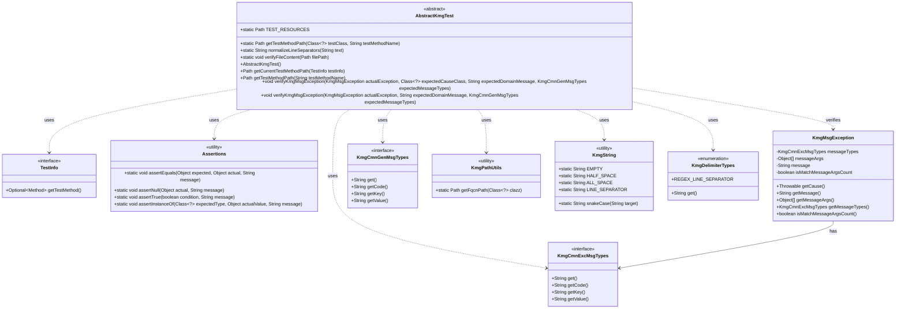
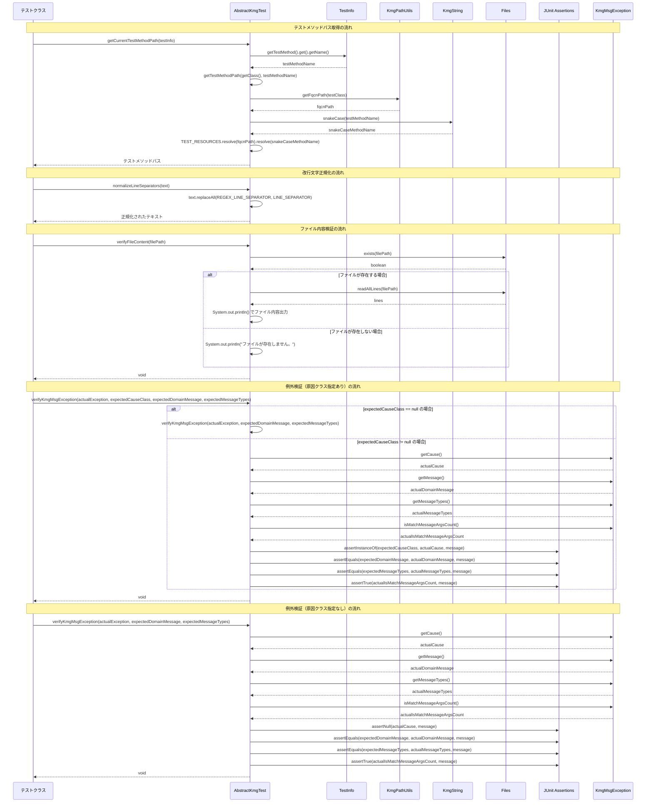

# インフラストラクチャ層テスト層の設計書

## 1. クラス図



## 2. シーケンス図



## 3. パッケージ構造

kmg-core の test パッケージは以下の構造で構成されています：

### 3.1 テスト基盤層 (infrastructure.test)

- **AbstractKmgTest**: KMG のテスト基底抽象クラス
  - テストメソッドパス生成機能
  - 改行文字正規化機能
  - ファイル内容検証機能
  - KMG 例外検証機能

## 4. 主要コンポーネント

### 4.1 テストメソッドパス生成機能

`AbstractKmgTest`は、テストリソースディレクトリ内のパスを自動生成する機能を提供します：

1. **静的メソッドによるパス生成**:

   - `getTestMethodPath(Class<?> testClass, String testMethodName)`: テストクラスとメソッド名からパスを生成

2. **インスタンスメソッドによるパス生成**:

   - `getTestMethodPath(String testMethodName)`: 現在のテストクラスとメソッド名からパスを生成
   - `getCurrentTestMethodPath(TestInfo testInfo)`: JUnit 5 の TestInfo からパスを自動生成

3. **パス生成ロジック**:
   - テストクラスの FQCN パスを取得
   - テストメソッド名をスネークケースに変換
   - `src/test/resources/{FQCNパス}/{スネークケースメソッド名}`の形式でパスを生成

### 4.2 改行文字正規化機能

クロスプラットフォーム対応のために、改行文字を正規化する機能を提供します：

- `normalizeLineSeparators(String text)`: 文字列内の改行文字をシステムの改行文字に統一
- 正規表現による改行文字の検出と置換
- null 安全な処理

### 4.3 ファイル内容検証機能

テスト時のデバッグを支援するために、ファイル内容を出力する機能を提供します：

- `verifyFileContent(Path filePath)`: ファイルの内容をコンソールに出力
- ファイルの存在確認
- ファイルが存在しない場合のメッセージ出力
- ファイル読み込み時の例外処理

### 4.4 KMG 例外検証機能

`KmgMsgException`の包括的な検証を行う機能を提供します：

1. **原因クラス指定ありの検証**:

   - `verifyKmgMsgException(KmgMsgException, Class<?>, String, KmgCmnGenMsgTypes)`: 原因クラスを含む検証
   - 例外の原因が null の場合は原因クラス指定なしの検証に委譲

2. **原因クラス指定なしの検証**:

   - `verifyKmgMsgException(KmgMsgException, String, KmgCmnGenMsgTypes)`: 原因が null であることを検証

3. **検証項目**:
   - 例外の原因（Throwable）の型
   - ドメインメッセージ
   - メッセージタイプ
   - メッセージ引数の数が一致しているか

## 5. 設計原則

### 5.1 継承による共通機能の提供

- テストクラスは`AbstractKmgTest`を継承することで共通機能を利用可能
- 抽象クラスとして設計され、継承を前提とした構造
- 静的メソッドと非静的メソッドを適切に使い分け

### 5.2 JUnit 5 統合

- `TestInfo`インターフェースとの統合により、テストメタデータを活用
- JUnit 5 の`Assertions`を使用した検証
- モダンなテストフレームワークへの対応

### 5.3 規約ベースのパス管理

- テストリソースの配置場所を規約化
- FQCN とスネークケースメソッド名によるディレクトリ構造
- テストデータの組織的な管理を促進

### 5.4 クロスプラットフォーム対応

- 改行文字の正規化により、異なる OS 間でのテスト実行を保証
- システム依存の改行文字を統一的に処理

### 5.5 デバッグ支援

- ファイル内容検証機能により、テスト失敗時のデバッグを容易化
- 絶対パス表示により、ファイルの位置を明確化
- コンソール出力による視覚的な確認

### 5.6 包括的な例外検証

- KMG 例外の各プロパティを網羅的に検証
- メッセージ引数の数の一致性を検証
- 原因クラスの型安全な検証

## 6. 使用例

### 6.1 テストクラスの基本構造

```java
import java.nio.file.Path;

import org.junit.jupiter.api.Test;
import org.junit.jupiter.api.TestInfo;

import kmg.core.infrastructure.test.AbstractKmgTest;

class ExampleTest extends AbstractKmgTest {

    @Test
    void testExample(TestInfo testInfo) {
        // テストメソッドのリソースパスを自動取得
        Path testMethodPath = getCurrentTestMethodPath(testInfo);

        // テストデータファイルのパスを構築
        Path inputFile = testMethodPath.resolve("input.txt");
        Path expectedFile = testMethodPath.resolve("expected.txt");

        // テスト実行...
    }
}
```

### 6.2 テストメソッドパスの取得（静的メソッド）

```java
import java.nio.file.Path;

import org.junit.jupiter.api.Test;

import kmg.core.infrastructure.test.AbstractKmgTest;

class ExampleTest extends AbstractKmgTest {

    @Test
    void testStaticPath() {
        // 静的メソッドでパスを取得
        Path testMethodPath = AbstractKmgTest.getTestMethodPath(
            ExampleTest.class,
            "testStaticPath"
        );
        // -> src/test/resources/kmg/core/example_test/test_static_path
    }
}
```

### 6.3 テストメソッドパスの取得（インスタンスメソッド）

```java
import java.nio.file.Path;

import org.junit.jupiter.api.Test;

import kmg.core.infrastructure.test.AbstractKmgTest;

class ExampleTest extends AbstractKmgTest {

    @Test
    void testInstancePath() {
        // インスタンスメソッドでパスを取得
        Path testMethodPath = getTestMethodPath("testInstancePath");
        // -> src/test/resources/kmg/core/example_test/test_instance_path
    }
}
```

### 6.4 改行文字の正規化

```java
import static org.junit.jupiter.api.Assertions.assertEquals;

import org.junit.jupiter.api.Test;

import kmg.core.infrastructure.test.AbstractKmgTest;

class ExampleTest extends AbstractKmgTest {

    @Test
    void testNormalizeLine() {
        String input = "Line1\r\nLine2\nLine3\rLine4";
        String normalized = AbstractKmgTest.normalizeLineSeparators(input);

        // システムの改行文字に統一される
        String expected = "Line1" + System.lineSeparator()
                        + "Line2" + System.lineSeparator()
                        + "Line3" + System.lineSeparator()
                        + "Line4";

        assertEquals(expected, normalized);
    }
}
```

### 6.5 ファイル内容の検証

```java
import java.nio.file.Path;

import org.junit.jupiter.api.Test;
import org.junit.jupiter.api.TestInfo;

import kmg.core.infrastructure.test.AbstractKmgTest;

class ExampleTest extends AbstractKmgTest {

    @Test
    void testFileContent(TestInfo testInfo) {
        Path testMethodPath = getCurrentTestMethodPath(testInfo);
        Path outputFile = testMethodPath.resolve("output.txt");

        // 何らかの処理でファイルを生成...

        // ファイル内容をコンソールに出力してデバッグ
        AbstractKmgTest.verifyFileContent(outputFile);
    }
}
```

### 6.6 KMG 例外の検証（原因クラス指定あり）

```java
import static org.junit.jupiter.api.Assertions.assertThrows;

import java.io.IOException;

import org.junit.jupiter.api.Test;

import kmg.core.exception.KmgMsgException;
import kmg.core.infrastructure.exception.type.KmgCmnExcMsgTypes;
import kmg.core.infrastructure.message.type.KmgCmnGenMsgTypes;
import kmg.core.infrastructure.test.AbstractKmgTest;

class ExampleTest extends AbstractKmgTest {

    @Test
    void testExceptionWithCause() {
        KmgMsgException exception = assertThrows(
            KmgMsgException.class,
            () -> {
                // 例外を発生させる処理
                throw new KmgMsgException(
                    KmgCmnExcMsgTypes.SOME_ERROR,
                    new Object[]{"arg1", "arg2"},
                    new IOException("IO Error")
                );
            }
        );

        // 原因クラスを含めて検証
        verifyKmgMsgException(
            exception,
            IOException.class,
            "期待するドメインメッセージ",
            KmgCmnGenMsgTypes.SOME_ERROR
        );
    }
}
```

### 6.7 KMG 例外の検証（原因クラス指定なし）

```java
import static org.junit.jupiter.api.Assertions.assertThrows;

import org.junit.jupiter.api.Test;

import kmg.core.exception.KmgMsgException;
import kmg.core.infrastructure.exception.type.KmgCmnExcMsgTypes;
import kmg.core.infrastructure.message.type.KmgCmnGenMsgTypes;
import kmg.core.infrastructure.test.AbstractKmgTest;

class ExampleTest extends AbstractKmgTest {

    @Test
    void testExceptionWithoutCause() {
        KmgMsgException exception = assertThrows(
            KmgMsgException.class,
            () -> {
                // 例外を発生させる処理
                throw new KmgMsgException(
                    KmgCmnExcMsgTypes.SOME_ERROR,
                    new Object[]{"arg1", "arg2"}
                );
            }
        );

        // 原因がnullであることを検証
        verifyKmgMsgException(
            exception,
            "期待するドメインメッセージ",
            KmgCmnGenMsgTypes.SOME_ERROR
        );
    }
}
```

### 6.8 統合的な使用例

```java
import static org.junit.jupiter.api.Assertions.assertEquals;
import static org.junit.jupiter.api.Assertions.assertThrows;

import java.io.IOException;
import java.nio.file.Files;
import java.nio.file.Path;

import org.junit.jupiter.api.Test;
import org.junit.jupiter.api.TestInfo;

import kmg.core.exception.KmgMsgException;
import kmg.core.infrastructure.message.type.KmgCmnGenMsgTypes;
import kmg.core.infrastructure.test.AbstractKmgTest;

class FileProcessorTest extends AbstractKmgTest {

    @Test
    void testProcessFile(TestInfo testInfo) throws IOException {
        // 1. テストリソースのパスを取得
        Path testMethodPath = getCurrentTestMethodPath(testInfo);
        Path inputFile = testMethodPath.resolve("input.txt");
        Path expectedFile = testMethodPath.resolve("expected.txt");
        Path actualFile = testMethodPath.resolve("actual.txt");

        // 2. ファイル処理を実行
        FileProcessor processor = new FileProcessor();
        processor.process(inputFile, actualFile);

        // 3. 結果ファイルの内容をデバッグ出力
        verifyFileContent(actualFile);

        // 4. ファイル内容を読み込み
        String expected = Files.readString(expectedFile);
        String actual = Files.readString(actualFile);

        // 5. 改行文字を正規化して比較
        String normalizedExpected = normalizeLineSeparators(expected);
        String normalizedActual = normalizeLineSeparators(actual);

        // 6. 検証
        assertEquals(normalizedExpected, normalizedActual);
    }

    @Test
    void testProcessFileError(TestInfo testInfo) {
        // 1. テストリソースのパスを取得
        Path testMethodPath = getCurrentTestMethodPath(testInfo);
        Path invalidFile = testMethodPath.resolve("invalid.txt");

        // 2. 例外発生を確認
        KmgMsgException exception = assertThrows(
            KmgMsgException.class,
            () -> {
                FileProcessor processor = new FileProcessor();
                processor.process(invalidFile, Path.of("output.txt"));
            }
        );

        // 3. 例外の詳細を検証
        verifyKmgMsgException(
            exception,
            IOException.class,
            "ファイルの読み込みに失敗しました。",
            KmgCmnGenMsgTypes.FILE_READ_ERROR
        );
    }
}
```

## 7. テストリソースの配置規約

### 7.1 ディレクトリ構造

```text
src/test/resources/
└── kmg/
    └── core/
        └── {テストクラス名のスネークケース}/
            └── {テストメソッド名のスネークケース}/
                ├── input.txt       # 入力データ
                ├── expected.txt    # 期待値データ
                └── config.yml      # 設定ファイル
```

### 7.2 命名規則

- **テストクラス名**: 元のクラス名をスネークケースに変換
  - 例: `FileProcessorTest` → `file_processor_test`
- **テストメソッド名**: 元のメソッド名をスネークケースに変換
  - 例: `testProcessFile` → `test_process_file`

### 7.3 リソースファイルの種類

1. **入力データ**: `input.*`
2. **期待値データ**: `expected.*`
3. **実際の出力**: `actual.*` (通常はテスト実行時に生成)
4. **設定ファイル**: `config.*`
5. **その他**: テストに必要な任意のファイル

## 8. ベストプラクティス

### 8.1 テストメソッドパスの活用

- `TestInfo`を使用した自動パス取得を優先
- テストメソッド名とリソースディレクトリを一致させる
- ハードコードされたパスを避ける

### 8.2 改行文字の扱い

- ファイル内容を比較する際は必ず正規化する
- 異なる OS 環境でのテスト実行を考慮

### 8.3 例外検証の徹底

- 例外のメッセージだけでなく、型やメッセージ引数も検証
- `verifyKmgMsgException`メソッドを活用した包括的な検証

### 8.4 デバッグ支援の活用

- テスト失敗時は`verifyFileContent`でファイル内容を確認
- コンソール出力により問題箇所を特定

### 8.5 テストデータの整理

- テストメソッドごとにディレクトリを分離
- テストデータのバージョン管理を適切に行う
- 不要なテストデータは定期的に削除
