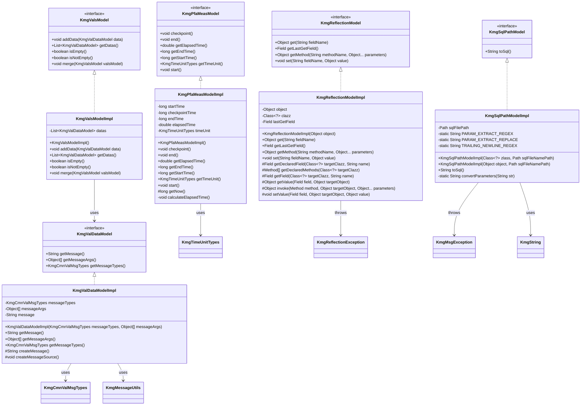

# インフラストラクチャ層モデル層の設計書

## 1. クラス図



## 2. シーケンス図

```mermaid
sequenceDiagram
    participant Client as クライアント
    participant PfaMeasModel as KmgPfaMeasModel
    participant ReflectionModel as KmgReflectionModel
    participant SqlPathModel as KmgSqlPathModel
    participant ValsModel as KmgValsModel
    participant ValDataModel as KmgValDataModel

    Note over Client, ValDataModel: パフォーマンス測定の使用例
    Client->>PfaMeasModel: new KmgPfaMeasModelImpl()
    PfaMeasModel-->>Client: モデルインスタンス
    Client->>PfaMeasModel: start()
    PfaMeasModel->>PfaMeasModel: startTime = getNow()

    Note over Client, PfaMeasModel: 計測対象の処理を実行

    Client->>PfaMeasModel: checkpoint()
    PfaMeasModel->>PfaMeasModel: checkpointTime = getNow()
    PfaMeasModel->>PfaMeasModel: calculateElapsedTime()
    PfaMeasModel-->>Client: 経過時間計算完了

    Client->>PfaMeasModel: getElapsedTime()
    PfaMeasModel-->>Client: 経過時間

    Client->>PfaMeasModel: getTimeUnit()
    PfaMeasModel-->>Client: 時間単位

    Client->>PfaMeasModel: end()
    PfaMeasModel->>PfaMeasModel: endTime = getNow()
    PfaMeasModel->>PfaMeasModel: calculateElapsedTime()
    PfaMeasModel-->>Client: 最終計測完了

    Note over Client, ValDataModel: リフレクション操作の使用例
    Client->>ReflectionModel: new KmgReflectionModelImpl(object)
    ReflectionModel-->>Client: モデルインスタンス

    Client->>ReflectionModel: get("fieldName")
    ReflectionModel->>ReflectionModel: getField(targetClazz, fieldName)

    alt フィールドが存在する場合
        ReflectionModel->>ReflectionModel: getValue(field, object)
        ReflectionModel-->>Client: フィールド値
    else フィールドが存在しない場合
        ReflectionModel->>ReflectionModel: getDeclaredField(targetClazz, fieldName)
        alt 宣言フィールドが見つかった場合
            ReflectionModel->>ReflectionModel: getValue(field, object)
            ReflectionModel-->>Client: フィールド値
        else フィールドが見つからない場合
            ReflectionModel-->>Client: null
        end
    end

    Client->>ReflectionModel: set("fieldName", value)
    ReflectionModel->>ReflectionModel: getField(targetClazz, fieldName)
    ReflectionModel->>ReflectionModel: setValue(field, object, value)
    ReflectionModel-->>Client: 設定完了

    Client->>ReflectionModel: getMethod("methodName", params)
    ReflectionModel->>ReflectionModel: getDeclaredMethods(targetClazz)
    ReflectionModel->>ReflectionModel: メソッド探索・パラメータ型チェック

    alt メソッドが見つかった場合
        ReflectionModel->>ReflectionModel: invoke(method, object, params)
        ReflectionModel-->>Client: メソッド実行結果
    else メソッドが見つからない場合
        ReflectionModel-->>Client: null
    end

    Note over Client, ValDataModel: SQLパスモデルの使用例
    Client->>SqlPathModel: new KmgSqlPathModelImpl(clazz, sqlFilePath)
    SqlPathModel-->>Client: モデルインスタンス

    Client->>SqlPathModel: toSql()
    SqlPathModel->>SqlPathModel: Files.newBufferedReader(sqlFilePath)

    alt ファイル読み込み成功
        loop 各行を処理
            SqlPathModel->>SqlPathModel: convertParameters(line)
            SqlPathModel->>SqlPathModel: パラメータ変換（/*param*/value → param）
        end
        SqlPathModel->>SqlPathModel: 末尾改行削除
        SqlPathModel-->>Client: 変換済みSQL文字列
    else ファイル読み込み失敗
        SqlPathModel->>SqlPathModel: new KmgMsgException(...)
        SqlPathModel-->>Client: 例外スロー
    end

    Note over Client, ValDataModel: バリデーションモデルの使用例
    Client->>ValsModel: new KmgValsModelImpl()
    ValsModel-->>Client: モデルインスタンス

    loop バリデーション処理
        Client->>ValDataModel: new KmgValDataModelImpl(msgTypes, msgArgs)
        ValDataModel->>ValDataModel: createMessageSource()
        ValDataModel->>ValDataModel: createMessage()
        ValDataModel-->>Client: バリデーションデータ

        Client->>ValsModel: addData(valDataModel)
        ValsModel->>ValsModel: datas.add(data)
        ValsModel-->>Client: 追加完了
    end

    Client->>ValsModel: isEmpty()
    ValsModel-->>Client: false（エラーあり）

    Client->>ValsModel: getDatas()
    ValsModel-->>Client: バリデーションエラーリスト

    Note over Client, ValDataModel: バリデーションモデルのマージ例
    Client->>ValsModel: merge(otherValsModel)
    ValsModel->>ValsModel: otherValsModel.getDatas()
    loop 各バリデーションデータ
        ValsModel->>ValsModel: addData(data)
    end
    ValsModel-->>Client: マージ完了
```



## 3. パッケージ構造

モデル層は以下のパッケージ構造で構成されています：

### 3.1 基本構造

```text
kmg.core.infrastructure.model
├── KmgPfaMeasModel.java                    (パフォーマンス測定モデルインターフェース)
├── KmgReflectionModel.java                 (リフレクションモデルインターフェース)
├── KmgSqlPathModel.java                    (SQLパスモデルインターフェース)
├── package-info.java
├── impl/
│   ├── KmgPfaMeasModelImpl.java           (パフォーマンス測定モデル実装)
│   ├── KmgReflectionModelImpl.java        (リフレクションモデル実装)
│   ├── KmgSqlPathModelImpl.java           (SQLパスモデル実装)
│   └── package-info.java
└── val/
    ├── KmgValDataModel.java               (バリデーションデータモデルインターフェース)
    ├── KmgValsModel.java                  (バリデーション集合モデルインターフェース)
    ├── package-info.java
    └── impl/
        ├── KmgValDataModelImpl.java       (バリデーションデータモデル実装)
        ├── KmgValsModelImpl.java          (バリデーション集合モデル実装)
        └── package-info.java
```

### 3.2 パッケージの役割

#### 3.2.1 kmg.core.infrastructure.model

モデル層の基本インターフェースを提供します。

- **KmgPfaMeasModel**: パフォーマンス測定機能のインターフェース
- **KmgReflectionModel**: リフレクション操作機能のインターフェース
- **KmgSqlPathModel**: SQL ファイル読み込み機能のインターフェース

#### 3.2.2 kmg.core.infrastructure.model.impl

モデルインターフェースの実装クラスを提供します。

- **KmgPfaMeasModelImpl**: パフォーマンス測定の具体的な実装
- **KmgReflectionModelImpl**: リフレクション操作の具体的な実装
- **KmgSqlPathModelImpl**: SQL ファイル読み込みの具体的な実装

#### 3.2.3 kmg.core.infrastructure.model.val

バリデーション関連のモデルインターフェースを提供します。

- **KmgValDataModel**: 単一のバリデーション結果を表すインターフェース
- **KmgValsModel**: 複数のバリデーション結果を管理するインターフェース

#### 3.2.4 kmg.core.infrastructure.model.val.impl

バリデーションモデルの実装クラスを提供します。

- **KmgValDataModelImpl**: バリデーション結果の具体的な実装
- **KmgValsModelImpl**: バリデーション結果集合の具体的な実装

## 4. 主要コンポーネント

### 4.1 パフォーマンス測定モデル

#### 4.1.1 概要

処理の実行時間を計測し、適切な時間単位で結果を提供するモデルです。

#### 4.1.2 主要機能

1. **計測開始**: `start()`メソッドで計測を開始
2. **チェックポイント**: `checkpoint()`メソッドで中間経過を記録
3. **計測終了**: `end()`メソッドで計測を終了
4. **時間単位自動選択**: 経過時間に応じて最適な単位（ナノ秒、マイクロ秒、ミリ秒、秒）を自動選択

#### 4.1.3 時間単位の自動選択ロジック

```text
経過時間 < 1000ナノ秒     → ナノ秒
経過時間 < 1000マイクロ秒 → マイクロ秒
経過時間 < 1000ミリ秒     → ミリ秒
経過時間 ≥ 1000ミリ秒     → 秒
```

#### 4.1.4 使用シーン

- メソッドの実行時間測定
- バッチ処理のパフォーマンス監視
- パフォーマンス最適化の効果測定

### 4.2 リフレクションモデル

#### 4.2.1 概要

Java のリフレクション機能を安全かつ簡潔に利用するためのモデルです。

#### 4.2.2 主要機能

1. **フィールド取得**: `get(String fieldName)`でフィールド値を取得
2. **フィールド設定**: `set(String fieldName, Object value)`でフィールド値を設定
3. **メソッド呼び出し**: `getMethod(String methodName, Object... parameters)`でメソッドを実行
4. **階層探索**: スーパークラスまで遡ってフィールド・メソッドを探索
5. **アクセス制御**: private フィールド・メソッドへのアクセスを自動的に許可

#### 4.2.3 例外処理

- フィールド・メソッドが見つからない場合: `null`を返す
- セキュリティ例外、アクセス例外が発生した場合: `KmgReflectionException`をスロー
- メソッド実行時の例外: 元の例外をそのままスロー（`InvocationTargetException`の原因例外を展開）

#### 4.2.4 使用シーン

- テストコードでの private フィールド・メソッドへのアクセス
- 動的なフィールド操作が必要な汎用処理
- フレームワーク実装におけるオブジェクト操作

### 4.3 SQL パスモデル

#### 4.3.1 概要

SQL ファイルを読み込み、パラメータ変換を行うモデルです。

#### 4.3.2 主要機能

1. **SQL ファイル読み込み**: 指定されたパスから SQL ファイルを読み込み
2. **パラメータ変換**: コメント形式のパラメータを実際のパラメータに変換
3. **サンプル値削除**: パラメータの後のサンプル値を削除
4. **末尾改行削除**: ファイル末尾の改行を全て削除

#### 4.3.3 パラメータ変換仕様

```text
変換前: /*:sampleId*/'サンプル'
変換後: :sampleId

変換前: /*:sampleId*/123
変換後: :sampleId
```

#### 4.3.4 使用シーン

- データベースアクセス処理での SQL 文取得
- SQL テンプレートの管理
- パラメータ化された SQL の実行

### 4.4 バリデーションデータモデル

#### 4.4.1 概要

単一のバリデーション結果を表すモデルです。

#### 4.4.2 主要機能

1. **メッセージ管理**: メッセージタイプと引数からエラーメッセージを生成
2. **メッセージ取得**: 完成されたエラーメッセージを取得
3. **メタ情報保持**: メッセージタイプと引数を保持

#### 4.4.3 データ構造

- **messageTypes**: メッセージの種類（`KmgCmnValMsgTypes`）
- **messageArgs**: メッセージの引数配列
- **message**: 生成された完全なメッセージ

#### 4.4.4 使用シーン

- 入力値のバリデーション結果の保持
- ビジネスルールのチェック結果の保持
- エラーメッセージの一元管理

### 4.5 バリデーション集合モデル

#### 4.5.1 概要

複数のバリデーション結果を管理するモデルです。

#### 4.5.2 主要機能

1. **データ追加**: `addData(KmgValDataModel)`で個別のバリデーション結果を追加
2. **空判定**: `isEmpty()`/`isNotEmpty()`でバリデーションエラーの有無を判定
3. **データ取得**: `getDatas()`で全てのバリデーション結果を取得
4. **マージ**: `merge(KmgValsModel)`で他のバリデーション結果を統合

#### 4.5.3 使用パターン

```java
// バリデーション結果の収集
KmgValsModel validations = new KmgValsModelImpl();

// 各バリデーションを実行
if (条件1が満たされない) {
    validations.addData(new KmgValDataModelImpl(msgTypes1, args1));
}
if (条件2が満たされない) {
    validations.addData(new KmgValDataModelImpl(msgTypes2, args2));
}

// エラーチェック
if (validations.isNotEmpty()) {
    throw new KmgValException(validations);
}
```

#### 4.5.4 使用シーン

- 複数項目の入力値検証
- 複数のビジネスルールチェック
- バリデーション結果の一括処理

## 5. 設計原則

### 5.1 インターフェース分離原則

全てのモデルはインターフェースと実装クラスを分離しています。これにより以下のメリットがあります：

- **テスト容易性**: モックオブジェクトの作成が容易
- **拡張性**: 新しい実装クラスの追加が容易
- **依存性の逆転**: 上位層が実装ではなくインターフェースに依存

### 5.2 単一責任原則

各モデルは明確な単一の責任を持ちます：

- **KmgPfaMeasModel**: パフォーマンス測定のみ
- **KmgReflectionModel**: リフレクション操作のみ
- **KmgSqlPathModel**: SQL ファイル読み込みのみ
- **KmgValDataModel**: 単一バリデーション結果の管理のみ
- **KmgValsModel**: バリデーション結果の集合管理のみ

### 5.3 不変性の保証

必要な箇所では不変性を保証しています：

- **KmgValDataModelImpl**: メッセージタイプ、引数、メッセージを final で保持
- **KmgSqlPathModelImpl**: SQL ファイルパスを final で保持
- **KmgReflectionModelImpl**: 対象オブジェクトとクラスを final で保持

### 5.4 例外処理の明確化

各モデルは適切な例外処理を実装しています：

- **KmgReflectionModelImpl**: リフレクション操作の失敗時に`KmgReflectionException`をスロー
- **KmgSqlPathModelImpl**: ファイル読み込み失敗時に`KmgMsgException`をスロー
- **例外の伝播**: `getMethod()`では元の例外をそのまま伝播

### 5.5 null 安全性

null 値の扱いを明確にしています：

- **引数チェック**: null チェックを実施し、適切に処理
- **早期リターン**: null 引数の場合は早期リターン
- **null 許容**: 戻り値で null を返す場合は明確に文書化

### 5.6 拡張性

protected メソッドを提供することで、サブクラスでの拡張を容易にしています：

- **KmgPfaMeasModelImpl**: `getNow()`を protected で提供（テスト時のオーバーライド可能）
- **KmgReflectionModelImpl**: 各種リフレクション操作メソッドを protected で提供
- **KmgValDataModelImpl**: `createMessage()`、`createMessageSource()`を protected で提供

## 6. 使用例

### 6.1 パフォーマンス測定の基本例

```java
// モデルのインスタンス生成
KmgPfaMeasModel measModel = new KmgPfaMeasModelImpl();

// 計測開始
measModel.start();

// 計測対象の処理
performHeavyOperation();

// 中間経過の確認
measModel.checkpoint();
System.out.println("中間経過: " + measModel.getElapsedTime() + " " +
                   measModel.getTimeUnit().getUnitName());

// さらに処理を実行
performAnotherOperation();

// 計測終了
measModel.end();
System.out.println("最終結果: " + measModel.getElapsedTime() + " " +
                   measModel.getTimeUnit().getUnitName());
```

### 6.2 リフレクション操作の基本例

```java
// 対象オブジェクトのリフレクションモデルを生成
MyObject target = new MyObject();
KmgReflectionModel reflection = new KmgReflectionModelImpl(target);

// フィールド値の取得
Object value = reflection.get("privateField");

// フィールド値の設定
reflection.set("privateField", newValue);

// メソッドの呼び出し
Object result = reflection.getMethod("privateMethod", param1, param2);

// 最後に取得したフィールドの情報を取得
Field lastField = reflection.getLastGetField();
```

### 6.3 SQL ファイル読み込みの基本例

```java
// SQLパスモデルの生成
Path sqlFilePath = Paths.get("src/test/resources/sql/sample.sql");
KmgSqlPathModel sqlModel = new KmgSqlPathModelImpl(this.getClass(), sqlFilePath);

// SQLの取得（パラメータ変換済み）
String sql = sqlModel.toSql();

// PreparedStatementで使用
PreparedStatement stmt = connection.prepareStatement(sql);
stmt.setString(1, sampleValue);
```

### 6.4 バリデーション結果の収集例

```java
// バリデーション集合モデルの生成
KmgValsModel validations = new KmgValsModelImpl();

// 各種バリデーションの実行
if (StringUtils.isEmpty(userName)) {
    KmgValDataModel error = new KmgValDataModelImpl(
        KmgCoreValMsgTypes.KMGCORE_VAL00001,
        new Object[]{"ユーザー名"}
    );
    validations.addData(error);
}

if (age < 0 || age > 150) {
    KmgValDataModel error = new KmgValDataModelImpl(
        KmgCoreValMsgTypes.KMGCORE_VAL00002,
        new Object[]{"年齢", 0, 150}
    );
    validations.addData(error);
}

// バリデーション結果のチェック
if (validations.isNotEmpty()) {
    // エラーメッセージの表示
    for (KmgValDataModel data : validations.getDatas()) {
        System.err.println(data.getMessage());
    }

    // 例外のスロー
    throw new KmgValException(validations);
}
```

### 6.5 バリデーション結果のマージ例

```java
// 複数のバリデーション処理を実行
KmgValsModel validations1 = validateBasicInfo(userInfo);
KmgValsModel validations2 = validateAddress(address);
KmgValsModel validations3 = validateCreditCard(creditCard);

// 全てのバリデーション結果をマージ
KmgValsModel allValidations = new KmgValsModelImpl();
allValidations.merge(validations1);
allValidations.merge(validations2);
allValidations.merge(validations3);

// 統合されたバリデーション結果のチェック
if (allValidations.isNotEmpty()) {
    throw new KmgValException(allValidations);
}
```

### 6.6 複合的な使用例

```java
// パフォーマンス測定とリフレクションの組み合わせ
KmgPfaMeasModel measModel = new KmgPfaMeasModelImpl();
measModel.start();

// リフレクションでフィールドを一括設定
KmgReflectionModel reflection = new KmgReflectionModelImpl(targetObject);
for (Map.Entry<String, Object> entry : fieldValues.entrySet()) {
    reflection.set(entry.getKey(), entry.getValue());
}

measModel.end();
logger.info("フィールド設定完了: " + measModel.getElapsedTime() + " " +
            measModel.getTimeUnit().getUnitName());
```

## 7. テストガイドライン

### 7.1 パフォーマンス測定モデルのテスト

```java
@Test
void testPerformanceMeasurement() {
    KmgPfaMeasModel model = new KmgPfaMeasModelImpl();

    model.start();
    assertNotEquals(0, model.getStartTime());

    // 処理の実行
    Thread.sleep(100);

    model.end();
    assertTrue(model.getElapsedTime() > 0);
    assertNotNull(model.getTimeUnit());
}
```

### 7.2 リフレクションモデルのテスト

```java
@Test
void testReflectionGet() throws KmgReflectionException {
    TestObject obj = new TestObject();
    obj.setPrivateField("test");

    KmgReflectionModel model = new KmgReflectionModelImpl(obj);
    Object value = model.get("privateField");

    assertEquals("test", value);
}
```

### 7.3 SQL パスモデルのテスト

```java
@Test
void testSqlPathModel() throws KmgMsgException {
    Path sqlPath = Paths.get("src/test/resources/test.sql");
    KmgSqlPathModel model = new KmgSqlPathModelImpl(this.getClass(), sqlPath);

    String sql = model.toSql();

    assertNotNull(sql);
    assertTrue(sql.contains("SELECT"));
    assertFalse(sql.endsWith("\n")); // 末尾改行が削除されていることを確認
}
```

### 7.4 バリデーションモデルのテスト

```java
@Test
void testValidationModel() {
    KmgValsModel validations = new KmgValsModelImpl();

    assertTrue(validations.isEmpty());

    KmgValDataModel error = new KmgValDataModelImpl(
        KmgCoreValMsgTypes.KMGCORE_VAL00001,
        new Object[]{"テストフィールド"}
    );
    validations.addData(error);

    assertTrue(validations.isNotEmpty());
    assertEquals(1, validations.getDatas().size());
}
```

## 8. パフォーマンス考慮事項

### 8.1 パフォーマンス測定モデル

- **System.nanoTime()の使用**: より高精度な時間測定
- **計算の遅延**: 経過時間は必要時のみ計算（checkpoint/end メソッド呼び出し時）

### 8.2 リフレクションモデル

- **フィールドキャッシュ**: 最後に取得したフィールドを保持（`lastGetField`）
- **階層探索**: Object.class まで遡る必要がある場合に備えた効率的な探索
- **アクセス制御の 1 回設定**: `setAccessible(true)`を 1 度だけ呼び出し

### 8.3 SQL パスモデル

- **BufferedReader の使用**: 効率的なファイル読み込み
- **StringBuilder の使用**: 文字列連結のパフォーマンス最適化
- **try-with-resources の使用**: リソースの確実な解放

### 8.4 バリデーションモデル

- **遅延評価**: メッセージはコンストラクタ時に 1 度だけ生成
- **ArrayList の使用**: 動的なサイズ変更に対応

## 9. まとめ

モデル層は、KMG Core フレームワークの基盤となる重要なコンポーネントです。各モデルは以下の特徴を持ちます：

- **明確な責任分離**: 各モデルが単一の明確な責任を持つ
- **インターフェース志向**: 全てのモデルがインターフェースと実装を分離
- **例外処理の明確化**: 適切な例外処理とエラーハンドリング
- **拡張性**: protected メソッドによる拡張ポイントの提供
- **テスト容易性**: モックの作成とテストが容易な設計

これらのモデルを適切に活用することで、堅牢で保守性の高いアプリケーションを構築できます。
