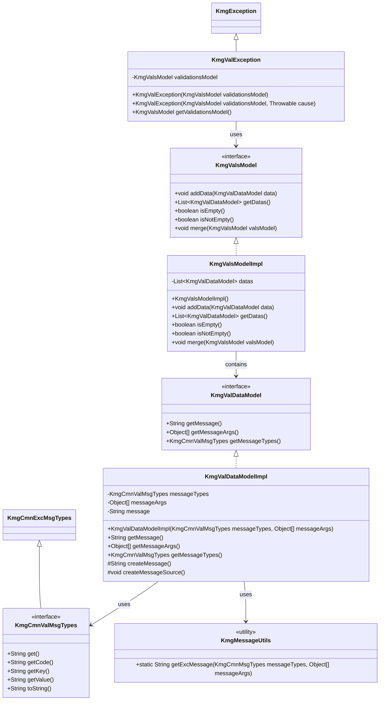
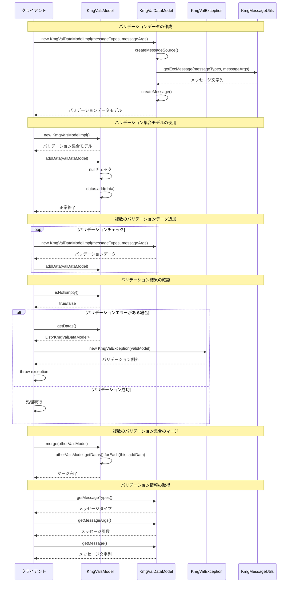

# インフラストラクチャ層モデル層バリデーション層の設計書

## 1. クラス図



## 2. シーケンス図



## 3. パッケージ構造

kmg-core のバリデーションモデルは以下のパッケージ構造で構成されています：

### 3.1 インフラストラクチャ層 (infrastructure)

#### 3.1.1 バリデーションモデル (model.val)

- **インターフェース**:
  - `KmgValDataModel`: バリデーションデータモデルインターフェース
  - `KmgValsModel`: バリデーション集合モデルインターフェース

#### 3.1.2 バリデーションモデル実装 (model.val.impl)

- **実装クラス**:
  - `KmgValDataModelImpl`: バリデーションデータモデル実装クラス
  - `KmgValsModelImpl`: バリデーション集合モデル実装クラス

#### 3.1.3 例外処理 (exception)

- `KmgValException`: バリデーション例外クラス

#### 3.1.4 メッセージタイプ (cmn.msg)

- `KmgCmnValMsgTypes`: バリデーションメッセージタイプインターフェース

## 4. 主要コンポーネント

### 4.1 バリデーションデータモデル (KmgValDataModel)

バリデーション結果の個別データを管理するモデル。

#### 4.1.1 責務

- バリデーションエラーメッセージの保持
- メッセージタイプと引数の管理
- メッセージの自動生成

#### 4.1.2 主要メソッド

| メソッド            | 説明                   | 戻り値            |
| ------------------- | ---------------------- | ----------------- |
| `getMessage()`      | メッセージを取得       | String            |
| `getMessageArgs()`  | メッセージ引数を取得   | Object[]          |
| `getMessageTypes()` | メッセージタイプを取得 | KmgCmnValMsgTypes |

#### 4.1.3 実装クラス (KmgValDataModelImpl)

**フィールド**:

- `messageTypes`: メッセージの種類（KmgCmnValMsgTypes）
- `messageArgs`: メッセージの引数（Object[]）
- `message`: メッセージ文字列（String）

**コンストラクタ**:

```java
public KmgValDataModelImpl(KmgCmnValMsgTypes messageTypes, Object[] messageArgs)
```

**内部処理**:

1. メッセージソースの作成（createMessageSource）
2. メッセージの生成（createMessage）
   - KmgMessageUtils を使用してメッセージを生成

### 4.2 バリデーション集合モデル (KmgValsModel)

複数のバリデーションデータを集約して管理するモデル。

#### 4.2.1 責務

- 複数のバリデーションデータの集約
- バリデーション結果の状態管理（空/非空）
- 複数のバリデーション集合のマージ

#### 4.2.2 主要メソッド

| メソッド                   | 説明               | 戻り値                      |
| -------------------------- | ------------------ | --------------------------- |
| `addData(KmgValDataModel)` | データを追加       | void                        |
| `getDatas()`               | データリストを取得 | List&lt;KmgValDataModel&gt; |
| `isEmpty()`                | 空かどうかを確認   | boolean                     |
| `isNotEmpty()`             | 空ではないかを確認 | boolean                     |
| `merge(KmgValsModel)`      | 他のモデルとマージ | void                        |

#### 4.2.3 実装クラス (KmgValsModelImpl)

**フィールド**:

- `datas`: データのリスト（List&lt;KmgValDataModel&gt;）

**コンストラクタ**:

```java
public KmgValsModelImpl()
```

- 空の ArrayList を初期化

**主要な実装**:

- `addData()`: null チェックを行い、null でない場合のみ追加
- `isEmpty()`: datas.isEmpty() の結果を返す
- `isNotEmpty()`: !isEmpty() の結果を返す
- `merge()`: 引数の KmgValsModel のデータを forEach で順次追加

### 4.3 バリデーション例外 (KmgValException)

バリデーションエラー発生時にスローされる例外クラス。

#### 4.3.1 責務

- バリデーション集合モデルの保持
- バリデーションエラー情報の伝播

#### 4.3.2 特徴

- `KmgException` を継承
- `KmgValsModel` を保持し、複数のバリデーションエラーを一度に伝達
- 原因例外（cause）も保持可能

#### 4.3.3 コンストラクタ

```java
public KmgValException(KmgValsModel validationsModel)
public KmgValException(KmgValsModel validationsModel, Throwable cause)
```

#### 4.3.4 主要メソッド

| メソッド                | 説明                           | 戻り値       |
| ----------------------- | ------------------------------ | ------------ |
| `getValidationsModel()` | バリデーション集合モデルを取得 | KmgValsModel |

### 4.4 バリデーションメッセージタイプ (KmgCmnValMsgTypes)

バリデーションメッセージの種類を定義するインターフェース。

#### 4.4.1 継承関係

- `KmgCmnExcMsgTypes` を継承
- `KmgCmnMsgTypes` の機能を全て利用可能

#### 4.4.2 提供メソッド（継承）

| メソッド     | 説明                   | 戻り値 |
| ------------ | ---------------------- | ------ |
| `get()`      | メッセージ値を取得     | String |
| `getCode()`  | メッセージコードを取得 | String |
| `getKey()`   | メッセージキーを取得   | String |
| `getValue()` | メッセージ値を取得     | String |
| `toString()` | 文字列表現を取得       | String |

## 5. 設計原則

### 5.1 単一責任の原則

- **KmgValDataModel**: 個別のバリデーション結果の管理に特化
- **KmgValsModel**: 複数のバリデーション結果の集約に特化
- **KmgValException**: バリデーション例外の伝播に特化

### 5.2 依存性逆転の原則

- インターフェース（KmgValDataModel、KmgValsModel）を定義
- 実装クラス（Impl）を分離
- クライアントはインターフェースに依存

### 5.3 オープン・クローズドの原則

- インターフェースベースの設計により拡張に開いている
- 既存コードの変更なしに新しい実装を追加可能

### 5.4 リスコフの置換原則

- 実装クラスはインターフェースの契約を完全に満たす
- インターフェース型で扱える場所では実装クラスを置換可能

### 5.5 インターフェース分離の原則

- 最小限のメソッドのみをインターフェースに定義
- クライアントは必要なメソッドのみに依存

### 5.6 null 安全性

- KmgValsModelImpl.addData() は null チェックを実施
- null データは追加されない

### 5.7 不変性の確保

- KmgValDataModelImpl のフィールドは final
- 一度作成されたバリデーションデータは変更不可

### 5.8 メッセージ管理の統一

- KmgMessageUtils を使用してメッセージを生成
- メッセージ生成ロジックの一元管理

## 6. 使用パターン

### 6.1 基本的な使用パターン

#### 6.1.1 単一のバリデーション

```java
// バリデーションデータの作成
KmgValDataModel valData = new KmgValDataModelImpl(
    KmgCoreValMsgTypes.VALIDATION_ERROR,
    new Object[] { "フィールド名", "エラー詳細" }
);

// バリデーション集合モデルの作成
KmgValsModel validations = new KmgValsModelImpl();
validations.addData(valData);

// バリデーションエラーの確認
if (validations.isNotEmpty()) {
    throw new KmgValException(validations);
}
```

#### 6.1.2 複数のバリデーション

```java
KmgValsModel validations = new KmgValsModelImpl();

// バリデーション1
if (StringUtils.isBlank(name)) {
    KmgValDataModel valData = new KmgValDataModelImpl(
        KmgCoreValMsgTypes.REQUIRED_ERROR,
        new Object[] { "名前" }
    );
    validations.addData(valData);
}

// バリデーション2
if (age < 0) {
    KmgValDataModel valData = new KmgValDataModelImpl(
        KmgCoreValMsgTypes.RANGE_ERROR,
        new Object[] { "年齢", "0以上" }
    );
    validations.addData(valData);
}

// バリデーションエラーの確認
if (validations.isNotEmpty()) {
    throw new KmgValException(validations);
}
```

### 6.2 バリデーション集合のマージ

```java
// 基本情報のバリデーション
KmgValsModel basicValidations = validateBasicInfo(data);

// 詳細情報のバリデーション
KmgValsModel detailValidations = validateDetailInfo(data);

// バリデーション結果のマージ
KmgValsModel allValidations = new KmgValsModelImpl();
allValidations.merge(basicValidations);
allValidations.merge(detailValidations);

// 統合されたバリデーション結果の確認
if (allValidations.isNotEmpty()) {
    throw new KmgValException(allValidations);
}
```

### 6.3 バリデーション例外のハンドリング

```java
try {
    // ビジネスロジック実行
    executeBusinessLogic(data);
} catch (KmgValException e) {
    // バリデーション集合モデルの取得
    KmgValsModel validations = e.getValidationsModel();

    // 各バリデーションエラーの処理
    for (KmgValDataModel valData : validations.getDatas()) {
        String message = valData.getMessage();
        KmgCmnValMsgTypes msgType = valData.getMessageTypes();
        Object[] msgArgs = valData.getMessageArgs();

        // エラーログの出力
        logger.error("バリデーションエラー: {}, タイプ: {}", message, msgType);
    }

    // エラーレスポンスの作成
    return createErrorResponse(validations);
}
```

### 6.4 段階的なバリデーション

```java
public KmgValsModel validateUser(User user) {
    KmgValsModel validations = new KmgValsModelImpl();

    // 必須項目チェック
    validateRequired(user, validations);

    // 書式チェック（必須チェックが成功した場合のみ）
    if (validations.isEmpty()) {
        validateFormat(user, validations);
    }

    // ビジネスルールチェック（書式チェックが成功した場合のみ）
    if (validations.isEmpty()) {
        validateBusinessRules(user, validations);
    }

    return validations;
}

private void validateRequired(User user, KmgValsModel validations) {
    if (StringUtils.isBlank(user.getName())) {
        validations.addData(new KmgValDataModelImpl(
            KmgCoreValMsgTypes.REQUIRED_ERROR,
            new Object[] { "名前" }
        ));
    }
}
```

### 6.5 メソッドチェーン風の使用

```java
KmgValsModel validations = new KmgValsModelImpl();

// バリデーションデータの連続追加
Optional.of(user.getName())
    .filter(StringUtils::isBlank)
    .ifPresent(name -> validations.addData(
        new KmgValDataModelImpl(
            KmgCoreValMsgTypes.REQUIRED_ERROR,
            new Object[] { "名前" }
        )
    ));

Optional.of(user.getAge())
    .filter(age -> age < 0)
    .ifPresent(age -> validations.addData(
        new KmgValDataModelImpl(
            KmgCoreValMsgTypes.RANGE_ERROR,
            new Object[] { "年齢", "0以上" }
        )
    ));

if (validations.isNotEmpty()) {
    throw new KmgValException(validations);
}
```

### 6.6 リポジトリパターンでの使用

```java
public class UserRepository {

    public void save(User user) throws KmgValException {
        // バリデーション実行
        KmgValsModel validations = validate(user);

        if (validations.isNotEmpty()) {
            throw new KmgValException(validations);
        }

        // 保存処理
        doSave(user);
    }

    private KmgValsModel validate(User user) {
        KmgValsModel validations = new KmgValsModelImpl();

        // 一意性チェック
        if (existsByEmail(user.getEmail())) {
            validations.addData(new KmgValDataModelImpl(
                KmgCoreValMsgTypes.DUPLICATE_ERROR,
                new Object[] { "メールアドレス", user.getEmail() }
            ));
        }

        return validations;
    }
}
```

## 7. テスト戦略

### 7.1 KmgValDataModelImpl のテスト

- **コンストラクタテスト**: 正常にインスタンスが作成されることを確認
- **getMessage テスト**: メッセージが正しく取得できることを確認
- **getMessageArgs テスト**: メッセージ引数が正しく取得できることを確認
- **getMessageTypes テスト**: メッセージタイプが正しく取得できることを確認

### 7.2 KmgValsModelImpl のテスト

- **コンストラクタテスト**: 初期状態が空であることを確認
- **addData テスト**:
  - 正常系: データが正しく追加されることを確認
  - 準正常系: null データが追加されないことを確認
  - 複数データ: 複数のデータが順序通り追加されることを確認
- **isEmpty テスト**: 空状態の判定が正しいことを確認
- **isNotEmpty テスト**: 非空状態の判定が正しいことを確認
- **merge テスト**:
  - 空のモデルをマージ
  - データを含むモデルをマージ
  - 空のターゲットにデータをマージ

### 7.3 KmgValException のテスト

- **コンストラクタテスト**:
  - バリデーション集合モデルのみを指定
  - バリデーション集合モデルと原因を指定
- **getValidationsModel テスト**: 正しくモデルが取得できることを確認

## 8. ベストプラクティス

### 8.1 バリデーションの粒度

- 1 つの KmgValDataModel は 1 つのバリデーションエラーを表す
- 複数のエラーは KmgValsModel で集約する
- エラーメッセージは明確で具体的にする

### 8.2 パフォーマンス考慮

- バリデーション集合モデルは再利用可能
- 不要なバリデーションデータの生成を避ける
- isEmpty() チェックで早期リターンを活用

### 8.3 エラーメッセージの国際化

- メッセージタイプ（Enum）を使用してメッセージを管理
- メッセージ引数を使用して動的な値を埋め込む
- KmgMessageUtils を通じて統一的にメッセージを生成

### 8.4 例外処理

- バリデーションエラーは KmgValException でスロー
- ビジネスロジックとバリデーションロジックを分離
- 例外からバリデーション詳細情報を取得可能

### 8.5 保守性

- インターフェースを使用して実装を隠蔽
- テストコードで仕様を明確化
- バリデーションロジックを小さなメソッドに分割

## 9. 関連コンポーネント

### 9.1 依存コンポーネント

- **KmgException**: バリデーション例外の基底クラス
- **KmgCmnValMsgTypes**: バリデーションメッセージタイプの定義
- **KmgMessageUtils**: メッセージ生成ユーティリティ

### 9.2 使用箇所

バリデーションモデルは、以下の場面で使用されます：

- ドメインモデルの入力チェック
- ビジネスルールの検証
- データ整合性チェック
- API リクエストの検証
- データベース保存前の検証

## 10. 今後の拡張性

### 10.1 バリデーションルールの追加

- 新しいメッセージタイプを KmgCmnValMsgTypes の実装として追加
- 既存のコードを変更せずに新しいバリデーションルールを追加可能

### 10.2 バリデーション戦略の拡張

- バリデーションチェーンパターンの導入
- カスタムバリデーターインターフェースの追加
- アノテーションベースのバリデーション対応

### 10.3 レポート機能の強化

- バリデーション結果のフォーマット機能
- エラーサマリーの生成
- バリデーション結果のエクスポート機能
