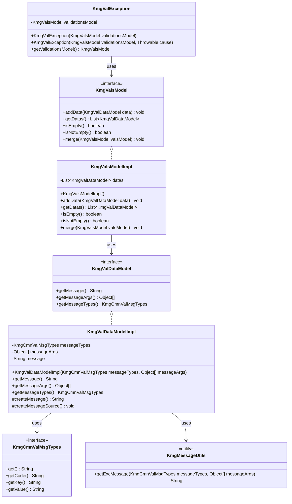
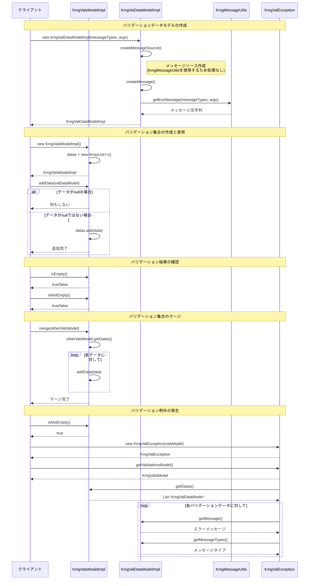

# インフラストラクチャ層モデル層バリデーション層実装層の設計書

## 1. クラス図



## 2. シーケンス図



## 3. パッケージ構造

バリデーションモデル実装層は以下のパッケージ構造で構成されています：

```text
kmg.core.infrastructure.model.val.impl
├── KmgValDataModelImpl.java      # バリデーションデータモデル実装
├── KmgValsModelImpl.java         # バリデーション集合モデル実装
└── package-info.java             # パッケージ情報
```

### 3.1 依存関係

**上位パッケージ（インターフェース）:**

- `kmg.core.infrastructure.model.val.KmgValDataModel`
- `kmg.core.infrastructure.model.val.KmgValsModel`

**依存パッケージ:**

- `kmg.core.infrastructure.cmn.msg.KmgCmnValMsgTypes` - バリデーションメッセージタイプ
- `kmg.core.infrastructure.utils.KmgMessageUtils` - メッセージユーティリティ
- `java.util.ArrayList` - リストの実装
- `java.util.List` - リストインターフェース

**使用元パッケージ:**

- `kmg.core.infrastructure.exception.KmgValException` - バリデーション例外

## 4. 主要コンポーネント

### 4.1 KmgValDataModelImpl

バリデーションデータモデルの実装クラスです。

#### 4.1.1 責務

- バリデーションエラーの個別データを保持
- メッセージタイプと引数からエラーメッセージを生成
- メッセージ情報へのアクセスを提供

#### 4.1.2 主要フィールド

| フィールド名 | 型                | 説明                          |
| ------------ | ----------------- | ----------------------------- |
| messageTypes | KmgCmnValMsgTypes | メッセージの種類（final）     |
| messageArgs  | Object[]          | メッセージの引数（final）     |
| message      | String            | 生成されたメッセージ（final） |

#### 4.1.3 主要メソッド

| メソッド名            | 戻り値            | 説明                                    |
| --------------------- | ----------------- | --------------------------------------- |
| getMessage()          | String            | メッセージを返す                        |
| getMessageArgs()      | Object[]          | メッセージの引数を返す                  |
| getMessageTypes()     | KmgCmnValMsgTypes | メッセージの種類を返す                  |
| createMessage()       | String            | メッセージを作成して返す（protected）   |
| createMessageSource() | void              | メッセージソースを作成する（protected） |

#### 4.1.4 設計上の特徴

- **イミュータブル設計**: すべてのフィールドが final で、生成後の変更不可
- **遅延評価なし**: コンストラクタで即座にメッセージを生成
- **拡張性**: protected メソッドにより、サブクラスでのカスタマイズが可能

### 4.2 KmgValsModelImpl

バリデーション集合モデルの実装クラスです。

#### 4.2.1 責務

- 複数のバリデーションエラーデータを集約
- バリデーション結果の有無を判定
- 他のバリデーション集合とのマージ機能

#### 4.2.2 主要フィールド

| フィールド名 | 型                          | 説明                                  |
| ------------ | --------------------------- | ------------------------------------- |
| datas        | List&lt;KmgValDataModel&gt; | バリデーションデータのリスト（final） |

#### 4.2.3 主要メソッド

| メソッド名                    | 戻り値                      | 説明                           |
| ----------------------------- | --------------------------- | ------------------------------ |
| addData(KmgValDataModel data) | void                        | バリデーションデータを追加     |
| getDatas()                    | List&lt;KmgValDataModel&gt; | データのリストを返す           |
| isEmpty()                     | boolean                     | データが空か判定               |
| isNotEmpty()                  | boolean                     | データが空ではないか判定       |
| merge(KmgValsModel valsModel) | void                        | 他のバリデーション集合をマージ |

#### 4.2.4 設計上の特徴

- **null セーフ**: addData メソッドで null チェックを実施
- **柔軟な集約**: merge メソッドで複数のバリデーション結果を統合可能
- **直感的な API**: isEmpty/isNotEmpty で可読性の高い条件分岐が可能

## 5. 設計原則

### 5.1 単一責任の原則（SRP）

- **KmgValDataModelImpl**: 個別のバリデーションエラー情報の保持と提供
- **KmgValsModelImpl**: バリデーションエラーの集約と管理

### 5.2 オープン・クローズドの原則（OCP）

- インターフェースベースの設計により、拡張に開いている
- protected メソッドにより、継承による機能拡張が可能
- 既存コードを変更せずに新しいバリデーションロジックを追加可能

### 5.3 リスコフの置換原則（LSP）

- インターフェースの契約を完全に満たす実装
- 実装クラスをインターフェース型で置き換え可能

### 5.4 インターフェース分離の原則（ISP）

- 最小限のメソッドセットで構成されたインターフェース
- クライアントは必要なメソッドのみに依存

### 5.5 依存性逆転の原則（DIP）

- 上位モジュール（KmgValException）は抽象（KmgValsModel）に依存
- 具体的な実装ではなくインターフェースに依存

### 5.6 イミュータビリティ

- **KmgValDataModelImpl**: 完全にイミュータブル
  - すべてのフィールドが final
  - 生成後の状態変更不可
  - スレッドセーフ

### 5.7 ヌル安全性

- **KmgValsModelImpl.addData()**: null 引数を安全に処理
- NPE を防ぐ防御的プログラミング

## 6. 使用例

### 6.1 基本的なバリデーションエラーの作成

```java
// バリデーションデータの作成
KmgCmnValMsgTypes msgType = SomeValMsgTypes.INVALID_VALUE;
Object[] msgArgs = new Object[]{"userId", "12345"};
KmgValDataModel valData = new KmgValDataModelImpl(msgType, msgArgs);

// メッセージの取得
String message = valData.getMessage(); // "ユーザーID（12345）は無効な値です"
```

### 6.2 複数のバリデーションエラーの集約

```java
// バリデーション集合の作成
KmgValsModel valsModel = new KmgValsModelImpl();

// 複数のエラーを追加
valsModel.addData(new KmgValDataModelImpl(msgType1, args1));
valsModel.addData(new KmgValDataModelImpl(msgType2, args2));
valsModel.addData(new KmgValDataModelImpl(msgType3, args3));

// エラーの有無を確認
if (valsModel.isNotEmpty()) {
    // エラーがある場合の処理
    List<KmgValDataModel> errors = valsModel.getDatas();
    for (KmgValDataModel error : errors) {
        System.out.println(error.getMessage());
    }
}
```

### 6.3 バリデーション例外の発生

```java
// バリデーション実行
KmgValsModel valsModel = new KmgValsModelImpl();

// 各種バリデーションチェック
if (StringUtils.isEmpty(userId)) {
    valsModel.addData(new KmgValDataModelImpl(
        ValMsgTypes.REQUIRED_ERROR,
        new Object[]{"ユーザーID"}
    ));
}

if (age < 0 || age > 150) {
    valsModel.addData(new KmgValDataModelImpl(
        ValMsgTypes.RANGE_ERROR,
        new Object[]{"年齢", 0, 150}
    ));
}

// エラーがあれば例外をスロー
if (valsModel.isNotEmpty()) {
    throw new KmgValException(valsModel);
}
```

### 6.4 バリデーション結果のマージ

```java
// 複数の場所でのバリデーション
KmgValsModel userVals = validateUser(user);
KmgValsModel addressVals = validateAddress(address);
KmgValsModel paymentVals = validatePayment(payment);

// すべてのバリデーション結果を統合
KmgValsModel allVals = new KmgValsModelImpl();
allVals.merge(userVals);
allVals.merge(addressVals);
allVals.merge(paymentVals);

// 統合結果をチェック
if (allVals.isNotEmpty()) {
    throw new KmgValException(allVals);
}
```

### 6.5 バリデーション例外のハンドリング

```java
try {
    // バリデーションを含む処理
    processUserData(userData);

} catch (KmgValException e) {
    // バリデーションエラーの取得
    KmgValsModel valsModel = e.getValidationsModel();

    // 各エラーメッセージの表示
    List<KmgValDataModel> errors = valsModel.getDatas();
    for (KmgValDataModel error : errors) {
        System.err.println("エラー: " + error.getMessage());
        System.err.println("  タイプ: " + error.getMessageTypes().getCode());
    }
}
```

### 6.6 null 安全な追加

```java
KmgValsModel valsModel = new KmgValsModelImpl();

// nullを追加しても例外は発生しない
valsModel.addData(null);  // 安全に無視される

// 条件付き追加
KmgValDataModel data = validateSomething();
valsModel.addData(data);  // dataがnullでも問題なし
```

## 7. テスト観点

### 7.1 KmgValDataModelImpl のテスト

- メッセージ生成の正確性
- null 引数の処理
- メッセージタイプとメッセージ内容の整合性
- イミュータブル性の確認

### 7.2 KmgValsModelImpl のテスト

- 空状態の判定
- データ追加の正確性
- null 追加の安全性
- マージ機能の正確性
- 複数データの保持確認

### 7.3 統合テスト

- KmgValException との連携
- 実際のバリデーションシナリオ
- エラーメッセージの国際化対応

## 8. パフォーマンス考慮事項

### 8.1 メモリ効率

- **即時生成**: メッセージはコンストラクタで生成（遅延評価なし）
- **トレードオフ**: メモリ使用量と処理速度のバランス
- **推奨**: 大量のバリデーションエラーが予想される場合は遅延評価も検討

### 8.2 処理効率

- **ArrayList 使用**: 高速な追加操作
- **forEach 使用**: merge 処理で関数型プログラミングを活用
- **不要なコピー回避**: getDatas()で内部リストを直接返却

## 9. 拡張性

### 9.1 カスタムバリデーションデータモデル

```java
public class CustomValDataModelImpl extends KmgValDataModelImpl {

    private final String fieldName;
    private final Object invalidValue;

    public CustomValDataModelImpl(
            String fieldName,
            Object invalidValue,
            KmgCmnValMsgTypes messageTypes,
            Object[] messageArgs) {

        super(messageTypes, messageArgs);
        this.fieldName = fieldName;
        this.invalidValue = invalidValue;
    }

    @Override
    protected String createMessage() {
        // カスタムメッセージ生成ロジック
        return String.format("[%s] %s", fieldName, super.createMessage());
    }

    public String getFieldName() {
        return fieldName;
    }

    public Object getInvalidValue() {
        return invalidValue;
    }
}
```

### 9.2 カスタムバリデーション集合モデル

```java
public class CustomValsModelImpl extends KmgValsModelImpl {

    private final Map<String, List<KmgValDataModel>> errorsByField;

    public CustomValsModelImpl() {
        super();
        this.errorsByField = new HashMap<>();
    }

    @Override
    public void addData(KmgValDataModel data) {
        super.addData(data);

        // フィールド別のエラー管理
        if (data instanceof CustomValDataModelImpl) {
            CustomValDataModelImpl customData = (CustomValDataModelImpl) data;
            String fieldName = customData.getFieldName();

            errorsByField.computeIfAbsent(fieldName, k -> new ArrayList<>())
                        .add(data);
        }
    }

    public List<KmgValDataModel> getErrorsByField(String fieldName) {
        return errorsByField.getOrDefault(fieldName, Collections.emptyList());
    }

    public Set<String> getErrorFields() {
        return errorsByField.keySet();
    }
}
```

## 10. まとめ

バリデーションモデル実装層は、以下の特徴を持つ堅牢な設計となっています：

1. **シンプルで明確な責務**: 各クラスが単一の責任を持つ
2. **型安全性**: インターフェースベースの設計
3. **イミュータビリティ**: スレッドセーフな実装
4. **ヌル安全性**: 防御的プログラミング
5. **拡張性**: 継承による機能拡張が可能
6. **使いやすさ**: 直感的な API 設計

この実装により、アプリケーション全体で一貫したバリデーションエラー処理が可能となっています。
