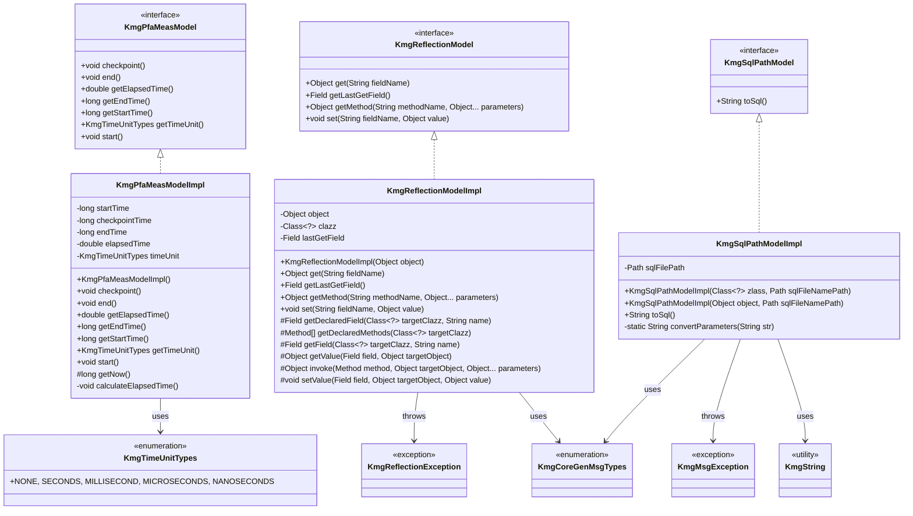
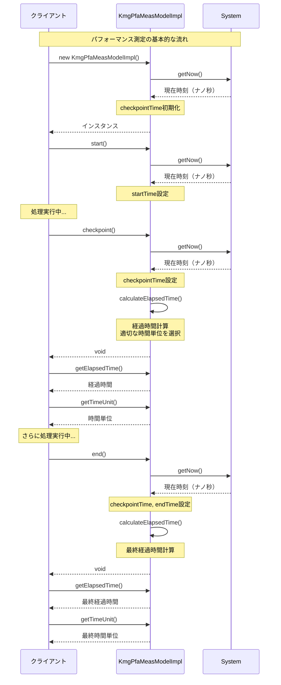
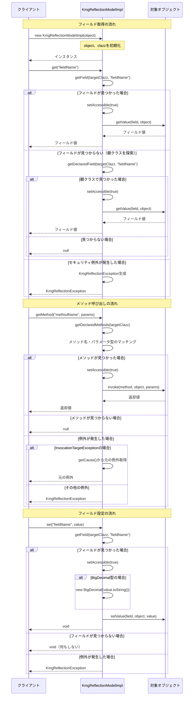
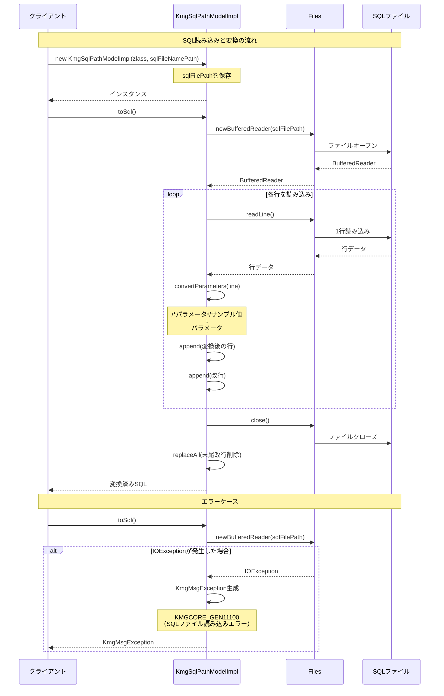

# インフラストラクチャ層モデル層実装層の設計書

## 1. クラス図



## 2. シーケンス図

### 2.1 パフォーマンス測定の流れ



### 2.2 リフレクション操作の流れ



### 2.3 SQL パスモデルの流れ



## 3. パッケージ概要

`kmg.core.infrastructure.model.impl` パッケージは、モデルインターフェースの具体的な実装を提供するパッケージです。

### 3.1 パッケージの役割

- **モデル実装の提供**: インフラストラクチャ層のモデルインターフェースに対する具体的な実装を提供します
- **ビジネスロジックからの分離**: 実装詳細をインターフェースの背後に隠蔽し、ビジネスロジックとの結合度を下げます
- **テスト容易性**: インターフェースベースの設計により、モック化やスタブ化が容易になります

### 3.2 パッケージ構成

```text
kmg.core.infrastructure.model.impl
├── KmgPfaMeasModelImpl.java      - パフォーマンス測定モデル実装
├── KmgReflectionModelImpl.java   - リフレクションモデル実装
├── KmgSqlPathModelImpl.java      - SQLパスモデル実装
└── package-info.java             - パッケージ情報
```

## 4. 主要クラス

### 4.1 KmgPfaMeasModelImpl

#### 4.1.1 概要

処理の実行時間を計測し、適切な時間単位で経過時間を提供するモデル実装クラスです。

#### 4.1.2 主な機能

- **計測開始**: `start()` メソッドで計測を開始
- **チェックポイント**: `checkpoint()` メソッドで途中経過を記録
- **計測終了**: `end()` メソッドで計測を終了
- **時間単位の自動選択**: 経過時間に応じて適切な単位（ナノ秒、マイクロ秒、ミリ秒、秒）を自動選択

#### 4.1.3 設計上の特徴

- システムの `nanoTime()` を使用し、高精度な時間計測を実現
- 経過時間の大きさに応じて自動的に時間単位を変換（1000 倍ごとに単位を変更）
- コンストラクタでチェックポイント時間を初期化し、即座に計測可能な状態を作成

#### 4.1.4 主要フィールド

- `startTime`: 計測開始時刻（ナノ秒）
- `checkpointTime`: チェックポイント時刻（ナノ秒）
- `endTime`: 計測終了時刻（ナノ秒）
- `elapsedTime`: 経過時間（自動選択された単位）
- `timeUnit`: 時間単位（`KmgTimeUnitTypes`）

#### 4.1.5 使用例

```java
// インスタンス生成（チェックポイント時間が初期化される）
KmgPfaMeasModelImpl measModel = new KmgPfaMeasModelImpl();

// 計測開始
measModel.start();

// 何らかの処理...

// 途中経過の確認
measModel.checkpoint();
double checkpointTime = measModel.getElapsedTime();
KmgTimeUnitTypes checkpointUnit = measModel.getTimeUnit();
System.out.println("途中経過: " + checkpointTime + " " + checkpointUnit.getUnitName());

// さらに処理...

// 計測終了
measModel.end();
double finalTime = measModel.getElapsedTime();
KmgTimeUnitTypes finalUnit = measModel.getTimeUnit();
System.out.println("最終経過時間: " + finalTime + " " + finalUnit.getUnitName());
```

### 4.2 KmgReflectionModelImpl

#### 4.2.1 概要

リフレクション API を使用してオブジェクトのフィールドやメソッドに安全にアクセスするためのモデル実装クラスです。

#### 4.2.2 主な機能

- **フィールド取得**: `get(String fieldName)` でフィールド値を取得
- **フィールド設定**: `set(String fieldName, Object value)` でフィールド値を設定
- **メソッド呼び出し**: `getMethod(String methodName, Object... parameters)` でメソッドを呼び出し
- **親クラス探索**: フィールドやメソッドが見つからない場合、親クラスまで探索
- **アクセス制御の解除**: private フィールド・メソッドへのアクセスを可能に
- **型変換サポート**: BigDecimal 型への自動変換をサポート

#### 4.2.3 設計上の特徴

- セキュリティ例外や不正アクセス例外を `KmgReflectionException` でラップし、詳細なエラー情報を提供
- InvocationTargetException の元の例外を適切に伝播
- protected メソッドを提供し、テストやカスタマイズを容易に

#### 4.2.4 主要フィールド

- `object`: 対象オブジェクト
- `clazz`: 対象クラス
- `lastGetField`: 最後に取得したフィールド（デバッグや検証に使用）

#### 4.2.5 例外処理

- `KmgReflectionException`: リフレクション操作で発生した例外をラップ
- メソッド呼び出し時の `InvocationTargetException` は元の例外を再スロー

#### 4.2.6 使用例

```java
// 対象オブジェクトでインスタンス生成
MyClass targetObject = new MyClass();
KmgReflectionModelImpl reflection = new KmgReflectionModelImpl(targetObject);

// フィールド値の取得
Object value = reflection.get("privateField");

// フィールド値の設定
reflection.set("privateField", "新しい値");

// メソッドの呼び出し
Object result = reflection.getMethod("privateMethod", "引数1", 123);

// 最後に取得したフィールドの確認
Field lastField = reflection.getLastGetField();
```

### 4.3 KmgSqlPathModelImpl

#### 4.3.1 概要

SQL ファイルを読み込み、パラメータ付き SQL に変換するモデル実装クラスです。

#### 4.3.2 主な機能

- **SQL ファイル読み込み**: 指定されたパスの SQL ファイルを読み込み
- **パラメータ変換**: コメント形式のパラメータ（`/*:param*/サンプル値`）を実際のパラメータ（`:param`）に変換
- **末尾改行削除**: 読み込んだ SQL の末尾改行を削除
- **エラーハンドリング**: ファイル読み込み失敗時に `KmgMsgException` をスロー

#### 4.3.3 設計上の特徴

- try-with-resources 構文でファイルリソースを自動的にクローズ
- 正規表現を使用した効率的なパラメータ抽出
- static メソッド `convertParameters()` で変換ロジックを分離

#### 4.3.4 主要フィールド

- `sqlFilePath`: SQL ファイルのパス

#### 4.3.5 定数

- `PARAM_EXTRACT_REGEX`: パラメータ抽出用の正規表現（`/\*(.+)\*/.*`）
- `PARAM_EXTRACT_REPLACE`: パラメータ抽出用の置換パターン（`$1`）
- `TRAILING_NEWLINE_REGEX`: 末尾改行削除用の正規表現（`\R+$`）

#### 4.3.6 変換例

```sql
-- 変換前
SELECT * FROM users WHERE id = /*:userId*/123 AND name = /*:userName*/'sample'

-- 変換後
SELECT * FROM users WHERE id = :userId AND name = :userName
```

#### 4.3.7 使用例

```java
// クラスとSQLファイル名でインスタンス生成
Path sqlFilePath = Paths.get("sql/sample.sql");
KmgSqlPathModelImpl sqlPath = new KmgSqlPathModelImpl(MyClass.class, sqlFilePath);

// SQLに変換
String sql = sqlPath.toSql();
System.out.println(sql);
```

## 5. 設計原則

### 5.1 インターフェース分離の原則

各実装クラスは対応するインターフェースを実装しており、インターフェースを通じてのみ公開機能を提供します。これにより：

- **実装の隠蔽**: 内部実装の詳細がクライアントから隠蔽される
- **テスト容易性**: モックやスタブの作成が容易
- **柔軟性**: 実装の変更や追加が容易

### 5.2 単一責任の原則

各クラスは明確に定義された単一の責任を持ちます：

- `KmgPfaMeasModelImpl`: パフォーマンス測定のみに専念
- `KmgReflectionModelImpl`: リフレクション操作のみに専念
- `KmgSqlPathModelImpl`: SQL 読み込みと変換のみに専念

### 5.3 例外処理の一貫性

すべての実装クラスで例外処理が一貫しています：

- チェック例外を適切な `KmgException` 系の例外でラップ
- 詳細なエラー情報（メッセージタイプ、引数）を提供
- 元の例外を cause として保持

### 5.4 リソース管理

リソースの適切な管理を実施しています：

- try-with-resources 構文の使用（`KmgSqlPathModelImpl`）
- 明示的なアクセス制御の設定と解除（`KmgReflectionModelImpl`）
- 適切なスコープでのフィールド管理

### 5.5 拡張性

将来の拡張を考慮した設計：

- protected メソッドの提供により、継承による拡張が可能
- static メソッドの分離により、再利用が容易
- 時間単位の自動選択など、柔軟な処理を実装

### 5.6 不変性の活用

可能な限り final フィールドを使用：

- `KmgReflectionModelImpl`: `object`, `clazz`
- `KmgSqlPathModelImpl`: `sqlFilePath`
- これにより、オブジェクトの状態が予測可能になり、スレッドセーフ性が向上

### 5.7 適切な可視性

メソッドとフィールドの可視性を適切に設定：

- public メソッド: インターフェースで定義された公開 API
- protected メソッド: 継承による拡張やテストのためのフック
- private フィールド・メソッド: 内部実装の詳細

## 6. 使用例

### 6.1 パフォーマンス測定の典型的な使用パターン

```java
public void performanceMonitoring() {
    // 1. インスタンス生成と計測開始
    KmgPfaMeasModelImpl measModel = new KmgPfaMeasModelImpl();
    measModel.start();

    // 2. 処理フェーズ1
    processPhase1();
    measModel.checkpoint();
    double phase1Time = measModel.getElapsedTime();
    KmgTimeUnitTypes phase1Unit = measModel.getTimeUnit();
    System.out.println("フェーズ1: " + phase1Time + " " + phase1Unit.getUnitName());

    // 3. 処理フェーズ2
    processPhase2();
    measModel.checkpoint();
    double phase2Time = measModel.getElapsedTime();
    KmgTimeUnitTypes phase2Unit = measModel.getTimeUnit();
    System.out.println("フェーズ2: " + phase2Time + " " + phase2Unit.getUnitName());

    // 4. 処理フェーズ3
    processPhase3();
    measModel.end();

    // 5. 最終結果の取得
    double totalTime = measModel.getElapsedTime();
    KmgTimeUnitTypes totalUnit = measModel.getTimeUnit();
    System.out.println("合計: " + totalTime + " " + totalUnit.getUnitName());

    // 開始・終了時刻の取得も可能
    long startTime = measModel.getStartTime();
    long endTime = measModel.getEndTime();
    System.out.println("開始時刻: " + startTime + " (ナノ秒)");
    System.out.println("終了時刻: " + endTime + " (ナノ秒)");
}
```

### 6.2 リフレクションによる動的なオブジェクト操作

```java
public void reflectionExample() throws KmgReflectionException, Exception {
    // 1. 対象オブジェクトの準備
    MyEntity entity = new MyEntity();

    // 2. リフレクションモデルの作成
    KmgReflectionModelImpl reflection = new KmgReflectionModelImpl(entity);

    // 3. プライベートフィールドへのアクセス
    Object id = reflection.get("id");
    System.out.println("ID: " + id);

    // 4. フィールド値の設定
    reflection.set("id", 12345L);
    reflection.set("name", "サンプル名");
    reflection.set("price", "1000.50"); // BigDecimalに自動変換

    // 5. プライベートメソッドの呼び出し
    Object result = reflection.getMethod("calculateTotal", 10, 100.0);
    System.out.println("計算結果: " + result);

    // 6. 最後に取得したフィールド情報の確認
    Field lastField = reflection.getLastGetField();
    if (lastField != null) {
        System.out.println("最後に取得したフィールド: " + lastField.getName());
        System.out.println("フィールドの型: " + lastField.getType().getName());
    }

    // 7. 親クラスのフィールドへのアクセスも可能
    Object baseField = reflection.get("baseField"); // 親クラスのフィールド
}
```

### 6.3 SQL ファイルの読み込みと変換

```java
public void sqlLoadingExample() throws KmgMsgException {
    // 1. SQLファイルパスの準備
    Path sqlFilePath = Paths.get("src/test/resources/sql/user_search.sql");

    // 2. KmgSqlPathModelImplのインスタンス生成
    KmgSqlPathModelImpl sqlPath = new KmgSqlPathModelImpl(this.getClass(), sqlFilePath);

    // 3. SQLの取得
    String sql = sqlPath.toSql();

    // 4. SQLの使用（例：JDBCで実行）
    System.out.println("変換後のSQL:");
    System.out.println(sql);

    // SQLファイルの例:
    // SELECT *
    // FROM users
    // WHERE id = /*:userId*/123
    //   AND name LIKE /*:userName*/'sample%'

    // 変換後のSQL:
    // SELECT *
    // FROM users
    // WHERE id = :userId
    //   AND name LIKE :userName
}
```

### 6.4 エラーハンドリングの例

```java
public void errorHandlingExample() {
    // 6.4.1 リフレクション例外のハンドリング
    try {
        KmgReflectionModelImpl reflection = new KmgReflectionModelImpl(myObject);
        reflection.get("nonExistentField");
    } catch (KmgReflectionException e) {
        // エラー情報の取得
        KmgCmnExcMsgTypes msgType = e.getMessageTypes();
        Object[] msgArgs = e.getMessageArgs();
        String message = e.getMessage();

        // ログ出力
        System.err.println("リフレクションエラー: " + message);
        System.err.println("メッセージタイプ: " + msgType.getCode());

        // 元の例外の取得
        Throwable cause = e.getCause();
        if (cause != null) {
            cause.printStackTrace();
        }
    }

    // 6.4.2 SQL読み込み例外のハンドリング
    try {
        Path invalidPath = Paths.get("invalid/path/to/sql.sql");
        KmgSqlPathModelImpl sqlPath = new KmgSqlPathModelImpl(this.getClass(), invalidPath);
        sqlPath.toSql();
    } catch (KmgMsgException e) {
        // エラー情報の取得
        KmgCmnExcMsgTypes msgType = e.getMessageTypes();
        Object[] msgArgs = e.getMessageArgs();

        // KMGCORE_GEN11100: SQLファイル読み込みエラー
        System.err.println("SQLファイル読み込みエラー: " + e.getMessage());
        System.err.println("ファイルパス: " + msgArgs[0]);
    }

    // 6.4.3 メソッド呼び出し時の元の例外の処理
    try {
        KmgReflectionModelImpl reflection = new KmgReflectionModelImpl(myObject);
        reflection.getMethod("methodThatThrowsException", "param1");
    } catch (KmgReflectionException e) {
        // リフレクション自体のエラー
        System.err.println("リフレクションエラー: " + e.getMessage());
    } catch (Exception e) {
        // メソッド内で発生した元の例外
        System.err.println("メソッド実行中のエラー: " + e.getMessage());
    }
}
```

### 6.5 複合的な使用例

```java
public void complexExample() throws Exception {
    // パフォーマンス測定とリフレクションの組み合わせ
    KmgPfaMeasModelImpl measModel = new KmgPfaMeasModelImpl();
    measModel.start();

    // 1. SQLの読み込み（パフォーマンス測定）
    Path sqlFilePath = Paths.get("sql/complex_query.sql");
    KmgSqlPathModelImpl sqlPath = new KmgSqlPathModelImpl(this.getClass(), sqlFilePath);
    String sql = sqlPath.toSql();

    measModel.checkpoint();
    System.out.println("SQL読み込み時間: " + measModel.getElapsedTime() + " "
                      + measModel.getTimeUnit().getUnitName());

    // 2. リフレクションによるオブジェクト操作（パフォーマンス測定）
    List<MyEntity> entities = new ArrayList<>();
    for (int i = 0; i < 1000; i++) {
        MyEntity entity = new MyEntity();
        KmgReflectionModelImpl reflection = new KmgReflectionModelImpl(entity);
        reflection.set("id", i);
        reflection.set("name", "Entity_" + i);
        entities.add(entity);
    }

    measModel.checkpoint();
    System.out.println("エンティティ生成時間: " + measModel.getElapsedTime() + " "
                      + measModel.getTimeUnit().getUnitName());

    // 3. データ処理（パフォーマンス測定）
    for (MyEntity entity : entities) {
        KmgReflectionModelImpl reflection = new KmgReflectionModelImpl(entity);
        Object result = reflection.getMethod("process");
    }

    measModel.end();
    System.out.println("合計処理時間: " + measModel.getElapsedTime() + " "
                      + measModel.getTimeUnit().getUnitName());
}
```

## 7. テスト戦略

### 7.1 単体テスト

各実装クラスに対して以下のテストを実施：

- **正常系テスト**: 基本的な機能が正しく動作することを確認
- **異常系テスト**: 例外が適切にスローされることを確認
- **境界値テスト**: 境界条件での動作を確認

### 7.2 KmgPfaMeasModelImpl のテスト観点

- 計測開始・終了・チェックポイントの正常動作
- 時間単位の自動選択（ナノ秒 → マイクロ秒 → ミリ秒 → 秒）
- 複数回のチェックポイント呼び出し
- 経過時間の計算精度

### 7.3 KmgReflectionModelImpl のテスト観点

- public フィールドへのアクセス
- private フィールドへのアクセス
- 親クラスのフィールドへのアクセス
- メソッド呼び出し（引数あり・なし）
- BigDecimal 型の自動変換
- 存在しないフィールド・メソッドへのアクセス
- 各種例外のハンドリング

### 7.4 KmgSqlPathModelImpl のテスト観点

- 正常な SQL ファイルの読み込み
- パラメータ変換の正確性
- 末尾改行の削除
- 存在しないファイルの処理
- 空のファイルの処理
- 複数行の SQL の処理

## 8. パフォーマンス考慮事項

### 8.1 KmgPfaMeasModelImpl

- `System.nanoTime()`の呼び出しオーバーヘッドは非常に小さい
- 時間単位の計算は単純な除算のみで、パフォーマンスへの影響は最小限

### 8.2 KmgReflectionModelImpl

- リフレクション操作は通常のフィールドアクセスと比較してオーバーヘッドがある
- 頻繁に呼び出される処理での使用は避けるべき
- 親クラスの探索は継承階層に比例してコストが増加
- `setAccessible(true)`は一度のみ実行されるため、複数回のアクセスでは効率的

### 8.3 KmgSqlPathModelImpl

- ファイル I/O のコストが主要なパフォーマンス要因
- 大きな SQL ファイルの場合、メモリ使用量に注意
- 正規表現の処理コストは行数に比例

## 9. 今後の拡張可能性

### 9.1 KmgPfaMeasModelImpl

- スレッドセーフなバージョンの実装
- 複数の測定ポイントを名前付きで管理する機能
- 統計情報（平均、最大、最小）の収集機能

### 9.2 KmgReflectionModelImpl

- アノテーションベースのフィールド探索
- キャッシュ機構の導入（フィールド・メソッドの探索結果をキャッシュ）
- ジェネリクス型の完全なサポート

### 9.3 KmgSqlPathModelImpl

- 複数のパラメータ形式のサポート
- SQL テンプレートエンジンとの統合
- キャッシュ機構の導入（読み込み済み SQL のキャッシュ）

## 10. 関連ドキュメント

- [コア全体の設計書](./コア全体の設計書.md)
- [インフラストラクチャ層の設計書](./インフラストラクチャ層の設計書.md)
- [インフラストラクチャ層例外処理層の設計書](./インフラストラクチャ層例外処理層の設計書.md)
- [インフラストラクチャ層共通層の設計書](./インフラストラクチャ層共通層の設計書.md)
