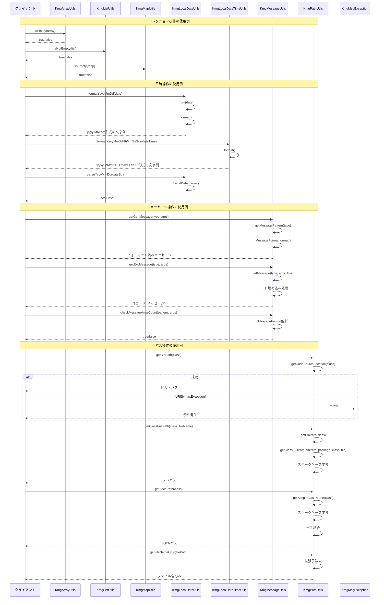

# インフラストラクチャ層ユーティリティ層の設計書

## 1. クラス図

```mermaid
classDiagram
    %% ユーティリティクラス群
    class KmgArrayUtils {
        <<utility>>
        +static boolean isEmpty(Object[] target)
        +static boolean isNotEmpty(Object[] target)
        -KmgArrayUtils()
    }

    class KmgListUtils {
        <<utility>>
        +static boolean isEmpty(List~?~ target)
        +static boolean isNotEmpty(List~?~ target)
        -KmgListUtils()
    }

    class KmgMapUtils {
        <<utility>>
        +static boolean isEmpty(Map~?,?~ target)
        +static boolean isNotEmpty(Map~?,?~ target)
        -KmgMapUtils()
    }

    class KmgLocalDateUtils {
        <<utility>>
        -static String FORMATTER_PATTERN_YYYY_MM_DD
        +static String formatYyyyMmDd(Date date)
        +static String formatYyyyMmDd(LocalDate localDate)
        +static LocalDate from(Date date)
        +static LocalDate parseYyyyMmDd(String dateStr)
        -KmgLocalDateUtils()
    }

    class KmgLocalDateTimeUtils {
        <<utility>>
        -static String FORMATTER_PATTERN_YYYY_MM_DD_HH_MM_SS_SSS
        +static String formatYyyyMmDdHhMmSsSss(Date date)
        +static String formatYyyyMmDdHhMmSsSss(LocalDateTime localDateTime)
        +static LocalDateTime from(Date date)
        +static LocalDate parseYyyyMmDdHhMmSsSss(String dateTimeStr)
        -KmgLocalDateTimeUtils()
    }

    class KmgMessageUtils {
        <<utility>>
        -static String CODE_EMBEDDING_FORMAT
        -static Map~String,ResourceBundle~ bundleMap
        -static String[] PROPERTY_FILES
        +static boolean checkMessageArgsCount(String messagePattern, Object[] messageArgs)
        +static String getExcMessage(KmgCmnExcMsgTypes type)
        +static String getExcMessage(KmgCmnExcMsgTypes type, Object[] args)
        +static String getGenMessage(KmgCmnGenMsgTypes type)
        +static String getGenMessage(KmgCmnGenMsgTypes type, Object[] messageArgs)
        +static String getLogMessage(KmgCmnLogMsgTypes type)
        +static String getLogMessage(KmgCmnLogMsgTypes type, Object[] messageArgs)
        +static String getMessage(KmgCmnGenMsgTypes type, Object[] messageArgs)
        +static String getMessage(KmgCmnMsgTypes type, Object[] messageArgs, boolean codeEmbeddingFlag)
        +static int getMessageArgsCount(String messagePattern)
        +static String getMessagePattern(KmgCmnMsgTypes type)
        -KmgMessageUtils()
    }

    class KmgPathUtils {
        <<utility>>
        -static String PROXY_CLASS_SEPARATOR
        -static char INNER_CLASS_SEPARATOR
        -static char FILE_EXTENSION_SEPARATOR
        -static char PATH_SEPARATOR
        -static String PATH_SEPARATOR_STR
        -static String CLASS_PATH_FORMAT
        +static Path getBinPath(Class~?~ zlass)
        +static Path getBinPath(Object obj)
        +static Path getClassFullPath(Class~?~ zlass, Path fileName)
        +static Path getClassFullPath(Object object, String fileName)
        +static String getFileNameOnly(Path filePath)
        +static Path getFqcnPath(Class~?~ zlass)
        +static String getSimpleClassName(Class~?~ zlass)
        #static Path getCodeSourceLocation(Class~?~ zlass)
        -static Path getClassFullPath(Path binPath, String packageName, String className, Path fileName)
        -KmgPathUtils()
    }

    %% 依存関係
    KmgMessageUtils --> KmgArrayUtils : uses
    KmgLocalDateUtils --> KmgString : uses
    KmgLocalDateTimeUtils --> KmgString : uses
    KmgPathUtils --> KmgString : uses
    KmgPathUtils --> KmgMsgException : throws
    KmgMessageUtils --> KmgCmnMsgTypes : uses
    KmgMessageUtils --> KmgCmnExcMsgTypes : uses
    KmgMessageUtils --> KmgCmnGenMsgTypes : uses
    KmgMessageUtils --> KmgCmnLogMsgTypes : uses

    %% 外部依存クラス（参考）
    class KmgString {
        <<type>>
    }

    class KmgMsgException {
        <<exception>>
    }

    class KmgCmnMsgTypes {
        <<interface>>
    }

    class KmgCmnExcMsgTypes {
        <<interface>>
    }

    class KmgCmnGenMsgTypes {
        <<interface>>
    }

    class KmgCmnLogMsgTypes {
        <<interface>>
    }
```



## 2. シーケンス図



## 3. パッケージ構造

utils パッケージは以下の機能別にユーティリティクラスを提供しています：

### 3.1 コレクション操作

- **KmgArrayUtils**: 配列の操作ユーティリティ

  - 配列の空判定（isEmpty、isNotEmpty）

- **KmgListUtils**: リストの操作ユーティリティ

  - リストの空判定（isEmpty、isNotEmpty）

- **KmgMapUtils**: マップの操作ユーティリティ
  - マップの空判定（isEmpty、isNotEmpty）

### 3.2 日時操作

- **KmgLocalDateUtils**: ローカル日付の操作ユーティリティ

  - 日付フォーマット（yyyy/MM/dd）
  - 日付パース
  - Date ↔ LocalDate 変換

- **KmgLocalDateTimeUtils**: ローカル日時の操作ユーティリティ
  - 日時フォーマット（yyyy/MM/dd HH:mm:ss.SSS）
  - 日時パース
  - Date ↔ LocalDateTime 変換

### 3.3 メッセージ操作

- **KmgMessageUtils**: メッセージの操作ユーティリティ
  - プロパティファイルからのメッセージ取得
  - メッセージパターンの引数置換
  - 例外用メッセージ（コード埋め込み）
  - 一般メッセージ
  - ログメッセージ
  - メッセージ引数数のチェック

### 3.4 パス操作

- **KmgPathUtils**: パスの操作ユーティリティ
  - ビルドパスの取得
  - クラスのフルパス取得
  - FQCN パスの取得
  - ファイル名のみの抽出
  - シンプルなクラス名の取得
  - プロキシクラス/内部クラスの処理

## 4. 主要コンポーネント

### 4.1 コレクション操作ユーティリティ

#### 4.1.1 KmgArrayUtils

配列の操作に関する基本的なユーティリティメソッドを提供します。

**主な機能:**

- **isEmpty()**: 配列が null または空の場合に true を返す
- **isNotEmpty()**: 配列が存在し要素がある場合に true を返す

**特徴:**

- null セーフな実装
- 統一的な判定ロジック

#### 4.1.2 KmgListUtils

リストの操作に関する基本的なユーティリティメソッドを提供します。

**主な機能:**

- **isEmpty()**: リストが null または空の場合に true を返す
- **isNotEmpty()**: リストが存在し要素がある場合に true を返す

**特徴:**

- ジェネリクスによる型安全性
- null セーフな実装

#### 4.1.3 KmgMapUtils

マップの操作に関する基本的なユーティリティメソッドを提供します。

**主な機能:**

- **isEmpty()**: マップが null または空の場合に true を返す
- **isNotEmpty()**: マップが存在し要素がある場合に true を返す

**特徴:**

- ジェネリクスによる型安全性
- null セーフな実装

### 4.2 日時操作ユーティリティ

#### 4.2.1 KmgLocalDateUtils

ローカル日付の操作に関するユーティリティメソッドを提供します。

**主な機能:**

- **formatYyyyMmDd()**: Date または LocalDate を"yyyy/MM/dd"形式にフォーマット
- **parseYyyyMmDd()**: "yyyy/MM/dd"形式の文字列を LocalDate に変換
- **from()**: Date を LocalDate に変換

**特徴:**

- 統一的な日付フォーマット
- null セーフな実装
- 日本で一般的な"/"区切り形式

#### 4.2.2 KmgLocalDateTimeUtils

ローカル日時の操作に関するユーティリティメソッドを提供します。

**主な機能:**

- **formatYyyyMmDdHhMmSsSss()**: Date または LocalDateTime を"yyyy/MM/dd HH:mm:ss.SSS"形式にフォーマット
- **parseYyyyMmDdHhMmSsSss()**: "yyyy/MM/dd HH:mm:ss.SSS"形式の文字列を LocalDate に変換
- **from()**: Date を LocalDateTime に変換

**特徴:**

- ミリ秒まで対応した精密な日時フォーマット
- null セーフな実装
- システムデフォルトタイムゾーンを使用

### 4.3 メッセージ操作ユーティリティ

#### 4.3.1 KmgMessageUtils

プロパティファイルからのメッセージ取得と整形を行うユーティリティです。

**主な機能:**

- **getGenMessage()**: 一般メッセージの取得（コード埋め込みなし）
- **getExcMessage()**: 例外用メッセージの取得（コード埋め込みあり）
- **getLogMessage()**: ログメッセージの取得（コード埋め込みあり）
- **getMessage()**: 汎用メッセージ取得（コード埋め込みフラグ指定可能）
- **checkMessageArgsCount()**: メッセージパターンと引数数の整合性チェック
- **getMessageArgsCount()**: メッセージパターンの引数数取得
- **getMessagePattern()**: メッセージパターンの取得

**特徴:**

- 複数のプロパティファイルに対応（kmg-core-messages、kmg-core-messages-log）
- MessageFormat による引数置換
- コード埋め込み機能（"[コード] メッセージ"形式）
- ResourceBundle の静的初期化によるパフォーマンス向上
- null セーフな実装

**メッセージ形式:**

- 一般メッセージ: "メッセージ内容"
- 例外/ログメッセージ: "[E001] メッセージ内容"

### 4.4 パス操作ユーティリティ

#### 4.4.1 KmgPathUtils

ファイルパスの操作とクラス関連パス処理を行うユーティリティです。

**主な機能:**

- **getBinPath()**: クラスまたはオブジェクトのビルドパスを取得
- **getClassFullPath()**: クラスとファイル名からフルパスを生成
- **getFqcnPath()**: FQCN（完全修飾クラス名）のパスを取得
- **getFileNameOnly()**: ファイルパスから拡張子を除いたファイル名のみを抽出
- **getSimpleClassName()**: プロキシクラスに対応したシンプルなクラス名を取得

**特徴:**

- クラスベースのパス生成
- スネークケース変換によるディレクトリ構造の生成
- プロキシクラス（$$）対応
- 内部クラス（$）対応
- パッケージパス変換（. → /）
- null セーフな実装

**パス生成例:**

- パッケージ: `com.sample`
- クラス: `SampleDao`
- ファイル名: `sample.sql`
- 生成パス: `ビルドパス/com/sample/sample_dao/sample.sql`

## 5. 設計原則

### 5.1 ユーティリティクラスの原則

- **静的メソッドのみ**: 全てのユーティリティメソッドは static で提供
- **インスタンス化不可**: private コンストラクタによりインスタンス化を防止
- **final クラス**: 継承を禁止し、設計の一貫性を保持

### 5.2 null セーフティ

- **null 引数の許容**: 全てのメソッドで null 引数を許容
- **適切な null 戻り値**: null が渡された場合は適切な null またはデフォルト値を返す
- **例外の最小化**: 可能な限り例外を投げずに処理

### 5.3 一貫性

- **命名規則の統一**: isEmpty/isNotEmpty など、統一的なメソッド名
- **戻り値の統一**: 同種のメソッドは同じ型の戻り値
- **引数の順序統一**: 類似メソッド間で引数の順序を統一

### 5.4 再利用性

- **汎用的な実装**: 特定のドメインに依存しない汎用的な実装
- **オーバーロード**: 複数の入力形式に対応
- **型パラメータ**: ジェネリクスによる柔軟な型対応

### 5.5 パフォーマンス

- **静的初期化**: ResourceBundle など頻繁に使用するリソースは静的に初期化
- **不要な処理の回避**: 早期リターンによる不要な処理の回避
- **効率的なアルゴリズム**: シンプルで効率的な実装

### 5.6 例外処理

- **最小限の例外**: 可能な限り例外を投げない設計
- **明確な例外**: 例外が必要な場合は明確なメッセージを持つ KmgMsgException を使用
- **原因の保持**: 元の例外を原因として保持

## 6. 使用例

### 6.1 コレクション操作

#### 配列の空判定

```java
String[] array = getArray();
if (KmgArrayUtils.isEmpty(array)) {
    // 配列が空またはnullの場合の処理
}

if (KmgArrayUtils.isNotEmpty(array)) {
    // 配列に要素がある場合の処理
}
```

#### リストの空判定

```java
List<String> list = getList();
if (KmgListUtils.isNotEmpty(list)) {
    // リストに要素がある場合の処理
    list.forEach(System.out::println);
}
```

#### マップの空判定

```java
Map<String, Object> map = getMap();
if (KmgMapUtils.isEmpty(map)) {
    // マップが空またはnullの場合の処理
    map = new HashMap<>();
}
```

### 6.2 日時操作

#### 日付のフォーマット

```java
Date date = new Date();
String dateStr = KmgLocalDateUtils.formatYyyyMmDd(date);
// 結果: "2024/01/15"

LocalDate localDate = LocalDate.now();
String dateStr2 = KmgLocalDateUtils.formatYyyyMmDd(localDate);
// 結果: "2024/01/15"
```

#### 日時のフォーマット

```java
Date date = new Date();
String dateTimeStr = KmgLocalDateTimeUtils.formatYyyyMmDdHhMmSsSss(date);
// 結果: "2024/01/15 14:30:45.123"

LocalDateTime localDateTime = LocalDateTime.now();
String dateTimeStr2 = KmgLocalDateTimeUtils.formatYyyyMmDdHhMmSsSss(localDateTime);
// 結果: "2024/01/15 14:30:45.123"
```

#### 日付のパース

```java
String dateStr = "2024/01/15";
LocalDate localDate = KmgLocalDateUtils.parseYyyyMmDd(dateStr);
```

#### Date 変換

```java
Date date = new Date();
LocalDate localDate = KmgLocalDateUtils.from(date);
LocalDateTime localDateTime = KmgLocalDateTimeUtils.from(date);
```

### 6.3 メッセージ操作

#### 一般メッセージの取得

```java
// 引数なし
String message = KmgMessageUtils.getGenMessage(KmgCoreGenMsgTypes.KMGCORE_GEN10001);
// 結果: "処理を開始します。"

// 引数あり
Object[] args = { "ユーザー登録" };
String message2 = KmgMessageUtils.getGenMessage(KmgCoreGenMsgTypes.KMGCORE_GEN10002, args);
// 結果: "ユーザー登録処理を開始します。"
```

#### 例外用メッセージの取得

```java
// コードが埋め込まれる
Object[] args = { "ファイルパス" };
String message = KmgMessageUtils.getExcMessage(KmgCoreExcMsgTypes.KMGCORE_EXC20001, args);
// 結果: "[E20001] ファイルパスが見つかりません。"
```

#### ログメッセージの取得

```java
Object[] args = { "データベース接続", "3.5秒" };
String message = KmgMessageUtils.getLogMessage(KmgCoreLogMsgTypes.KMGCORE_LOG30001, args);
// 結果: "[L30001] データベース接続処理が完了しました。処理時間: 3.5秒"
```

#### メッセージ引数数のチェック

```java
String pattern = "処理{0}を{1}で実行しました。";
Object[] args = { "登録", "成功" };
boolean isValid = KmgMessageUtils.checkMessageArgsCount(pattern, args);
// 結果: true（パターンの引数数2と実際の引数数2が一致）
```

### 6.4 パス操作

#### ビルドパスの取得

```java
// クラスから取得
Path binPath = KmgPathUtils.getBinPath(MyClass.class);
// 結果: /path/to/build/classes

// オブジェクトから取得
Object obj = new MyClass();
Path binPath2 = KmgPathUtils.getBinPath(obj);
// 結果: /path/to/build/classes
```

#### クラスのフルパスの取得

```java
// パッケージ: com.sample, クラス: SampleDao, ファイル: sample.sql
Path fullPath = KmgPathUtils.getClassFullPath(SampleDao.class, Paths.get("sample.sql"));
// 結果: /build/path/com/sample/sample_dao/sample.sql

// オブジェクトから取得
Object dao = new SampleDao();
Path fullPath2 = KmgPathUtils.getClassFullPath(dao, "sample.sql");
// 結果: /build/path/com/sample/sample_dao/sample.sql
```

#### FQCN パスの取得

```java
// パッケージ: com.sample, クラス: SampleDao
Path fqcnPath = KmgPathUtils.getFqcnPath(SampleDao.class);
// 結果: com/sample/sample_dao
```

#### ファイル名のみの取得

```java
Path filePath = Paths.get("/path/to/file/sample.txt");
String fileName = KmgPathUtils.getFileNameOnly(filePath);
// 結果: "sample"
```

#### シンプルなクラス名の取得

```java
// 通常のクラス
String className = KmgPathUtils.getSimpleClassName(MyClass.class);
// 結果: "MyClass"

// プロキシクラス（MyClass$$EnhancerByCGLIB$$12345など）
String className2 = KmgPathUtils.getSimpleClassName(proxyClass);
// 結果: "MyClass"（$$以降が除去される）
```

### 6.5 組み合わせ使用例

#### SQL ファイルの読み込み

```java
// DAOクラスに対応するSQLファイルのパスを取得
Path sqlPath = KmgPathUtils.getClassFullPath(UserDao.class, Paths.get("select_user.sql"));
// 結果: /build/path/com/sample/dao/user_dao/select_user.sql

// ファイル読み込み処理...
```

#### ログ出力とメッセージ整形

```java
List<String> results = getResults();
if (KmgListUtils.isNotEmpty(results)) {
    Object[] args = { results.size() };
    String message = KmgMessageUtils.getLogMessage(
        KmgCoreLogMsgTypes.KMGCORE_LOG30002, args);
    logger.info(message);
    // ログ出力: "[L30002] 検索結果: 10件"
}
```

#### 日付フォーマットとメッセージ組み込み

```java
Date processDate = new Date();
String dateStr = KmgLocalDateTimeUtils.formatYyyyMmDdHhMmSsSss(processDate);

Object[] args = { dateStr, "正常終了" };
String message = KmgMessageUtils.getLogMessage(
    KmgCoreLogMsgTypes.KMGCORE_LOG30003, args);
// 結果: "[L30003] 処理完了: 2024/01/15 14:30:45.123 - 正常終了"
```

## 7. 依存関係

### 7.1 内部依存

utils パッケージ内の依存関係：

- **KmgMessageUtils** → KmgArrayUtils（配列の空判定に使用）
- **KmgLocalDateUtils** → KmgString（文字列操作に使用）
- **KmgLocalDateTimeUtils** → KmgString（文字列操作に使用）
- **KmgPathUtils** → KmgString（文字列操作に使用）

### 7.2 外部依存

他の kmg-core パッケージへの依存：

- **KmgPathUtils** → KmgMsgException（例外スロー）
- **KmgMessageUtils** → KmgCmnMsgTypes、KmgCmnExcMsgTypes、KmgCmnGenMsgTypes、KmgCmnLogMsgTypes（メッセージタイプ）
- **KmgLocalDateUtils** → KmgString（文字列ユーティリティ）
- **KmgLocalDateTimeUtils** → KmgString（文字列ユーティリティ）
- **KmgPathUtils** → KmgString（文字列ユーティリティ）

### 7.3 標準ライブラリ依存

- **java.util**: List、Map、Date、ResourceBundle、MessageFormat
- **java.time**: LocalDate、LocalDateTime、ZoneId、DateTimeFormatter
- **java.nio.file**: Path、Paths
- **java.text**: MessageFormat

## 8. テスト方針

### 8.1 コレクション操作のテスト

- null 値の処理
- 空のコレクションの処理
- 要素を持つコレクションの処理
- 境界値テスト

### 8.2 日時操作のテスト

- null 値の処理
- 正常な日時のフォーマット
- 日時のパース
- タイムゾーンの考慮
- フォーマットパターンの検証

### 8.3 メッセージ操作のテスト

- メッセージパターンの取得
- 引数置換の検証
- コード埋め込みの検証
- 引数数チェックの検証
- 複数プロパティファイルの検証

### 8.4 パス操作のテスト

- ビルドパスの取得
- フルパスの生成
- ファイル名抽出
- プロキシクラスの処理
- 内部クラスの処理
- 例外処理の検証

## 9. 注意事項

### 9.1 スレッドセーフティ

- 全てのユーティリティクラスはステートレスで、スレッドセーフです
- KmgMessageUtils の静的フィールド（bundleMap）は初期化後不変であり、スレッドセーフです

### 9.2 パフォーマンス

- ResourceBundle は静的に初期化されるため、初回アクセス時のみコストが発生します
- 日時フォーマットは毎回 DateTimeFormatter を生成しますが、パターンが固定のため最適化の余地があります

### 9.3 拡張性

- 新しいメッセージプロパティファイルを追加する場合は、PROPERTY_FILES 配列に追加します
- 新しい日時フォーマットが必要な場合は、対応するメソッドを追加します

### 9.4 制限事項

- KmgLocalDateTimeUtils.parseYyyyMmDdHhMmSsSss()の戻り値が LocalDate になっている点は、LocalDateTime の誤りと思われます
- プロキシクラスの処理は"$$"区切りのみに対応しています
