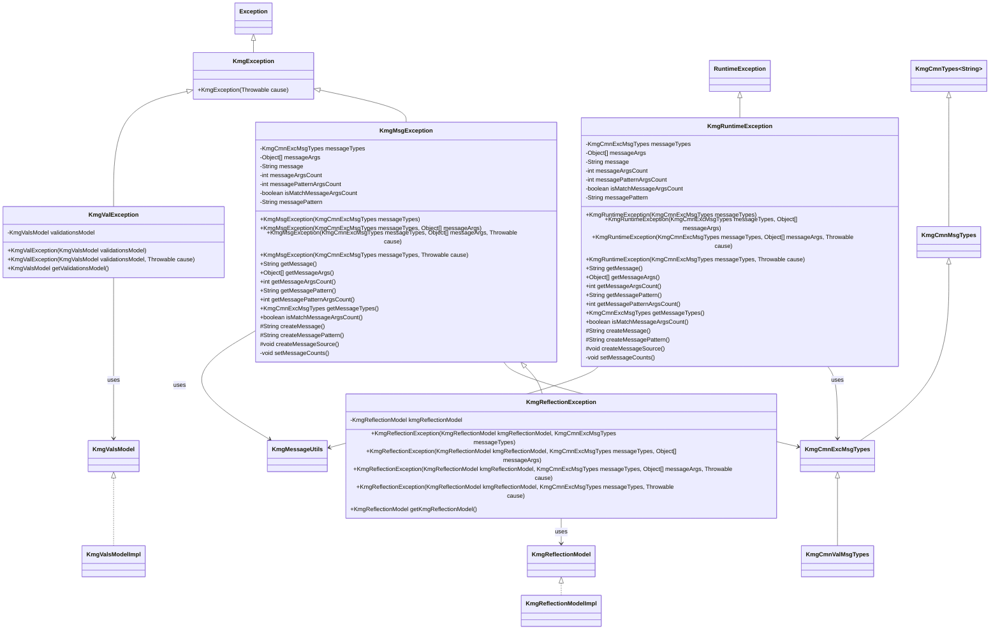
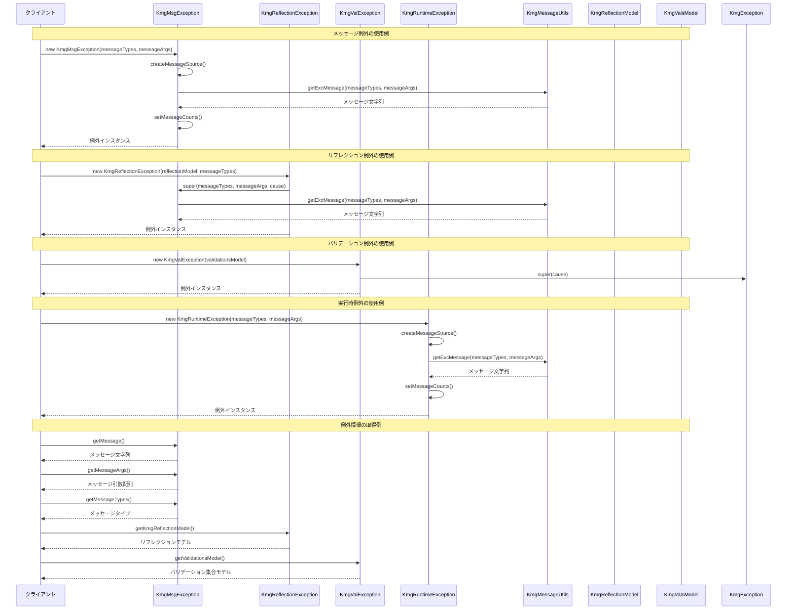

# インフラストラクチャ層例外処理層の設計書

## 1. クラス図



## 2. シーケンス図



## 3. パッケージ構造

`kmg.core.infrastructure.exception` パッケージは以下の構造で構成されています：

### 3.1 基底例外クラス

- **KmgException**: すべての KMG 例外の基底クラス
  - 原因となる例外を保持
  - チェック例外として設計

### 3.2 メッセージ付き例外クラス

- **KmgMsgException**: メッセージ付き例外（チェック例外）

  - メッセージタイプと引数による詳細なエラー情報
  - メッセージ引数の数とパターンの整合性チェック
  - 国際化対応のメッセージ生成

- **KmgRuntimeException**: メッセージ付き実行時例外
  - KmgMsgException と同様の機能を実行時例外として提供
  - アプリケーションの実行中に発生するエラーに使用

### 3.3 特殊化された例外クラス

- **KmgReflectionException**: リフレクション操作時の例外

  - リフレクションモデルを保持
  - リフレクション操作の詳細情報を提供

- **KmgValException**: バリデーション例外
  - バリデーション集合モデルを保持
  - 複数のバリデーションエラーを一括管理

## 4. 主要コンポーネント

### 4.1 例外階層システム

kmg-core の例外処理システムは階層的な設計を採用しています：

1. **KmgException**: 基底例外クラス

   - すべての KMG 例外の親クラス
   - 原因となる例外を保持

2. **KmgMsgException**: メッセージ付き例外（チェック例外）

   - メッセージタイプと引数による詳細なエラー情報
   - 国際化対応のメッセージ生成
   - メッセージ引数の整合性チェック

3. **KmgRuntimeException**: メッセージ付き実行時例外

   - KmgMsgException と同様の機能を実行時例外として提供
   - アプリケーションの実行中に発生するエラーに使用

4. **KmgReflectionException**: リフレクション例外

   - リフレクション操作時の詳細情報を提供
   - リフレクションモデルを保持

5. **KmgValException**: バリデーション例外
   - バリデーションエラーの集合管理
   - 複数のバリデーションエラーを一括処理

### 4.2 メッセージ処理システム

`KmgMsgException`と`KmgRuntimeException`は高度なメッセージ処理機能を提供します：

#### 4.2.1 メッセージ生成

- `KmgMessageUtils.getExcMessage()`を使用したメッセージ生成
- メッセージタイプと引数による動的なメッセージ作成
- 国際化対応のメッセージ処理

#### 4.2.2 引数整合性チェック

- メッセージ引数の数とパターンの整合性を自動チェック
- `isMatchMessageArgsCount()`による整合性確認
- デバッグ時のメッセージ引数不整合の早期発見

#### 4.2.3 メッセージ情報の提供

- `getMessage()`: 生成されたメッセージ文字列
- `getMessageArgs()`: メッセージ引数配列
- `getMessageTypes()`: メッセージタイプ
- `getMessagePattern()`: メッセージパターン
- `getMessageArgsCount()`: メッセージ引数の数
- `getMessagePatternArgsCount()`: メッセージパターンの引数の数

### 4.3 特殊化された例外機能

#### 4.3.1 リフレクション例外

`KmgReflectionException`はリフレクション操作の詳細情報を提供：

- **リフレクションモデルの保持**: `getKmgReflectionModel()`
- **リフレクション操作のコンテキスト情報**: どのオブジェクトでエラーが発生したかを追跡
- **デバッグ支援**: リフレクション操作の詳細なエラー情報

#### 4.3.2 バリデーション例外

`KmgValException`はバリデーションエラーの集合管理を提供：

- **バリデーション集合モデルの保持**: `getValidationsModel()`
- **複数エラーの一括管理**: 複数のバリデーションエラーを一つの例外で処理
- **バリデーション結果の詳細情報**: 各バリデーションエラーの詳細情報

## 5. 設計原則

### 5.1 例外の階層化

- **単一責任の原則**: 各例外クラスは特定の用途に特化
- **継承による機能拡張**: 基底クラスの機能を継承しつつ、特殊化
- **適切な例外の使い分け**: チェック例外と実行時例外の適切な選択

### 5.2 メッセージ処理の統一性

- **統一されたメッセージ形式**: すべてのメッセージ付き例外で同じ形式
- **国際化対応**: メッセージの国際化に対応
- **引数整合性の保証**: メッセージ引数の整合性を自動チェック

### 5.3 デバッグ支援

- **詳細なエラー情報**: 例外発生時の詳細なコンテキスト情報
- **メッセージ引数の検証**: メッセージ引数の不整合を早期発見
- **関連モデルの保持**: 例外発生に関連するモデル情報の保持

### 5.4 拡張性

- **新たな例外タイプの追加**: 基底クラスを継承した新たな例外の追加が容易
- **メッセージタイプの拡張**: 新しいメッセージタイプの追加に対応
- **特殊化された例外の追加**: 特定用途向けの例外クラスの追加

## 6. 使用例

### 6.1 基本的なメッセージ例外

```java
// メッセージタイプのみで例外を作成
KmgMsgException exception1 = new KmgMsgException(KmgCmnExcMsgTypes.ERROR_OCCURRED);

// メッセージ引数付きで例外を作成
Object[] args = {"ファイル名", "読み込みエラー"};
KmgMsgException exception2 = new KmgMsgException(KmgCmnExcMsgTypes.FILE_READ_ERROR, args);

// 原因付きで例外を作成
KmgMsgException exception3 = new KmgMsgException(KmgCmnExcMsgTypes.ERROR_OCCURRED, cause);
```

### 6.2 リフレクション例外

```java
// リフレクション操作でエラーが発生した場合
KmgReflectionModel reflectionModel = new KmgReflectionModelImpl(targetObject);
try {
    Object value = reflectionModel.get("fieldName");
} catch (KmgReflectionException e) {
    // リフレクションモデルを取得してデバッグ情報を確認
    KmgReflectionModel model = e.getKmgReflectionModel();
    // エラー処理
}
```

### 6.3 バリデーション例外

```java
// バリデーション処理
KmgValsModel validations = new KmgValsModelImpl();
// バリデーション処理...
if (validations.isNotEmpty()) {
    throw new KmgValException(validations);
}

// バリデーション例外の処理
try {
    // バリデーション処理
} catch (KmgValException e) {
    KmgValsModel validationErrors = e.getValidationsModel();
    // バリデーションエラーの処理
}
```

### 6.4 実行時例外

```java
// 実行時例外の作成
KmgRuntimeException runtimeException = new KmgRuntimeException(
    KmgCmnExcMsgTypes.INVALID_ARGUMENT,
    new Object[]{"引数名", "値"}
);

// 実行時例外の投げ方
if (invalidCondition) {
    throw new KmgRuntimeException(KmgCmnExcMsgTypes.INVALID_ARGUMENT, args);
}
```

### 6.5 例外情報の取得

```java
try {
    // 何らかの処理
} catch (KmgMsgException e) {
    // メッセージ情報の取得
    String message = e.getMessage();
    Object[] messageArgs = e.getMessageArgs();
    KmgCmnExcMsgTypes messageTypes = e.getMessageTypes();

    // 引数整合性の確認
    boolean isMatch = e.isMatchMessageArgsCount();
    int argsCount = e.getMessageArgsCount();
    int patternArgsCount = e.getMessagePatternArgsCount();
}
```

## 7. メッセージ処理の詳細

### 7.1 メッセージ生成フロー

1. **例外インスタンス作成**: コンストラクタでメッセージタイプと引数を設定
2. **メッセージソース作成**: `createMessageSource()`でメッセージソースを初期化
3. **メッセージパターン作成**: `createMessagePattern()`でメッセージパターンを取得
4. **メッセージ生成**: `createMessage()`で`KmgMessageUtils`を使用してメッセージを生成
5. **引数整合性チェック**: `setMessageCounts()`で引数の整合性をチェック

### 7.2 メッセージ引数の整合性チェック

- **メッセージ引数の数**: 実際に渡された引数の数
- **メッセージパターンの引数の数**: メッセージパターンに含まれる`{0}`, `{1}`などのプレースホルダーの数
- **整合性の確認**: 両者の数が一致しているかを`isMatchMessageArgsCount()`で確認

### 7.3 国際化対応

- **メッセージタイプ**: 各メッセージタイプに対応する国際化メッセージ
- **引数の置換**: メッセージパターン内のプレースホルダーに引数を置換
- **ロケール対応**: システムのロケールに応じたメッセージの表示

## 8. テスト戦略

### 8.1 単体テスト

- **例外インスタンスの作成テスト**: 各コンストラクタの動作確認
- **メッセージ生成テスト**: メッセージの正しい生成を確認
- **引数整合性テスト**: 引数の整合性チェック機能の確認
- **特殊化された例外のテスト**: リフレクション例外、バリデーション例外の動作確認

### 8.2 統合テスト

- **メッセージ処理の統合テスト**: `KmgMessageUtils`との連携テスト
- **モデル連携テスト**: リフレクションモデル、バリデーションモデルとの連携テスト
- **国際化テスト**: 異なるロケールでのメッセージ表示テスト

### 8.3 パフォーマンステスト

- **例外作成のパフォーマンス**: 大量の例外作成時のパフォーマンス
- **メッセージ生成のパフォーマンス**: メッセージ生成処理のパフォーマンス
- **メモリ使用量**: 例外オブジェクトのメモリ使用量

## 9. 運用時の考慮事項

### 9.1 ログ出力

- **例外情報のログ出力**: 例外発生時の詳細情報をログに記録
- **メッセージ引数のログ出力**: デバッグ時のメッセージ引数情報
- **関連モデル情報のログ出力**: リフレクションモデル、バリデーションモデルの情報

### 9.2 監視・アラート

- **例外発生の監視**: 例外発生頻度の監視
- **メッセージ引数不整合のアラート**: 引数不整合の早期発見
- **パフォーマンス監視**: 例外処理のパフォーマンス監視

### 9.3 メンテナンス

- **メッセージタイプの追加**: 新しいメッセージタイプの追加手順
- **例外クラスの拡張**: 新たな例外クラスの追加手順
- **国際化メッセージの更新**: メッセージの国際化対応の更新手順
