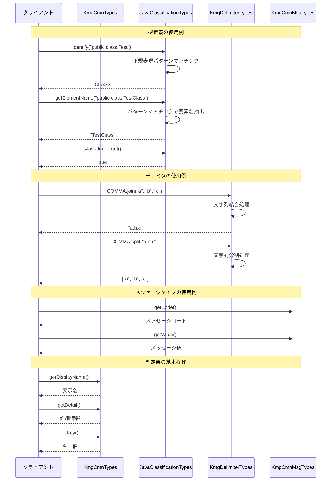

# インフラストラクチャ層共通層の設計書

## 1. クラス図

```mermaid
classDiagram
    %% 共通型インターフェース階層
    KmgCmnTypes~T~ <|-- KmgCmnMsgTypes
    KmgCmnMsgTypes <|-- KmgCmnExcMsgTypes
    KmgCmnMsgTypes <|-- KmgCmnGenMsgTypes
    KmgCmnMsgTypes <|-- KmgCmnLogMsgTypes
    KmgCmnExcMsgTypes <|-- KmgCmnValMsgTypes

    %% 型定義クラス群（KmgCmnTypesを実装）
    KmgCmnTypes~String~ <|-- JavaClassificationTypes
    KmgCmnTypes~String~ <|-- KmgCharsetTypes
    KmgCmnTypes~String~ <|-- KmgDbDataTypeTypes
    KmgCmnTypes~String~ <|-- KmgDbTypes
    KmgCmnTypes~String~ <|-- KmgDelimiterTypes
    KmgCmnTypes~String~ <|-- KmgJavadocTagTypes
    KmgCmnTypes~String~ <|-- KmgJavaKeywordTypes
    KmgCmnTypes~String~ <|-- KmgTimeUnitTypes
    KmgCmnTypes~String~ <|-- KmgTemplateTypes

    %% 共通型インターフェース
    class KmgCmnTypes~T~ {
        <<interface>>
        +T get()
        +String getDetail()
        +String getDisplayName()
        +T getKey()
        +String toString()
    }

    class KmgCmnMsgTypes {
        <<interface>>
        +String get()
        +String getCode()
        +String getKey()
        +String getValue()
        +String toString()
    }

    class KmgCmnExcMsgTypes {
        <<interface>>
    }

    class KmgCmnGenMsgTypes {
        <<interface>>
    }

    class KmgCmnLogMsgTypes {
        <<interface>>
    }

    class KmgCmnValMsgTypes {
        <<interface>>
    }

    %% 型定義クラス
    class JavaClassificationTypes {
        <<enumeration>>
        +NONE, CLASS, INNER_CLASS, INTERFACE, ENUM, ENUM_CONST, ANNOTATION_DEFINITION, ANNOTATION_USAGE, FIELD, METHOD, CONSTRUCTOR, MODULE, PACKAGE_INFO
        -String displayName
        -String key
        -String detail
        -String classificationPattern
        +static JavaClassificationTypes identify(String text)
        +String getElementName(String text)
        +boolean isJavadocTarget()
        +boolean isNotJavadocTarget()
    }

    class KmgDelimiterTypes {
        <<enumeration>>
        +NONE, PERIOD, COMMA, COLON, VERTICAL_BAR, UNDERSCORE, SLASH, HYPHEN, HALF_SPACE, PLUS, ALL_COLON, ALL_IDEOGRAPHIC, SERIES_HALF_SPACE, LINE_SEPARATOR, REGEX_LINE_SEPARATOR, TAB, HALF_EQUAL, HALF_AT_SIGN
        -String displayName
        -String key
        -String detail
        +String join(Object... targets)
        +String joinAll(Object... targets)
        +String[] split(String target)
        +String[] split(String target, int limit)
    }

    class KmgCharsetTypes {
        <<enumeration>>
        +NONE, MS932, UTF8
        -String displayName
        -String key
        -String detail
        -Charset charset
        +Charset toCharset()
    }

    class KmgDbDataTypeTypes {
        <<enumeration>>
        +NONE, INTEGER, LONG, DATE, TIME, STRING, SMALLSERIAL, SERIAL, FLOAT, DOUBLE, BIG_DECIMAL
        -String displayName
        -String key
        -String detail
        -Type type
        +Type getType()
    }

    class KmgDbTypes {
        <<enumeration>>
        +NONE, POSTGRE_SQL, MYSQL, ORACLE, SQL_SERVER
        -String displayName
        -String key
        -String detail
        -String[] aliasArray
        +String[] getAliasArray()
        +static KmgDbTypes getEnumByTarget(String target)
    }

    class KmgJavadocTagTypes {
        <<enumeration>>
        +NONE, AUTHOR, VERSION, SEE, SINCE, DEPRECATED, PARAM, RETURN, THROWS, EXCEPTION, SERIAL_DATA, SERIAL_FIELD, SERIAL, INHERIT_DOC, CODE, LINK, LINK_PLAIN, LITERAL, VALUE, DOC_ROOT, HIDDEN, SUMMARY, INDEX, API_NOTE, IMPL_SPEC, IMPL_NOTE, SYSTEM_PROPERTY, SNIPPET, PROVIDES, USES
        -String displayName
        -String key
        -String detail
        -List~JavaClassificationTypes~ locations
        +List~JavaClassificationTypes~ getLocations()
        +boolean isVersionValue()
        +static String createSearchKey(String key)
    }

    class KmgJavaKeywordTypes {
        <<enumeration>>
        +NONE, ABSTRACT, ASSERT, BOOLEAN, BREAK, BYTE, CASE, CATCH, CHAR, CLASS, CONST, CONTINUE, DEFAULT, DO, DOUBLE, ELSE, ENUM, EXPORTS, EXTENDS, FINAL, FINALLY, FLOAT, FOR, GOTO, IF, IMPLEMENTS, IMPORT, INSTANCEOF, INT, INTERFACE, LONG, MODULE, NATIVE, NEW, NON_SEALED, OPEN, OPENS, PACKAGE, PERMITS, PRIVATE, PROTECTED, PROVIDES, PUBLIC, RECORD, REQUIRES, RETURN, SEALED, SHORT, STATIC, STRICTFP, SUPER, SWITCH, SYNCHRONIZED, THIS, THROW, THROWS, TO, TRANSIENT, TRANSITIVE, TRY, USES, VAR, VOID, VOLATILE, WHEN, WHILE, YIELD
        -String displayName
        -String key
        -String detail
    }

    class KmgTimeUnitTypes {
        <<enumeration>>
        +NONE, SECONDS, MILLISECOND, MICROSECONDS, NANOSECONDS
        -String displayName
        -String key
        -String detail
        -String unitName
        -BigDecimal unitValue
        +String getUnitName()
        +BigDecimal getUnitValue()
    }

    class KmgTemplateTypes {
        <<enumeration>>
        -String displayName
        -String key
        -String detail
    }

    %% 関係性
    KmgCmnMsgTypes --> KmgCmnTypes~String~ : extends
    KmgCmnExcMsgTypes --> KmgCmnMsgTypes : extends
    KmgCmnGenMsgTypes --> KmgCmnMsgTypes : extends
    KmgCmnLogMsgTypes --> KmgCmnMsgTypes : extends
    KmgCmnValMsgTypes --> KmgCmnExcMsgTypes : extends
    JavaClassificationTypes --> KmgCmnTypes~String~ : implements
    KmgDelimiterTypes --> KmgCmnTypes~String~ : implements
    KmgCharsetTypes --> KmgCmnTypes~String~ : implements
    KmgDbDataTypeTypes --> KmgCmnTypes~String~ : implements
    KmgDbTypes --> KmgCmnTypes~String~ : implements
    KmgJavadocTagTypes --> KmgCmnTypes~String~ : implements
    KmgJavaKeywordTypes --> KmgCmnTypes~String~ : implements
    KmgTimeUnitTypes --> KmgCmnTypes~String~ : implements
    KmgTemplateTypes --> KmgCmnTypes~String~ : implements
```



## 2. シーケンス図



## 3. パッケージ構造

cmn パッケージは以下の構造で構成されています：

### 3.1 共通機能 (cmn)

- **KmgCmnTypes**: 共通型インターフェース
- **msg**: メッセージタイプの定義
  - `KmgCmnMsgTypes`: メッセージタイプの基底インターフェース
  - `KmgCmnExcMsgTypes`: 例外メッセージタイプ
  - `KmgCmnGenMsgTypes`: 一般メッセージタイプ
  - `KmgCmnLogMsgTypes`: ログメッセージタイプ
  - `KmgCmnValMsgTypes`: バリデーションメッセージタイプ

### 3.2 型定義システム

`KmgCmnTypes<T>`インターフェースを基底とした型定義システム：

- 各型定義は enum として実装
- 表示名、キー、詳細情報を統一的な形式で提供
- 型安全な操作を保証

## 4. 主要コンポーネント

### 4.1 共通型インターフェース

`KmgCmnTypes<T>`は、アプリケーション全体で使用される型定義の基底インターフェースです：

- **ジェネリクス対応**: 型パラメータ T で型安全性を保証
- **統一的な API**: 表示名、キー、詳細情報の取得方法を統一
- **Supplier 実装**: Java 標準の関数型インターフェースとの互換性

### 4.2 メッセージタイプ階層

階層的なメッセージタイプシステム：

1. **KmgCmnMsgTypes**: メッセージタイプの基底インターフェース
2. **KmgCmnExcMsgTypes**: 例外メッセージタイプ
3. **KmgCmnGenMsgTypes**: 一般メッセージタイプ
4. **KmgCmnLogMsgTypes**: ログメッセージタイプ
5. **KmgCmnValMsgTypes**: バリデーションメッセージタイプ

### 4.3 型定義クラス群

各種型定義クラスが`KmgCmnTypes<String>`を実装：

- **JavaClassificationTypes**: Java 要素の分類
- **KmgDelimiterTypes**: デリミタ定義
- **KmgCharsetTypes**: 文字セット定義
- **KmgDbDataTypeTypes**: データベースデータ型定義
- **KmgDbTypes**: データベース種類定義
- **KmgJavadocTagTypes**: Javadoc タグ定義
- **KmgJavaKeywordTypes**: Java キーワード定義
- **KmgTimeUnitTypes**: 時間単位定義
- **KmgTemplateTypes**: テンプレート定義

## 5. 設計原則

### 5.1 型安全性

- ジェネリクスを活用した型安全な設計
- enum による定数管理
- コンパイル時の型チェック

### 5.2 統一性

- 全ての型定義で統一された API
- 表示名、キー、詳細情報の統一的な取得方法
- 一貫した命名規則

### 5.3 拡張性

- インターフェースベースの設計
- 新たな型定義の追加が容易
- 階層的なメッセージタイプシステム

### 5.4 再利用性

- 共通機能のインターフェース化
- 型定義の統一
- アプリケーション全体での再利用

### 5.5 保守性

- 明確な責任分離
- 統一された実装パターン
- ドキュメント化された設計

## 6. 使用例

### 6.1 型定義の基本使用

```java
// Java要素の分類
JavaClassificationTypes type = JavaClassificationTypes.identify("public class Test");
String elementName = type.getElementName("public class TestClass");
boolean isJavadocTarget = type.isJavadocTarget();

// デリミタの使用
KmgDelimiterTypes delimiter = KmgDelimiterTypes.COMMA;
String joined = delimiter.join("a", "b", "c");
String[] split = delimiter.split("a,b,c");
```

### 6.2 メッセージタイプの使用

```java
// メッセージタイプの基本操作
KmgCmnMsgTypes msgType = someMessageType;
String code = msgType.getCode();
String value = msgType.getValue();
String key = msgType.getKey();
```

### 6.3 型定義の情報取得

```java
// 型定義の基本情報取得
KmgCmnTypes<String> typeDef = someTypeDefinition;
String displayName = typeDef.getDisplayName();
String detail = typeDef.getDetail();
String key = typeDef.getKey();
```

### 6.4 文字セットの使用

```java
// 文字セットの変換
KmgCharsetTypes charsetType = KmgCharsetTypes.UTF8;
Charset charset = charsetType.toCharset();
```

### 6.5 データベース型の使用

```java
// データベース型の取得
KmgDbDataTypeTypes dbType = KmgDbDataTypeTypes.INTEGER;
Type javaType = dbType.getType();
```

## 7. 実装パターン

### 7.1 型定義 enum の実装パターン

```java
public enum SomeTypeDefinition implements KmgCmnTypes<String> {
    VALUE1("表示名1", "key1", "詳細1"),
    VALUE2("表示名2", "key2", "詳細2");

    private final String displayName;
    private final String key;
    private final String detail;

    // コンストラクタ、getter実装
}
```

### 7.2 メッセージタイプの実装パターン

```java
public interface SomeMsgTypes extends KmgCmnMsgTypes {
    // メッセージタイプ固有のメソッド
}
```

### 7.3 型定義の拡張パターン

```java
public enum ExtendedTypeDefinition implements KmgCmnTypes<String> {
    // 基本実装に加えて、固有の機能を追加
    public String getSpecialValue() {
        // 固有の処理
    }
}
```

## 8. 注意事項

### 8.1 型安全性の確保

- ジェネリクスを適切に使用して型安全性を保つ
- 型パラメータの適切な指定

### 8.2 パフォーマンス考慮

- enum の値マップを活用した高速検索
- 正規表現の適切な使用

### 8.3 拡張時の注意

- 既存の API との互換性を保つ
- 階層構造の適切な設計
- 命名規則の遵守

## 9. 今後の拡張予定

### 9.1 新たな型定義の追加

- アプリケーション固有の型定義
- 外部システム連携用の型定義

### 9.2 メッセージタイプの拡張

- 国際化対応
- 動的メッセージ生成

### 9.3 パフォーマンス最適化

- キャッシュ機能の追加
- 並列処理対応
