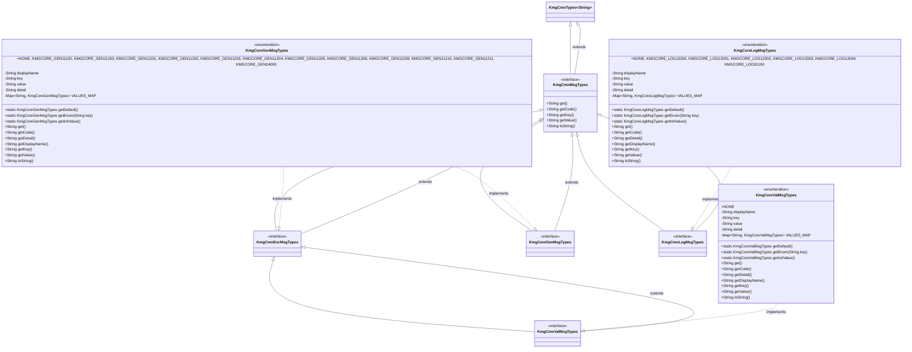
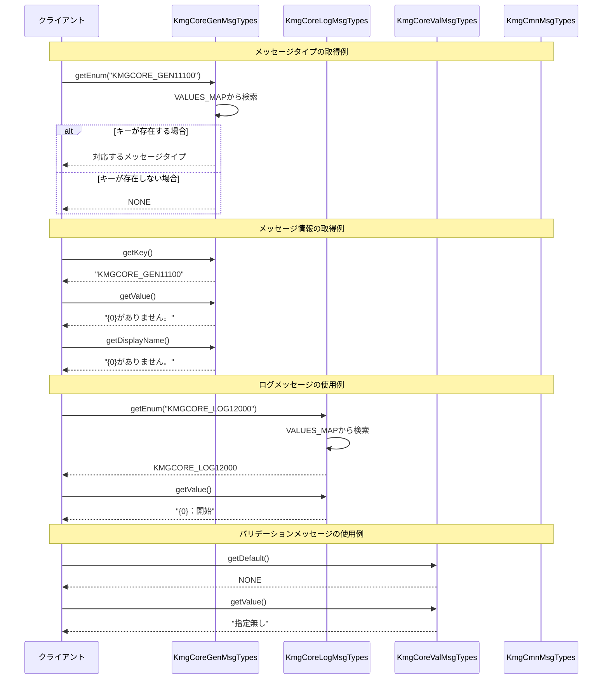

# インフラストラクチャ層共通層メッセージ層の設計書

## 1. クラス図



## 2. シーケンス図



## 3. パッケージ構造

メッセージパッケージは以下の構造で構成されています：

### 3.1 共通メッセージインターフェース (cmn.msg)

- **KmgCmnMsgTypes**: メッセージタイプの基底インターフェース

  - `get()`: メッセージのキーを返す
  - `getCode()`: メッセージのキーを返す（get()と同じ）
  - `getKey()`: メッセージのキーを返す
  - `getValue()`: メッセージの値を返す
  - `toString()`: メッセージのキーを返す

- **KmgCmnExcMsgTypes**: 例外メッセージタイプのインターフェース
- **KmgCmnGenMsgTypes**: 一般メッセージタイプのインターフェース
- **KmgCmnLogMsgTypes**: ログメッセージタイプのインターフェース
- **KmgCmnValMsgTypes**: バリデーションメッセージタイプのインターフェース

### 3.2 コアメッセージタイプ実装 (types.msg)

- **KmgCoreGenMsgTypes**: コア一般メッセージの種類

  - リフレクション関連のエラーメッセージ
  - フィールド・メソッド操作のエラーメッセージ
  - ビルドパス関連のエラーメッセージ

- **KmgCoreLogMsgTypes**: コアログメッセージの種類

  - パフォーマンス測定関連のログメッセージ
  - 処理開始・終了・チェックポイントのメッセージ
  - 一般的なログメッセージ

- **KmgCoreValMsgTypes**: コアバリデーションメッセージの種類
  - 現在は NONE のみ定義（将来の拡張用）

## 4. 主要コンポーネント

### 4.1 メッセージタイプ階層

メッセージシステムは階層的な設計になっています：

1. **KmgCmnTypes<String>**: 共通型インターフェース
2. **KmgCmnMsgTypes**: メッセージタイプの基底インターフェース
3. **特殊化されたメッセージタイプ**:
   - `KmgCmnExcMsgTypes`: 例外メッセージ
   - `KmgCmnGenMsgTypes`: 一般メッセージ
   - `KmgCmnLogMsgTypes`: ログメッセージ
   - `KmgCmnValMsgTypes`: バリデーションメッセージ

### 4.2 メッセージタイプの実装パターン

各メッセージタイプは以下の共通パターンで実装されています：

- **enum 実装**: 型安全性を保証
- **静的マップ**: 高速なキー検索
- **統一されたメソッド**: 一貫した API
- **デフォルト値**: 安全な初期化

### 4.3 メッセージの構造

各メッセージは以下の情報を持ちます：

- **キー**: メッセージの識別子（例：KMGCORE_GEN11100）
- **値**: メッセージテンプレート（例："{0}がありません。"）
- **表示名**: 人間が読みやすい形式
- **詳細**: 追加情報

### 4.4 パラメータ化されたメッセージ

メッセージはパラメータ化されており、実行時に値を埋め込むことができます：

- `{0}`, `{1}`, `{2}`: パラメータプレースホルダー
- 動的な値の挿入が可能
- 国際化対応の基盤

## 5. 設計原則

### 5.1 型安全性

- enum による型安全なメッセージ管理
- コンパイル時の型チェック
- 実行時エラーの削減

### 5.2 拡張性

- インターフェースベースの設計
- 新しいメッセージタイプの追加が容易
- 既存コードへの影響を最小化

### 5.3 パフォーマンス

- 静的マップによる高速検索
- メモリ効率的な実装
- 初期化時の最適化

### 5.4 一貫性

- 統一された API 設計
- 共通のメソッド名
- 一貫した命名規則

### 5.5 保守性

- 明確な階層構造
- 適切な責任分離
- 理解しやすい設計

## 6. 使用例

### 6.1 一般メッセージの使用

```java
// メッセージタイプの取得
KmgCoreGenMsgTypes msgType = KmgCoreGenMsgTypes.getEnum("KMGCORE_GEN11100");

// メッセージ情報の取得
String key = msgType.getKey();        // "KMGCORE_GEN11100"
String value = msgType.getValue();   // "{0}がありません。"
String displayName = msgType.getDisplayName(); // "{0}がありません。"

// パラメータ化されたメッセージの使用
String message = MessageFormat.format(msgType.getValue(), "ファイル");
// 結果: "ファイルがありません。"
```

### 6.2 ログメッセージの使用

```java
// ログメッセージの取得
KmgCoreLogMsgTypes logType = KmgCoreLogMsgTypes.getEnum("KMGCORE_LOG12000");

// パフォーマンス測定での使用
String startMessage = MessageFormat.format(logType.getValue(), "処理名");
// 結果: "処理名：開始"

// 終了メッセージ
KmgCoreLogMsgTypes endType = KmgCoreLogMsgTypes.getEnum("KMGCORE_LOG12001");
String endMessage = MessageFormat.format(endType.getValue(), "処理名", "1.5", "秒");
// 結果: "処理名：終了。経過時間=[1.5秒]"
```

### 6.3 バリデーションメッセージの使用

```java
// デフォルト値の取得
KmgCoreValMsgTypes valType = KmgCoreValMsgTypes.getDefault();
// 結果: NONE

// 将来の拡張例
// KmgCoreValMsgTypes errorType = KmgCoreValMsgTypes.getEnum("KMGCORE_VAL11100");
// String errorMessage = MessageFormat.format(errorType.getValue(), "入力値");
```

### 6.4 メッセージタイプの検索

```java
// 存在するキーの検索
KmgCoreGenMsgTypes found = KmgCoreGenMsgTypes.getEnum("KMGCORE_GEN11100");
// 結果: KMGCORE_GEN11100

// 存在しないキーの検索
KmgCoreGenMsgTypes notFound = KmgCoreGenMsgTypes.getEnum("INVALID_KEY");
// 結果: NONE
```

### 6.5 メッセージの一覧取得

```java
// 全メッセージタイプの取得
for (KmgCoreGenMsgTypes type : KmgCoreGenMsgTypes.values()) {
    System.out.println(type.getKey() + ": " + type.getValue());
}
```

## 7. メッセージの分類

### 7.1 一般メッセージ (KmgCoreGenMsgTypes)

- **KMGCORE_GEN11100**: 基本的な存在チェックエラー
- **KMGCORE_GEN11200-11211**: リフレクション関連エラー
  - フィールド取得・設定エラー
  - メソッド取得・実行エラー
- **KMGCORE_GEN24000**: ビルドパス関連エラー

### 7.2 ログメッセージ (KmgCoreLogMsgTypes)

- **KMGCORE_LOG12000**: 処理開始メッセージ
- **KMGCORE_LOG12001**: 処理終了メッセージ（経過時間付き）
- **KMGCORE_LOG12002-12004**: チェックポイントメッセージ
- **KMGCORE_LOG91100**: 一般的なログメッセージ

### 7.3 バリデーションメッセージ (KmgCoreValMsgTypes)

- **NONE**: 現在はデフォルト値のみ（将来の拡張用）

## 8. 国際化対応

メッセージシステムは国際化に対応できる設計になっています：

- パラメータ化されたメッセージテンプレート
- 外部リソースファイルとの連携可能
- 多言語対応の基盤

## 9. 拡張ガイドライン

新しいメッセージタイプを追加する際のガイドライン：

1. **命名規則**: `KMGCORE_[カテゴリ][番号]`の形式
2. **番号体系**: カテゴリごとに連番を割り当て
3. **メッセージテンプレート**: パラメータ化された形式で記述
4. **テスト**: 対応するテストクラスを作成
5. **ドキュメント**: メッセージの用途を明確に記載
