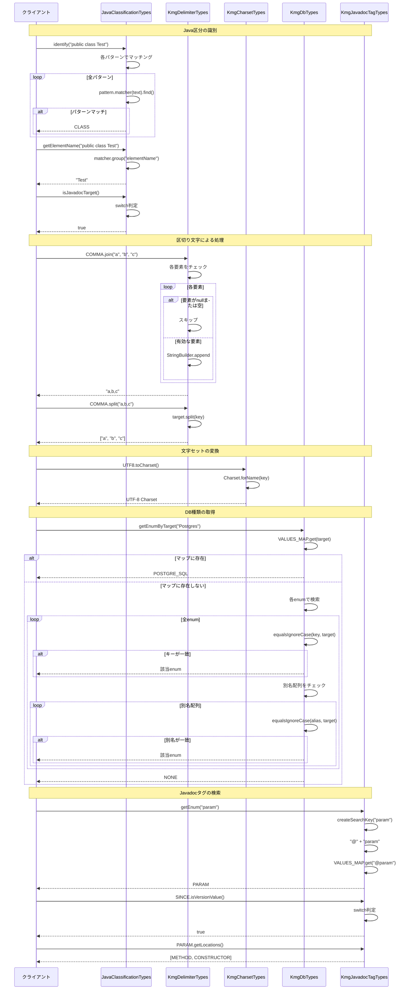

# インフラストラクチャ層型列挙層の設計書

## 1. クラス図

```mermaid
classDiagram
    %% 基底インターフェース
    KmgCmnTypes~T~ <|.. JavaClassificationTypes
    KmgCmnTypes~T~ <|.. KmgCharsetTypes
    KmgCmnTypes~T~ <|.. KmgDbDataTypeTypes
    KmgCmnTypes~T~ <|.. KmgDbTypes
    KmgCmnTypes~T~ <|.. KmgDelimiterTypes
    KmgCmnTypes~T~ <|.. KmgJavadocTagTypes
    KmgCmnTypes~T~ <|.. KmgJavaKeywordTypes
    KmgCmnTypes~T~ <|.. KmgTimeUnitTypes
    KmgCmnTypes~T~ <|.. KmgTemplateTypes

    %% 共通型インターフェース
    class KmgCmnTypes~T~ {
        <<interface>>
        +T get()
        +String getDetail()
        +String getDisplayName()
        +T getKey()
        +String toString()
    }

    %% Java区分
    class JavaClassificationTypes {
        <<enumeration>>
        +NONE, CLASS, INNER_CLASS, INTERFACE, ENUM, ENUM_CONST
        +ANNOTATION_DEFINITION, ANNOTATION_USAGE, FIELD, METHOD
        +CONSTRUCTOR, MODULE, PACKAGE_INFO
        -String displayName
        -String key
        -String detail
        -String classificationPattern
        +static JavaClassificationTypes getDefault()
        +static JavaClassificationTypes getEnum(String key)
        +static JavaClassificationTypes getInitValue()
        +static JavaClassificationTypes identify(String text)
        +String getClassificationPattern()
        +String getElementName(String text)
        +boolean isJavadocTarget()
        +boolean isNotJavadocTarget()
    }

    %% 文字セット
    class KmgCharsetTypes {
        <<enumeration>>
        +NONE, MS932, UTF8
        -String displayName
        -String key
        -String detail
        -Charset charset
        +static KmgCharsetTypes getDefault()
        +static KmgCharsetTypes getEnum(String key)
        +static KmgCharsetTypes getInitValue()
        +Charset toCharset()
    }

    %% DBデータ型
    class KmgDbDataTypeTypes {
        <<enumeration>>
        +NONE, INTEGER, LONG, DATE, TIME, STRING
        +SMALLSERIAL, SERIAL, FLOAT, DOUBLE, BIG_DECIMAL
        -String displayName
        -String key
        -String detail
        -Type type
        +static KmgDbDataTypeTypes getDefault()
        +static KmgDbDataTypeTypes getEnum(String key)
        +static KmgDbDataTypeTypes getInitValue()
        +Type getType()
    }

    %% DB種類
    class KmgDbTypes {
        <<enumeration>>
        +NONE, POSTGRE_SQL, MYSQL, ORACLE, SQL_SERVER
        -String displayName
        -String key
        -String detail
        -String[] aliasArray
        +static KmgDbTypes getDefault()
        +static KmgDbTypes getEnum(String key)
        +static KmgDbTypes getEnumByTarget(String target)
        +static KmgDbTypes getInitValue()
        +String[] getAliasArray()
    }

    %% 区切り文字
    class KmgDelimiterTypes {
        <<enumeration>>
        +NONE, PERIOD, COMMA, COLON, VERTICAL_BAR, UNDERSCORE
        +SLASH, HYPHEN, HALF_SPACE, PLUS, ALL_COLON
        +ALL_IDEOGRAPHIC, SERIES_HALF_SPACE, LINE_SEPARATOR
        +REGEX_LINE_SEPARATOR, TAB, HALF_EQUAL, HALF_AT_SIGN
        -String displayName
        -String key
        -String detail
        +static KmgDelimiterTypes getDefault()
        +static KmgDelimiterTypes getEnum(String key)
        +static KmgDelimiterTypes getInitValue()
        +String join(Object... targets)
        +String join(List~T~ targetList)
        +String joinAll(Object... targets)
        +String[] split(String target)
        +String[] split(String target, int limit)
    }

    %% Javadocタグ
    class KmgJavadocTagTypes {
        <<enumeration>>
        +NONE, AUTHOR, VERSION, SEE, SINCE, DEPRECATED
        +PARAM, RETURN, THROWS, EXCEPTION, SERIAL_DATA
        +SERIAL_FIELD, SERIAL, INHERIT_DOC, CODE, LINK
        +LINK_PLAIN, LITERAL, VALUE, DOC_ROOT, HIDDEN
        +SUMMARY, INDEX, API_NOTE, IMPL_SPEC, IMPL_NOTE
        +SYSTEM_PROPERTY, SNIPPET, PROVIDES, USES
        -String displayName
        -String key
        -String detail
        -List~JavaClassificationTypes~ locations
        +static String createSearchKey(String key)
        +static KmgJavadocTagTypes getDefault()
        +static KmgJavadocTagTypes getEnum(String key)
        +static KmgJavadocTagTypes getInitValue()
        +List~JavaClassificationTypes~ getLocations()
        +boolean isVersionValue()
    }

    %% Javaキーワード
    class KmgJavaKeywordTypes {
        <<enumeration>>
        +NONE, ABSTRACT, ASSERT, BOOLEAN, BREAK, BYTE
        +CASE, CATCH, CHAR, CLASS, CONST, CONTINUE
        +DEFAULT, DO, DOUBLE, ELSE, ENUM, EXPORTS
        +EXTENDS, FINAL, FINALLY, FLOAT, FOR, GOTO
        +IF, IMPLEMENTS, IMPORT, INSTANCEOF, INT, INTERFACE
        +LONG, MODULE, NATIVE, NEW, NON_SEALED, OPEN
        +OPENS, PACKAGE, PERMITS, PRIVATE, PROTECTED
        +PROVIDES, PUBLIC, RECORD, REQUIRES, RETURN
        +SEALED, SHORT, STATIC, STRICTFP, SUPER
        +SWITCH, SYNCHRONIZED, THIS, THROW, THROWS
        +TO, TRANSIENT, TRANSITIVE, TRY, USES, VAR
        +VOID, VOLATILE, WHEN, WHILE, YIELD
        -String displayName
        -String key
        -String detail
        +static KmgJavaKeywordTypes getDefault()
        +static KmgJavaKeywordTypes getEnum(String key)
        +static KmgJavaKeywordTypes getInitValue()
    }

    %% 時間単位
    class KmgTimeUnitTypes {
        <<enumeration>>
        +NONE, SECONDS, MILLISECOND, MICROSECONDS, NANOSECONDS
        -String displayName
        -String key
        -String detail
        -String unitName
        -BigDecimal unitValue
        +static KmgTimeUnitTypes getDefault()
        +static KmgTimeUnitTypes getEnum(String key)
        +static KmgTimeUnitTypes getInitValue()
        +String getUnitName()
        +BigDecimal getUnitValue()
    }

    %% テンプレート
    class KmgTemplateTypes {
        <<enumeration>>
        +NONE
        -String displayName
        -String key
        -String detail
        +static KmgTemplateTypes getDefault()
        +static KmgTemplateTypes getEnum(String key)
        +static KmgTemplateTypes getInitValue()
    }

    %% 関係性
    JavaClassificationTypes ..> KmgJavadocTagTypes : referenced by
    KmgCharsetTypes ..> Charset : uses
    KmgDbDataTypeTypes ..> Type : uses
    KmgDbTypes ..> KmgString : uses
    KmgDbTypes ..> KmgArrayUtils : uses
    KmgDelimiterTypes ..> KmgString : uses

    note for JavaClassificationTypes "Java要素の分類を識別\n正規表現パターンによる判定\nJavadoc対象の判定"
    note for KmgDelimiterTypes "文字列の結合・分割\nnull安全な処理\n可変長引数対応"
    note for KmgJavadocTagTypes "Javadocタグの定義\n適用可能な場所の管理\nバージョン値の判定"
```



## 2. シーケンス図



## 3. パッケージ構造

kmg-core の types パッケージは以下の構造で構成されています：

### 3.1 パッケージ構成

```text
kmg.core.infrastructure.types/
├── JavaClassificationTypes.java      # Java区分の種類
├── KmgCharsetTypes.java              # 文字セットの種類
├── KmgDbDataTypeTypes.java           # DBデータ型の種類
├── KmgDbTypes.java                   # DB種類の種類
├── KmgDelimiterTypes.java            # 区切り文字の種類
├── KmgJavadocTagTypes.java           # Javadocタグの種類
├── KmgJavaKeywordTypes.java          # Javaキーワードの種類
├── KmgTimeUnitTypes.java             # 時間単位の種類
├── package-info.java                 # パッケージ情報
├── msg/                              # メッセージ型サブパッケージ
│   ├── KmgCoreGenMsgTypes.java       # 一般メッセージの種類
│   ├── KmgCoreLogMsgTypes.java       # ログメッセージの種類
│   ├── KmgCoreValMsgTypes.java       # バリデーションメッセージの種類
│   └── package-info.java             # パッケージ情報
└── template/                         # テンプレート型サブパッケージ
    ├── KmgTemplateTypes.java         # テンプレートの種類
    └── package-info.java             # パッケージ情報
```

### 3.2 パッケージの目的

`kmg.core.infrastructure.types` パッケージは、アプリケーション全体で使用される型安全な列挙型を提供します。これらの列挙型は、以下の役割を果たします：

1. **型安全性の提供**: 文字列や数値の代わりに型安全な列挙型を使用
2. **統一的なインターフェース**: `KmgCmnTypes<T>` を実装し、一貫した操作方法を提供
3. **拡張情報の保持**: 各列挙値に表示名、キー、詳細情報などのメタデータを付与
4. **ユーティリティ機能**: 列挙値に関連する便利なメソッドを提供

## 4. 主要コンポーネント

### 4.1 JavaClassificationTypes

Java コードの要素を分類するための列挙型です。

#### 4.1.1 主な機能

1. **Java 要素の識別**

   - クラス、インターフェース、列挙型、フィールド、メソッドなどを識別
   - 正規表現パターンによる自動判定
   - `identify(String text)` メソッドでテキストから区分を判別

2. **要素名の抽出**

   - `getElementName(String text)` で要素名を抽出
   - 正規表現の名前付きグループを使用

3. **Javadoc 対象の判定**
   - `isJavadocTarget()` で Javadoc 生成対象かを判定
   - `isNotJavadocTarget()` で非対象かを判定

#### 4.1.2 定義されている区分

- `NONE`: 指定無し
- `CLASS`: クラス
- `INNER_CLASS`: 内部クラス
- `INTERFACE`: インターフェース
- `ENUM`: 列挙型
- `ENUM_CONST`: 列挙型の定数
- `ANNOTATION_DEFINITION`: アノテーション定義
- `ANNOTATION_USAGE`: アノテーション使用
- `FIELD`: フィールド
- `METHOD`: メソッド
- `CONSTRUCTOR`: コンストラクタ
- `MODULE`: モジュール
- `PACKAGE_INFO`: パッケージ情報

#### 4.1.3 設計の特徴

- **パターンマッチング**: 正規表現による柔軟な判定
- **名前付きグループ**: 要素名を簡単に抽出可能
- **除外パターン**: アノテーション使用では Javadoc タグを除外

### 4.2 KmgDelimiterTypes

文字列の結合と分割を行うための区切り文字列挙型です。

#### 4.2.1 主な機能

1. **文字列結合**

   - `join(Object... targets)`: null と空文字を除外して結合
   - `joinAll(Object... targets)`: すべての要素を結合（null は "null" として結合）
   - `join(List<T> targetList)`: リストの要素を結合

2. **文字列分割**
   - `split(String target)`: 区切り文字で分割
   - `split(String target, int limit)`: 分割数を制限

#### 4.2.2 定義されている区切り文字

- `PERIOD`: ピリオド（.）
- `COMMA`: カンマ（,）
- `COLON`: コロン（:）
- `VERTICAL_BAR`: バーティカルバー（|）
- `UNDERSCORE`: アンダースコア（\_）
- `SLASH`: スラッシュ（/）
- `HYPHEN`: ハイフン（-）
- `HALF_SPACE`: 半角スペース
- `TAB`: タブ
- `LINE_SEPARATOR`: 改行
- `REGEX_LINE_SEPARATOR`: 正規表現による改行
- その他

#### 4.2.3 設計の特徴

- **null 安全**: null 値を適切に処理
- **柔軟な結合**: 空要素の除外/含有を選択可能
- **可変長引数**: 可変長引数とリストの両方に対応

### 4.3 KmgCharsetTypes

文字セットを管理する列挙型です。

#### 4.3.1 主な機能

1. **文字セット変換**
   - `toCharset()`: java.nio.charset.Charset への変換
   - コンストラクタで自動的に Charset インスタンスを生成

#### 4.3.2 定義されている文字セット

- `NONE`: 指定無し
- `MS932`: MS932（日本語 Shift-JIS）
- `UTF8`: UTF-8

#### 4.3.3 設計の特徴

- **遅延初期化なし**: コンストラクタで即座に Charset を生成
- **null 処理**: NONE の場合は null を返す

### 4.4 KmgDbTypes

データベースの種類を管理する列挙型です。

#### 4.4.1 主な機能

1. **柔軟な検索**

   - `getEnum(String key)`: キーによる検索
   - `getEnumByTarget(String target)`: 値または別名による大文字小文字を区別しない検索

2. **別名管理**
   - `getAliasArray()`: 別名配列の取得
   - 複数の別名をサポート

#### 4.4.2 定義されている DB

- `NONE`: 指定無し
- `POSTGRE_SQL`: PostgreSQL（別名: Postgres）
- `MYSQL`: MySQL
- `ORACLE`: Oracle
- `SQL_SERVER`: SQL Server（別名: MS SQL）

#### 4.4.3 設計の特徴

- **別名サポート**: 複数の呼び方に対応
- **大文字小文字を区別しない検索**: ユーザー入力に対して柔軟

### 4.5 KmgDbDataTypeTypes

データベースのデータ型を管理する列挙型です。

#### 4.5.1 主な機能

1. **Java 型との対応**
   - `getType()`: 対応する Java の型（Type）を取得
   - Integer、Long、LocalDate、String などに対応

#### 4.5.2 定義されているデータ型

- `INTEGER`: 4 バイト整数（Integer.class）
- `LONG`: 8 バイト整数（Long.class）
- `DATE`: 日付型（LocalDate.class）
- `TIME`: 日時型（LocalDateTime.class）
- `STRING`: 文字列型（String.class）
- `FLOAT`: 4 バイト実数（Float.class）
- `DOUBLE`: 8 バイト実数（Double.class）
- `BIG_DECIMAL`: 高精度実数（BigDecimal.class）
- `SMALLSERIAL`: 自動 4 バイト（Integer.class）
- `SERIAL`: 自動 8 バイト（Long.class）

### 4.6 KmgJavadocTagTypes

Javadoc タグを管理する列挙型です。

#### 4.6.1 主な機能

1. **タグの検索**

   - `getEnum(String key)`: "@" の有無に関わらず検索可能
   - `createSearchKey(String key)`: "@" を自動付与

2. **適用可能な場所の管理**

   - `getLocations()`: タグが適用可能な Java 要素のリストを取得

3. **バージョン値の判定**
   - `isVersionValue()`: @version または @since タグかを判定

#### 4.6.2 定義されている主なタグ

**ブロックタグ:**

- `AUTHOR`: @author（作成者）
- `VERSION`: @version（バージョン）
- `SINCE`: @since（導入バージョン）
- `PARAM`: @param（パラメータ）
- `RETURN`: @return（戻り値）
- `THROWS`: @throws（例外）
- `SEE`: @see（参照）
- `DEPRECATED`: @deprecated（非推奨）

**インラインタグ:**

- `CODE`: {@code}（コード）
- `LINK`: {@link}（リンク）
- `LITERAL`: {@literal}（リテラル）
- `VALUE`: {@value}（値）

**Java 9 以降:**

- `HIDDEN`: @hidden（隠し）
- `INDEX`: {@index}（インデックス）

#### 4.6.3 設計の特徴

- **場所の制約**: 各タグが適用可能な場所を JavaClassificationTypes のリストで管理
- **検索キー生成**: "@" の有無を自動処理

### 4.7 KmgJavaKeywordTypes

Java のキーワードを管理する列挙型です。

#### 4.7.1 定義されているキーワード

Java の全予約語を網羅：

- 制御構文: `if`, `else`, `switch`, `for`, `while`, `do` など
- 型宣言: `class`, `interface`, `enum`, `record` など
- アクセス修飾子: `public`, `private`, `protected`
- 型: `int`, `long`, `double`, `boolean` など
- モジュールシステム: `module`, `requires`, `exports` など
- 新しいキーワード: `sealed`, `non-sealed`, `permits`, `var`, `yield` など

### 4.8 KmgTimeUnitTypes

時間単位を管理する列挙型です。

#### 4.8.1 主な機能

1. **単位情報の提供**
   - `getUnitName()`: 単位名を取得
   - `getUnitValue()`: 秒に対する単位値を取得（BigDecimal）

#### 4.8.2 定義されている時間単位

- `SECONDS`: 秒（1）
- `MILLISECOND`: ミリ秒（0.001）
- `MICROSECONDS`: マイクロ秒（0.000001）
- `NANOSECONDS`: ナノ秒（0.000000001）

### 4.9 メッセージ型（msg サブパッケージ）

#### 4.9.1 KmgCoreGenMsgTypes

一般メッセージを管理する列挙型です。

**主なメッセージ:**

- `KMGCORE_GEN11100`: "{0}がありません。"
- `KMGCORE_GEN11200`: "フィールドの取得に失敗しました。フィールド名=[{0}]、対象のクラス=[{1}]、最後に取得したフィールド=[{2}]"
- その他、リフレクション操作に関するエラーメッセージ

#### 4.9.2 KmgCoreLogMsgTypes

ログメッセージを管理する列挙型です。

**主なメッセージ:**

- `KMGCORE_LOG12000`: "{0}：開始"
- `KMGCORE_LOG12001`: "{0}：終了。経過時間=[{1}{2}]"
- `KMGCORE_LOG12002`: "{0}：{1}。経過時間=[{2}{3}]"

#### 4.9.3 KmgCoreValMsgTypes

バリデーションメッセージを管理する列挙型です（現在は NONE のみ定義）。

### 4.10 KmgTemplateTypes

テンプレートの種類を管理する列挙型です（template サブパッケージ）。

現在は NONE のみ定義されており、将来の拡張のためのテンプレートとして提供されています。

## 5. 設計原則

### 5.1 型安全性

すべての列挙型は `KmgCmnTypes<T>` インターフェースを実装し、型安全な操作を保証します。

- **コンパイル時チェック**: 列挙値の使用は コンパイル時に検証される
- **null 安全**: 存在しないキーの検索時は NONE を返す
- **統一インターフェース**: すべての型列挙が同じメソッドセットを提供

### 5.2 統一性

#### 5.2.1 共通メソッド

すべての型列挙は以下のメソッドを提供します：

- `getDefault()`: デフォルト値（NONE）を返す
- `getEnum(String key)`: キーから列挙値を取得
- `getInitValue()`: 初期値（NONE）を返す
- `get()`: キーを返す（getKey() のエイリアス）
- `getKey()`: キーを返す
- `getDisplayName()`: 表示名を返す
- `getDetail()`: 詳細情報を返す
- `toString()`: キーを返す

#### 5.2.2 VALUES_MAP パターン

すべての型列挙は静的な VALUES_MAP を持ち、キーから列挙値への高速検索を実現します。

```java
private static final Map<String, XxxTypes> VALUES_MAP = new HashMap<>();

static {
    for (final XxxTypes type : XxxTypes.values()) {
        XxxTypes.VALUES_MAP.put(type.get(), type);
    }
}
```

### 5.3 拡張性

#### 5.3.1 機能拡張

各列挙型は独自の機能を追加できます：

- `JavaClassificationTypes`: パターンマッチング、要素名抽出
- `KmgDelimiterTypes`: 文字列結合・分割
- `KmgDbTypes`: 別名検索
- `KmgJavadocTagTypes`: 場所管理、バージョン値判定

#### 5.3.2 値の追加

新しい列挙値を追加する際は、以下の点に注意します：

1. コンストラクタパラメータの一貫性を保つ
2. 必要に応じて switch 文や判定ロジックを更新
3. Javadoc コメントで @since バージョンを明記

### 5.4 可読性

#### 5.4.1 命名規則

- **列挙値**: 大文字のスネークケース（例: `POSTGRE_SQL`, `HALF_SPACE`）
- **フィールド**: キャメルケース（例: `displayName`, `classificationPattern`）
- **メソッド**: キャメルケース（例: `getEnum`, `isJavadocTarget`）

#### 5.4.2 ドキュメント

- すべての列挙値に Javadoc コメントを記載
- `@since` タグで導入バージョンを明記
- 複雑なロジックには説明コメントを追加

### 5.5 保守性

#### 5.5.1 値の廃止

列挙値を廃止する場合：

1. `@Deprecated` アノテーションを付与
2. Javadoc に廃止理由と代替手段を記載
3. 削除予定バージョンを明記

#### 5.5.2 後方互換性

- 既存の列挙値の意味を変更しない
- メソッドシグネチャを変更しない
- 新しい機能は新しいメソッドとして追加

## 6. 使用例

### 6.1 JavaClassificationTypes の使用例

#### 6.1.1 Java 要素の識別

```java
// クラスの識別
String code = "public class SampleClass {";
JavaClassificationTypes type = JavaClassificationTypes.identify(code);
// → CLASS

// 要素名の取得
String elementName = type.getElementName(code);
// → "SampleClass"

// Javadoc対象かチェック
boolean isTarget = type.isJavadocTarget();
// → true
```

#### 6.1.2 メソッドの識別

```java
String methodCode = "public void doSomething() {";
JavaClassificationTypes methodType = JavaClassificationTypes.identify(methodCode);
// → METHOD

String methodName = methodType.getElementName(methodCode);
// → "doSomething"
```

#### 6.1.3 アノテーションの識別

```java
String annotation = "@Override";
JavaClassificationTypes annoType = JavaClassificationTypes.identify(annotation);
// → ANNOTATION_USAGE

boolean isJavadocTarget = annoType.isJavadocTarget();
// → false（アノテーション使用は Javadoc 対象外）
```

### 6.2 KmgDelimiterTypes の使用例

#### 6.2.1 文字列の結合

```java
// カンマ区切りで結合（null と空文字を除外）
String joined = KmgDelimiterTypes.COMMA.join("apple", null, "banana", "", "cherry");
// → "apple,banana,cherry"

// すべての要素を結合
String joinedAll = KmgDelimiterTypes.COMMA.joinAll("apple", null, "banana", "", "cherry");
// → "apple,null,banana,,cherry"

// リストの結合
List<String> fruits = List.of("apple", "banana", "cherry");
String listJoined = KmgDelimiterTypes.COMMA.join(fruits);
// → "apple,banana,cherry"
```

#### 6.2.2 文字列の分割

```java
// カンマで分割
String csv = "apple,banana,cherry";
String[] array = KmgDelimiterTypes.COMMA.split(csv);
// → ["apple", "banana", "cherry"]

// 分割数を制限
String data = "name:John:age:30";
String[] limited = KmgDelimiterTypes.COLON.split(data, 2);
// → ["name", "John:age:30"]
```

#### 6.2.3 パス文字列の処理

```java
// パス結合
String path = KmgDelimiterTypes.SLASH.join("usr", "local", "bin");
// → "usr/local/bin"

// アンダースコア結合（スネークケース）
String snakeCase = KmgDelimiterTypes.UNDERSCORE.join("user", "name", "list");
// → "user_name_list"
```

### 6.3 KmgCharsetTypes の使用例

#### 6.3.1 文字セット変換

```java
// UTF-8 の Charset 取得
Charset utf8 = KmgCharsetTypes.UTF8.toCharset();

// ファイル読み込み
Path file = Paths.get("data.txt");
String content = Files.readString(file, utf8);

// ファイル書き込み
Files.writeString(file, "テスト", utf8);
```

#### 6.3.2 列挙値の取得

```java
// キーから取得
KmgCharsetTypes charset = KmgCharsetTypes.getEnum("UTF-8");
// → UTF8

// NONE の場合
KmgCharsetTypes none = KmgCharsetTypes.getEnum("Unknown");
// → NONE

Charset noneCharset = none.toCharset();
// → null
```

### 6.4 KmgDbTypes の使用例

#### 6.4.1 DB 種類の取得

```java
// キーによる取得
KmgDbTypes db1 = KmgDbTypes.getEnum("PostgreSQL");
// → POSTGRE_SQL

// 柔軟な検索（大文字小文字を区別しない）
KmgDbTypes db2 = KmgDbTypes.getEnumByTarget("postgres");
// → POSTGRE_SQL（別名 "Postgres" で検索）

KmgDbTypes db3 = KmgDbTypes.getEnumByTarget("MS SQL");
// → SQL_SERVER（別名 "MS SQL" で検索）
```

#### 6.4.2 別名の取得

```java
// 別名配列の取得
String[] aliases = KmgDbTypes.POSTGRE_SQL.getAliasArray();
// → ["Postgres"]

// 別名がない場合
String[] noAliases = KmgDbTypes.MYSQL.getAliasArray();
// → null
```

### 6.5 KmgDbDataTypeTypes の使用例

#### 6.5.1 Java 型の取得

```java
// 文字列型の取得
Type stringType = KmgDbDataTypeTypes.STRING.getType();
// → String.class

// 整数型の取得
Type integerType = KmgDbDataTypeTypes.INTEGER.getType();
// → Integer.class

// 日付型の取得
Type dateType = KmgDbDataTypeTypes.DATE.getType();
// → LocalDate.class
```

#### 6.5.2 型の比較

```java
// 型が一致するかチェック
boolean isString = KmgDbDataTypeTypes.STRING.getType().equals(String.class);
// → true

// 特定の型かチェック
KmgDbDataTypeTypes dataType = KmgDbDataTypeTypes.INTEGER;
if (dataType.getType().equals(Integer.class)) {
    System.out.println("整数型です");
}
```

### 6.6 KmgJavadocTagTypes の使用例

#### 6.6.1 タグの検索

```java
// "@" 付きで検索
KmgJavadocTagTypes tag1 = KmgJavadocTagTypes.getEnum("@param");
// → PARAM

// "@" なしで検索
KmgJavadocTagTypes tag2 = KmgJavadocTagTypes.getEnum("param");
// → PARAM（自動的に "@" を付与して検索）
```

#### 6.6.2 適用可能な場所の確認

```java
// パラメータタグの適用可能な場所
List<JavaClassificationTypes> locations = KmgJavadocTagTypes.PARAM.getLocations();
// → [METHOD, CONSTRUCTOR]

// タグが特定の場所に適用可能かチェック
boolean canUseInMethod = locations.contains(JavaClassificationTypes.METHOD);
// → true

boolean canUseInClass = locations.contains(JavaClassificationTypes.CLASS);
// → false
```

#### 6.6.3 バージョン値の判定

```java
// バージョン関連のタグかチェック
boolean isVersion1 = KmgJavadocTagTypes.SINCE.isVersionValue();
// → true

boolean isVersion2 = KmgJavadocTagTypes.VERSION.isVersionValue();
// → true

boolean isVersion3 = KmgJavadocTagTypes.PARAM.isVersionValue();
// → false
```

### 6.7 KmgTimeUnitTypes の使用例

#### 6.7.1 時間単位の取得

```java
// 単位名の取得
String unitName = KmgTimeUnitTypes.MILLISECOND.getUnitName();
// → "ミリ秒"

// 単位値の取得
BigDecimal unitValue = KmgTimeUnitTypes.MILLISECOND.getUnitValue();
// → 0.001
```

#### 6.7.2 時間の換算

```java
// ナノ秒から秒への換算
long nanos = 1_500_000_000L; // 1.5秒
BigDecimal unitValue = KmgTimeUnitTypes.NANOSECONDS.getUnitValue();
BigDecimal seconds = new BigDecimal(nanos).multiply(unitValue);
// → 1.5
```

### 6.8 メッセージ型の使用例

#### 6.8.1 KmgCoreGenMsgTypes（一般メッセージ）

```java
// メッセージの取得
String message = KmgCoreGenMsgTypes.KMGCORE_GEN11100.getValue();
// → "{0}がありません。"

// メッセージキーの取得
String code = KmgCoreGenMsgTypes.KMGCORE_GEN11100.getCode();
// → "KMGCORE_GEN11100"

// メッセージ引数を使用（別途メッセージフォーマッタを使用）
Object[] args = new Object[]{"ファイル"};
String formatted = MessageFormat.format(message, args);
// → "ファイルがありません。"
```

#### 6.8.2 KmgCoreLogMsgTypes（ログメッセージ）

```java
// ログメッセージの取得
String logMsg = KmgCoreLogMsgTypes.KMGCORE_LOG12000.getValue();
// → "{0}：開始"

// ログ出力例
Object[] logArgs = new Object[]{"データ処理"};
String logFormatted = MessageFormat.format(logMsg, logArgs);
// → "データ処理：開始"
```

### 6.9 実践的な使用例

#### 6.9.1 Javadoc 解析

```java
public void analyzeJavadoc(String line) {
    // Java要素の識別
    JavaClassificationTypes elementType = JavaClassificationTypes.identify(line);

    if (elementType.isJavadocTarget()) {
        String elementName = elementType.getElementName(line);
        System.out.println("Javadoc対象: " + elementName);

        // 適用可能なタグを確認
        for (KmgJavadocTagTypes tag : KmgJavadocTagTypes.values()) {
            if (tag.getLocations().contains(elementType)) {
                System.out.println("  使用可能: " + tag.getKey());
            }
        }
    }
}
```

#### 6.9.2 CSV 処理

```java
public List<Map<String, String>> parseCsv(String csvData) {
    List<Map<String, String>> records = new ArrayList<>();

    // 改行で分割
    String[] lines = KmgDelimiterTypes.LINE_SEPARATOR.split(csvData);

    // ヘッダー行を取得
    String[] headers = KmgDelimiterTypes.COMMA.split(lines[0]);

    // データ行を処理
    for (int i = 1; i < lines.length; i++) {
        String[] values = KmgDelimiterTypes.COMMA.split(lines[i]);
        Map<String, String> record = new HashMap<>();

        for (int j = 0; j < headers.length; j++) {
            record.put(headers[j], values[j]);
        }
        records.add(record);
    }

    return records;
}
```

#### 6.9.3 DB 接続設定

```java
public Connection createConnection(String dbTypeName, String url,
                                   String user, String password)
        throws SQLException {

    // DB種類の取得（柔軟な検索）
    KmgDbTypes dbType = KmgDbTypes.getEnumByTarget(dbTypeName);

    switch (dbType) {
        case POSTGRE_SQL:
            return DriverManager.getConnection(
                "jdbc:postgresql://" + url, user, password);
        case MYSQL:
            return DriverManager.getConnection(
                "jdbc:mysql://" + url, user, password);
        case ORACLE:
            return DriverManager.getConnection(
                "jdbc:oracle:thin:@" + url, user, password);
        default:
            throw new IllegalArgumentException(
                "サポートされていないDB: " + dbTypeName);
    }
}
```

#### 6.9.4 ファイルエンコーディング処理

```java
public String readFile(Path filePath, String charsetName) throws IOException {
    // 文字セットの取得
    KmgCharsetTypes charsetType = KmgCharsetTypes.getEnum(charsetName);

    if (charsetType == KmgCharsetTypes.NONE) {
        // デフォルトエンコーディングを使用
        return Files.readString(filePath);
    } else {
        // 指定されたエンコーディングを使用
        Charset charset = charsetType.toCharset();
        return Files.readString(filePath, charset);
    }
}
```

## 7. テスト戦略

### 7.1 テストカバレッジ

各列挙型に対して以下のテストを実施します：

#### 7.1.1 基本機能のテスト

1. **列挙値の取得**

   - `getEnum(String key)` のテスト
   - 有効なキーでの取得
   - 無効なキーでの取得（NONE を期待）
   - null キーでの取得

2. **デフォルト値のテスト**

   - `getDefault()` が NONE を返すことの確認

3. **プロパティアクセスのテスト**
   - `getKey()`, `getDisplayName()`, `getDetail()` のテスト
   - `toString()` が `getKey()` と同じ値を返すことの確認

#### 7.1.2 拡張機能のテスト

各列挙型の独自機能に対するテスト：

1. **JavaClassificationTypes**

   - `identify(String)` の正常パターン
   - `identify(String)` の異常パターン（NONE を期待）
   - `getElementName(String)` の正常パターン
   - `isJavadocTarget()` の判定

2. **KmgDelimiterTypes**

   - `join(Object...)` の null 除外
   - `joinAll(Object...)` の null 含有
   - `split(String)` の分割処理
   - 空文字列の処理

3. **KmgDbTypes**

   - `getEnumByTarget(String)` の大文字小文字を区別しない検索
   - 別名による検索

4. **KmgJavadocTagTypes**
   - `createSearchKey(String)` の "@" 付与
   - `getLocations()` の適切性
   - `isVersionValue()` の判定

### 7.2 テストケース例

#### 7.2.1 JavaClassificationTypes のテスト

```java
@Test
void testIdentifyClass() {
    String code = "public class TestClass {";
    JavaClassificationTypes type = JavaClassificationTypes.identify(code);
    assertEquals(JavaClassificationTypes.CLASS, type);
    assertEquals("TestClass", type.getElementName(code));
    assertTrue(type.isJavadocTarget());
}

@Test
void testIdentifyNone() {
    String invalidCode = "invalid code";
    JavaClassificationTypes type = JavaClassificationTypes.identify(invalidCode);
    assertEquals(JavaClassificationTypes.NONE, type);
    assertFalse(type.isJavadocTarget());
}
```

#### 7.2.2 KmgDelimiterTypes のテスト

```java
@Test
void testJoinWithNull() {
    String result = KmgDelimiterTypes.COMMA.join("a", null, "b");
    assertEquals("a,b", result);
}

@Test
void testJoinAllWithNull() {
    String result = KmgDelimiterTypes.COMMA.joinAll("a", null, "b");
    assertEquals("a,null,b", result);
}

@Test
void testSplit() {
    String[] result = KmgDelimiterTypes.COMMA.split("a,b,c");
    assertArrayEquals(new String[]{"a", "b", "c"}, result);
}
```

#### 7.2.3 KmgDbTypes のテスト

```java
@Test
void testGetEnumByTargetCaseInsensitive() {
    KmgDbTypes type = KmgDbTypes.getEnumByTarget("postgres");
    assertEquals(KmgDbTypes.POSTGRE_SQL, type);
}

@Test
void testGetEnumByTargetAlias() {
    KmgDbTypes type = KmgDbTypes.getEnumByTarget("MS SQL");
    assertEquals(KmgDbTypes.SQL_SERVER, type);
}

@Test
void testGetEnumByTargetNotFound() {
    KmgDbTypes type = KmgDbTypes.getEnumByTarget("Unknown");
    assertEquals(KmgDbTypes.NONE, type);
}
```

## 8. パフォーマンス考慮事項

### 8.1 VALUES_MAP の活用

すべての列挙型は静的な `VALUES_MAP` を使用してキーから列挙値への高速検索を実現しています。

- **時間計算量**: O(1) のハッシュマップ検索
- **初期化**: 静的初期化ブロックでクラスロード時に 1 回のみ実行
- **メモリ**: 列挙値の数に応じた HashMap のオーバーヘッド

### 8.2 正規表現のコンパイル

`JavaClassificationTypes` は正規表現を使用しますが、パターンのコンパイルは毎回実行されます。

- **改善案**: 事前コンパイル済みの Pattern オブジェクトをフィールドに保持
- **トレードオフ**: メモリ使用量の増加 vs パフォーマンス向上

### 8.3 文字列操作

`KmgDelimiterTypes` の `join` メソッドは `StringBuilder` を使用して効率的な文字列結合を実現しています。

- **StringBuilder の使用**: 文字列連結のパフォーマンスを最適化
- **可変長引数**: 必要に応じて配列が生成される

## 9. 今後の拡張方針

### 9.1 新しい型列挙の追加

以下のような新しい型列挙の追加を検討できます：

1. **KmgHttpStatusTypes**: HTTP ステータスコードの列挙
2. **KmgMimeTypes**: MIME タイプの列挙
3. **KmgDateFormatTypes**: 日付フォーマットパターンの列挙
4. **KmgRegexPatternTypes**: よく使用する正規表現パターンの列挙

### 9.2 既存の型列挙の拡張

1. **JavaClassificationTypes**

   - レコード（record）のサポート強化
   - sealed クラスのサポート
   - より詳細なメソッドシグネチャ解析

2. **KmgDelimiterTypes**

   - 複数の区切り文字による分割
   - エスケープ文字のサポート
   - 引用符で囲まれた文字列の処理

3. **KmgJavadocTagTypes**
   - カスタムタグのサポート
   - タグの検証機能

### 9.3 パフォーマンス最適化

1. **正規表現の事前コンパイル**

   - `JavaClassificationTypes` で Pattern オブジェクトをキャッシュ

2. **不変コレクションの使用**

   - `KmgJavadocTagTypes.getLocations()` で不変リストを返す

3. **遅延初期化**
   - 必要になるまで重い初期化を遅延させる

## 10. まとめ

`kmg.core.infrastructure.types` パッケージは、型安全な列挙型を通じて以下の価値を提供します：

### 10.1 主な利点

1. **型安全性**

   - コンパイル時の型チェック
   - 不正な値の使用を防止
   - IDE の補完機能でミスを減らす

2. **統一性**

   - すべての型列挙が同じインターフェースを実装
   - 一貫した操作方法
   - 学習コストの低減

3. **拡張性**

   - 独自の機能を簡単に追加可能
   - 新しい列挙値の追加が容易
   - 後方互換性を維持しやすい

4. **保守性**

   - メタデータの一元管理
   - ドキュメントとコードの一致
   - リファクタリングが容易

5. **利便性**
   - 文字列操作（結合・分割）
   - Java 要素の識別
   - 型変換（Charset, Type など）

### 10.2 使用推奨

以下の場合に types パッケージの列挙型を使用することを推奨します：

1. **文字列定数の代わり**

   - ハードコードされた文字列を型安全な列挙値に置き換え
   - タイポや不正な値の使用を防止

2. **設定値の管理**

   - データベース種類、文字セットなどの設定値を列挙型で管理
   - 有効な値のセットを明確化

3. **コード解析**

   - Java コードの解析に `JavaClassificationTypes` を使用
   - Javadoc 生成に `KmgJavadocTagTypes` を使用

4. **文字列処理**
   - CSV、TSV、パスなどの処理に `KmgDelimiterTypes` を使用
   - null 安全で簡潔なコード

### 10.3 ベストプラクティス

1. **適切な列挙型の選択**

   - 目的に合った列挙型を使用
   - 不明な場合は NONE を使用

2. **列挙値の追加**

   - 既存の値の意味を変更しない
   - @since タグで導入バージョンを明記
   - 適切なドキュメントを記載

3. **エラー処理**

   - `getEnum()` の結果が NONE の場合を適切に処理
   - null チェックではなく NONE チェックを使用

4. **パフォーマンス**
   - 頻繁に使用する列挙値はフィールドにキャッシュ
   - 大量の文字列操作には StringBuilder を併用

これらの型列挙は、アプリケーション全体で一貫した型安全な操作を可能にし、コードの品質と保守性の向上に貢献します。
