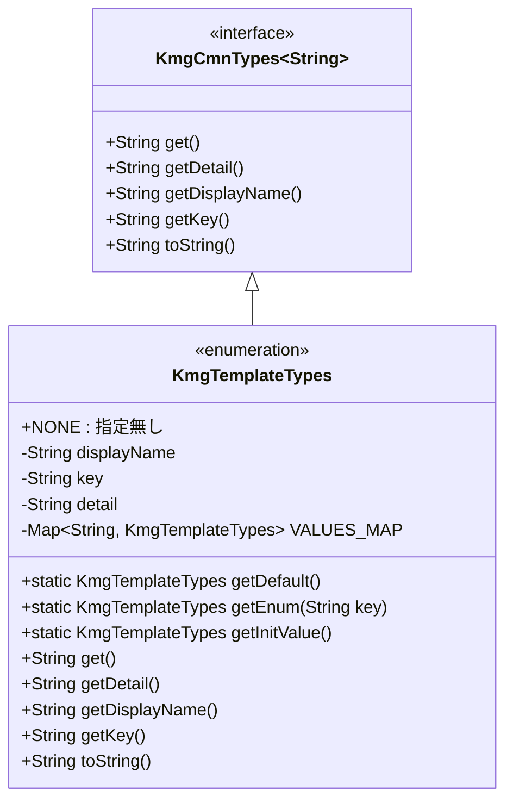
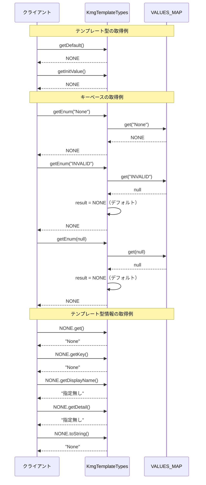

# インフラストラクチャ層型列挙層テンプレート層の設計書

## 1. クラス図



## 2. シーケンス図



## 3. パッケージ構造

### 3.1 パッケージの目的

`kmg.core.infrastructure.types.template` パッケージは、アプリケーションで使用されるテンプレート型の列挙定義を格納するパッケージです。テンプレートの種類を型安全に管理し、将来的な拡張に備えた基盤を提供します。

### 3.2 パッケージ構成

```text
kmg.core.infrastructure.types.template/
├── KmgTemplateTypes.java     # テンプレート型列挙
└── package-info.java          # パッケージ情報
```

### 3.3 パッケージの位置づけ

KMG フレームワークの型定義システムにおいて、テンプレート型を管理する責務を担います。

- **上位パッケージ**: `kmg.core.infrastructure.types`（型定義層）
- **基底インターフェース**: `KmgCmnTypes<String>`（共通型インターフェース）
- **関連パッケージ**:
  - `kmg.core.infrastructure.types.delimiter`（デリミタ型）
  - `kmg.core.infrastructure.types.charset`（文字セット型）
  - その他の型定義パッケージ

## 4. 主要コンポーネント

### 4.1 KmgTemplateTypes

テンプレートの種類を定義する列挙型です。現在は基本構造のみを提供し、将来の拡張に備えています。

#### 4.1.1 列挙定数

| 定数名 | 表示名   | キー | 詳細     | 用途                     |
| ------ | -------- | ---- | -------- | ------------------------ |
| NONE   | 指定無し | None | 指定無し | デフォルト値、未指定状態 |

#### 4.1.2 フィールド

1. **displayName**（表示名）

   - 型: `String`
   - 用途: ユーザーインターフェースでの表示
   - 特徴: 日本語による分かりやすい名称

2. **key**（キー）

   - 型: `String`
   - 用途: 一意識別子、検索キー
   - 特徴: 英語による簡潔な識別子

3. **detail**（詳細情報）

   - 型: `String`
   - 用途: 詳細な説明情報
   - 特徴: 追加情報の提供

4. **VALUES_MAP**（値マップ）
   - 型: `Map<String, KmgTemplateTypes>`
   - 用途: キーベースの高速検索
   - 特徴: static 初期化ブロックで構築

#### 4.1.3 静的メソッド

1. **getDefault()**

   ```java
   public static KmgTemplateTypes getDefault()
   ```

   - 戻り値: デフォルトのテンプレート型（NONE）
   - 用途: デフォルト値が必要な場合
   - 特徴: 常に NONE を返す

2. **getEnum(String key)**

   ```java
   public static KmgTemplateTypes getEnum(final String key)
   ```

   - パラメータ: key - 検索キー
   - 戻り値: 該当するテンプレート型、存在しない場合は NONE
   - 用途: キーから型を取得
   - 特徴: null 安全、存在しないキーでも NONE を返す

3. **getInitValue()**

   ```java
   public static KmgTemplateTypes getInitValue()
   ```

   - 戻り値: 初期値のテンプレート型（NONE）
   - 用途: 初期化時の値
   - 特徴: 常に NONE を返す

#### 4.1.4 インスタンスメソッド

1. **get()**

   ```java
   public String get()
   ```

   - 戻り値: キー値
   - 用途: 型のキーを取得
   - 特徴: getKey()のエイリアス

2. **getDetail()**

   ```java
   public String getDetail()
   ```

   - 戻り値: 詳細情報
   - 用途: 詳細な説明を取得

3. **getDisplayName()**

   ```java
   public String getDisplayName()
   ```

   - 戻り値: 表示名
   - 用途: UI での表示

4. **getKey()**

   ```java
   public String getKey()
   ```

   - 戻り値: キー値
   - 用途: 一意識別子の取得

5. **toString()**

   ```java
   public String toString()
   ```

   - 戻り値: キー値
   - 用途: 文字列表現の取得
   - 特徴: getKey()のエイリアス

## 5. 設計原則

### 5.1 型安全性

- **enum による定数管理**

  - コンパイル時の型チェック
  - IDE の補完機能活用
  - タイプセーフなテンプレート参照

- **インターフェース継承**
  - `KmgCmnTypes<String>`を実装
  - 統一的なインターフェース
  - 他の型定義との一貫性

### 5.2 拡張性

- **将来の拡張に備えた設計**

  - 基本構造の確立
  - 新しいテンプレート型の追加が容易
  - VALUES_MAP による柔軟な検索

- **マーカーとしての役割**
  - 現在は NONE のみだが、将来的な拡張を想定
  - システム全体の設計に組み込み済み

### 5.3 保守性

- **一元管理**

  - テンプレート型を一箇所で管理
  - 変更の影響範囲を限定
  - 重複定義の防止

- **命名規則の統一**
  - 他の型定義と同じパターン
  - 予測可能な構造
  - 学習コストの低減

### 5.4 エラーハンドリング

- **安全なキー検索**

  - 存在しないキーは NONE を返す
  - null 回避の設計
  - デフォルト値の明確化

- **null 安全性**
  - null キーの適切な処理
  - NullPointerException の防止

### 5.5 一貫性

- **KMG フレームワークの標準パターン**
  - 他の型定義と同じ構造
  - 統一的なメソッド命名
  - 予測可能な動作

## 6. 使用例

### 6.1 基本的な使用方法

#### 6.1.1 テンプレート型の取得

```java
// 直接参照
KmgTemplateTypes templateType = KmgTemplateTypes.NONE;

// デフォルト値の取得
KmgTemplateTypes defaultType = KmgTemplateTypes.getDefault();

// 初期値の取得
KmgTemplateTypes initType = KmgTemplateTypes.getInitValue();
```

#### 6.1.2 キーベースの取得

```java
// キーからテンプレート型を取得
String key = "None";
KmgTemplateTypes templateType = KmgTemplateTypes.getEnum(key);

// 存在しないキーの安全な処理
KmgTemplateTypes unknown = KmgTemplateTypes.getEnum("UNKNOWN");
// 結果: NONE（nullではない）

// null キーの安全な処理
KmgTemplateTypes nullKey = KmgTemplateTypes.getEnum(null);
// 結果: NONE（NullPointerException は発生しない）
```

### 6.2 テンプレート型情報の取得

#### 6.2.1 各種情報の取得

```java
KmgTemplateTypes templateType = KmgTemplateTypes.NONE;

// キーの取得
String key = templateType.get();              // "None"
String key2 = templateType.getKey();          // "None"

// 表示名の取得
String displayName = templateType.getDisplayName(); // "指定無し"

// 詳細情報の取得
String detail = templateType.getDetail();      // "指定無し"

// 文字列表現の取得
String str = templateType.toString();          // "None"
```

### 6.3 条件分岐での使用

#### 6.3.1 型の判定

```java
KmgTemplateTypes templateType = getTemplateType(); // 何らかの方法で取得

// NONE かどうかの判定
if (templateType == KmgTemplateTypes.NONE) {
    // デフォルト処理
    System.out.println("テンプレートが指定されていません");
}

// switch 式での使用（Java 14以降）
String message = switch (templateType) {
    case NONE -> "テンプレート未指定";
    // 将来的な拡張に備えた構造
    // case TEMPLATE_A -> "テンプレートA";
    // case TEMPLATE_B -> "テンプレートB";
};
```

### 6.4 ログ出力での使用

#### 6.4.1 ログメッセージへの組み込み

```java
KmgTemplateTypes templateType = KmgTemplateTypes.NONE;

// キーを使用したログ出力
logger.info("テンプレート型: {}", templateType.get());

// 表示名を使用したログ出力
logger.info("選択されたテンプレート: {}", templateType.getDisplayName());

// 詳細情報を使用したログ出力
logger.debug("テンプレート詳細: {}", templateType.getDetail());
```

### 6.5 モデルクラスでの使用

#### 6.5.1 フィールドとしての定義

```java
public class TemplateModel {

    private KmgTemplateTypes templateType;

    /**
     * コンストラクタ<br>
     */
    public TemplateModel() {
        // デフォルト値で初期化
        this.templateType = KmgTemplateTypes.getDefault();
    }

    /**
     * テンプレート型を取得する<br>
     *
     * @return テンプレート型
     */
    public KmgTemplateTypes getTemplateType() {
        return this.templateType;
    }

    /**
     * テンプレート型を設定する<br>
     *
     * @param templateType テンプレート型
     */
    public void setTemplateType(final KmgTemplateTypes templateType) {
        this.templateType = templateType != null ? templateType : KmgTemplateTypes.getDefault();
    }
}
```

### 6.6 設定ファイルとの連携

#### 6.6.1 外部設定からの型取得

```java
// プロパティファイルから設定を読み込み
Properties properties = new Properties();
properties.load(new FileInputStream("config.properties"));

// キーを取得してテンプレート型に変換
String templateKey = properties.getProperty("template.type", "None");
KmgTemplateTypes templateType = KmgTemplateTypes.getEnum(templateKey);

// 安全な取得（存在しない場合はデフォルト値）
if (templateType == KmgTemplateTypes.NONE) {
    logger.warn("テンプレート型が未指定のため、デフォルト設定を使用します");
}
```

### 6.7 テストでの使用

#### 6.7.1 ユニットテストでの検証

```java
@Test
public void testTemplateTypeDefault() {
    // デフォルト値の検証
    KmgTemplateTypes expected = KmgTemplateTypes.NONE;
    KmgTemplateTypes actual = KmgTemplateTypes.getDefault();

    Assertions.assertEquals(expected, actual, "デフォルト値が一致しません");
}

@Test
public void testTemplateTypeEnumSafetyWithNull() {
    // null 安全性の検証
    KmgTemplateTypes expected = KmgTemplateTypes.NONE;
    KmgTemplateTypes actual = KmgTemplateTypes.getEnum(null);

    Assertions.assertEquals(expected, actual, "null値の場合、NONEが返されること");
}

@Test
public void testTemplateTypeEnumSafetyWithInvalidKey() {
    // 無効なキーの安全性検証
    KmgTemplateTypes expected = KmgTemplateTypes.NONE;
    KmgTemplateTypes actual = KmgTemplateTypes.getEnum("INVALID_KEY");

    Assertions.assertEquals(expected, actual, "無効なキーの場合、NONEが返されること");
}
```

## 7. 将来の拡張方針

### 7.1 想定される拡張項目

現在は NONE のみの定義ですが、将来的には以下のようなテンプレート型の追加が想定されます。

#### 7.1.1 コード生成テンプレート

```java
// 将来的な拡張例
/**
 * Javaクラステンプレート
 *
 * @since 将来バージョン
 */
JAVA_CLASS("Javaクラステンプレート", "JavaClass", "Java クラスファイルの生成テンプレート"),

/**
 * Javaインターフェーステンプレート
 *
 * @since 将来バージョン
 */
JAVA_INTERFACE("Javaインターフェーステンプレート", "JavaInterface", "Java インターフェースファイルの生成テンプレート"),

/**
 * Java enumテンプレート
 *
 * @since 将来バージョン
 */
JAVA_ENUM("Java列挙型テンプレート", "JavaEnum", "Java enum ファイルの生成テンプレート"),
```

#### 7.1.2 ドキュメント生成テンプレート

```java
// 将来的な拡張例
/**
 * Javadocテンプレート
 *
 * @since 将来バージョン
 */
JAVADOC("Javadocテンプレート", "Javadoc", "Javadoc コメントの生成テンプレート"),

/**
 * README.mdテンプレート
 *
 * @since 将来バージョン
 */
README_MD("READMEテンプレート", "ReadmeMd", "README.md ファイルの生成テンプレート"),

/**
 * 設計書テンプレート
 *
 * @since 将来バージョン
 */
DESIGN_DOC("設計書テンプレート", "DesignDoc", "設計書の生成テンプレート"),
```

#### 7.1.3 データベーススクリプトテンプレート

```java
// 将来的な拡張例
/**
 * DDLテンプレート
 *
 * @since 将来バージョン
 */
DDL_SCRIPT("DDLテンプレート", "DdlScript", "データベース DDL スクリプトの生成テンプレート"),

/**
 * DMLテンプレート
 *
 * @since 将来バージョン
 */
DML_SCRIPT("DMLテンプレート", "DmlScript", "データベース DML スクリプトの生成テンプレート"),
```

#### 7.1.4 設定ファイルテンプレート

```java
// 将来的な拡張例
/**
 * YAMLテンプレート
 *
 * @since 将来バージョン
 */
YAML_CONFIG("YAML設定テンプレート", "YamlConfig", "YAML 設定ファイルの生成テンプレート"),

/**
 * Propertiesテンプレート
 *
 * @since 将来バージョン
 */
PROPERTIES_CONFIG("Properties設定テンプレート", "PropertiesConfig", "Properties ファイルの生成テンプレート"),
```

### 7.2 拡張時の考慮事項

#### 7.2.1 命名規則

- **表示名**: 日本語で分かりやすい名称
- **キー**: 英語による簡潔な識別子（CamelCase 推奨）
- **詳細**: 具体的な用途や特徴の説明

#### 7.2.2 互換性の維持

- 既存の NONE は削除・変更しない
- 新しい定数は末尾に追加
- デフォルト値は引き続き NONE を使用

#### 7.2.3 テストの追加

新しいテンプレート型を追加する際は、以下のテストを実装：

```java
@Test
public void testNewTemplateType_normalBasicValue() {
    /* 期待値の定義 */
    final String expected = "新しいテンプレートのキー";

    /* 準備 */
    final KmgTemplateTypes testType = KmgTemplateTypes.NEW_TEMPLATE;

    /* テスト対象の実行 */
    final String actual = testType.get();

    /* 検証の実施 */
    Assertions.assertEquals(expected, actual, "値が一致しません");
}
```

### 7.3 拡張に伴う関連機能

テンプレート型の拡張に伴い、以下の関連機能の実装も想定されます。

#### 7.3.1 テンプレートエンジンとの連携

```java
// 将来的な実装例
public interface KmgTemplateEngine {
    String generate(KmgTemplateTypes templateType, Map<String, Object> parameters);
}
```

#### 7.3.2 テンプレートファイルの管理

```java
// 将来的な実装例
public class KmgTemplateFileManager {
    public Path getTemplatePath(KmgTemplateTypes templateType);
    public String loadTemplate(KmgTemplateTypes templateType);
}
```

#### 7.3.3 カスタムテンプレートのサポート

```java
// 将来的な実装例
public class KmgCustomTemplateRegistry {
    public void register(String key, String templateContent);
    public KmgTemplateTypes getCustomTemplate(String key);
}
```

## 8. 設計の利点

### 8.1 型安全性

- **コンパイル時チェック**: enum による型安全な定数管理
- **IDE サポート**: 自動補完機能の活用
- **リファクタリング**: 安全な名前変更や参照の追跡

### 8.2 保守性

- **一元管理**: テンプレート型を一箇所で管理
- **変更容易性**: 新しいテンプレート型の追加が簡単
- **影響範囲の限定**: 変更の影響を最小限に抑制

### 8.3 拡張性

- **将来の拡張**: 基本構造が確立済み
- **柔軟な検索**: VALUES_MAP による効率的な検索
- **統一的なインターフェース**: KmgCmnTypes の実装

### 8.4 安全性

- **null 安全**: null キーの適切な処理
- **デフォルト値**: 存在しないキーに対する安全な動作
- **例外回避**: NullPointerException の防止

### 8.5 一貫性

- **フレームワーク標準**: KMG フレームワークの標準パターンに準拠
- **予測可能性**: 他の型定義と同じ動作
- **学習コスト**: 統一的な構造による学習コストの低減

## 9. 関連する型定義との比較

### 9.1 他の型定義との共通点

KmgTemplateTypes は、以下の型定義と同じ基本構造を持ちます：

| 型定義                  | 基底 IF | VALUES_MAP | getEnum() | getDefault() |
| ----------------------- | ------- | ---------- | --------- | ------------ |
| KmgTemplateTypes        | ✓       | ✓          | ✓         | ✓            |
| KmgCharsetTypes         | ✓       | ✓          | ✓         | ✓            |
| KmgDelimiterTypes       | ✓       | ✓          | ✓         | ✓            |
| KmgDbTypes              | ✓       | ✓          | ✓         | ✓            |
| JavaClassificationTypes | ✓       | ✓          | ✓         | ✓            |

### 9.2 特徴的な違い

| 型定義                  | 特徴                       | 追加フィールド/メソッド       |
| ----------------------- | -------------------------- | ----------------------------- |
| KmgTemplateTypes        | 将来の拡張に備えた基本構造 | なし（基本構造のみ）          |
| KmgCharsetTypes         | 文字セットの管理           | Charset toCharset()           |
| KmgDelimiterTypes       | デリミタ操作               | join(), split()               |
| KmgDbTypes              | データベース種類管理       | getAliasArray()               |
| JavaClassificationTypes | Java 要素の分類            | identify(), isJavadocTarget() |

### 9.3 設計パターンの一貫性

すべての型定義が同じパターンに従うことで：

- **学習コストの低減**: 一度パターンを理解すれば、他の型定義も容易に使用可能
- **保守性の向上**: 統一的な構造による保守作業の効率化
- **拡張性の確保**: 新しい型定義の追加が容易

## 10. まとめ

### 10.1 現在の状態

`kmg.core.infrastructure.types.template` パッケージは、KMG フレームワークにおけるテンプレート型管理の基盤を提供しています。

**現在の特徴:**

- 基本構造の確立
- 型安全な定数管理
- null 安全な動作
- KmgCmnTypes インターフェースの実装
- 他の型定義との一貫性

### 10.2 将来の展望

現在は NONE のみの定義ですが、将来的には以下の拡張が想定されます：

1. **コード生成テンプレート**: Java クラス、インターフェース、enum など
2. **ドキュメント生成テンプレート**: Javadoc、README、設計書など
3. **スクリプト生成テンプレート**: DDL、DML、マイグレーションなど
4. **設定ファイルテンプレート**: YAML、Properties、JSON など

### 10.3 設計の価値

この設計により、以下の価値を提供します：

1. **型安全性**: コンパイル時のチェックによる安全なコード
2. **保守性**: 一元管理による保守作業の効率化
3. **拡張性**: 将来の機能追加に対する柔軟な対応
4. **一貫性**: KMG フレームワーク全体との整合性
5. **安全性**: null 安全な動作とデフォルト値の提供

### 10.4 推奨される使用方法

1. **デフォルト値の使用**: 未指定状態では getDefault()を使用
2. **null 安全な取得**: getEnum()を使用して null を回避
3. **型の判定**: == 演算子で型を判定
4. **情報の取得**: 用途に応じて get()、getDisplayName()、getDetail()を使用
5. **将来の拡張**: 新しいテンプレート型の追加を想定した設計

この設計書は、`kmg.core.infrastructure.types.template` パッケージの現在の実装と将来の拡張方針を示しています。基本構造が確立されているため、必要に応じて新しいテンプレート型を追加することで、システムのテンプレート管理機能を拡張できます。
