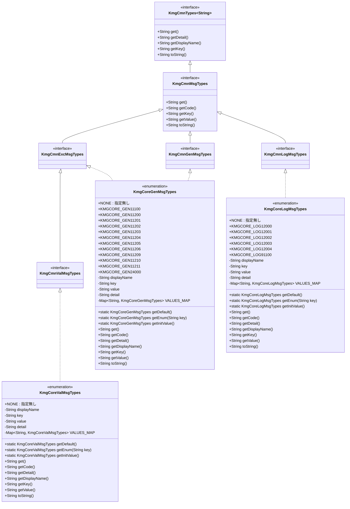
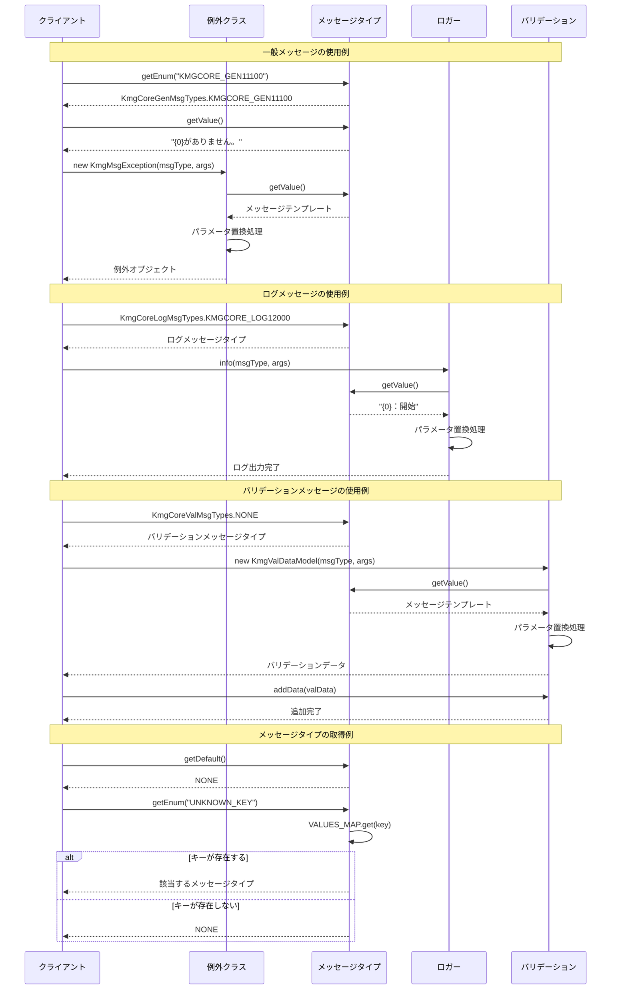

# インフラストラクチャ層型列挙層メッセージ層の設計書

## 1. クラス図



## 2. シーケンス図



## 3. パッケージ構造

msg パッケージは以下の階層構造で構成されています：

### 3.1 基底インターフェース (cmn.msg)

- **KmgCmnMsgTypes**: メッセージタイプの基底インターフェース
  - 全てのメッセージタイプが実装すべき共通メソッドを定義
  - `KmgCmnTypes<String>`を継承し、メッセージ固有のメソッドを追加

### 3.2 メッセージタイプインターフェース (cmn.msg)

- **KmgCmnGenMsgTypes**: 一般メッセージタイプインターフェース

  - 一般的なメッセージに使用
  - マーカーインターフェースとして機能

- **KmgCmnExcMsgTypes**: 例外メッセージタイプインターフェース

  - 例外処理で使用されるメッセージ
  - KmgMsgException、KmgRuntimeException などで使用

- **KmgCmnLogMsgTypes**: ログメッセージタイプインターフェース

  - ロギング処理で使用されるメッセージ
  - パフォーマンス測定などで使用

- **KmgCmnValMsgTypes**: バリデーションメッセージタイプインターフェース
  - バリデーション処理で使用されるメッセージ
  - KmgCmnExcMsgTypes を継承（バリデーションエラーも例外として扱える）

### 3.3 具体的な実装列挙型 (types.msg)

- **KmgCoreGenMsgTypes**: コアモジュールの一般メッセージ実装

  - KmgCmnGenMsgTypes と KmgCmnExcMsgTypes を実装
  - リフレクション処理、SQL パス処理などのメッセージを定義

- **KmgCoreLogMsgTypes**: コアモジュールのログメッセージ実装

  - KmgCmnLogMsgTypes を実装
  - パフォーマンス測定のログメッセージを定義

- **KmgCoreValMsgTypes**: コアモジュールのバリデーションメッセージ実装
  - KmgCmnValMsgTypes を実装
  - 現在は NONE のみ定義（将来の拡張用）

## 4. 主要コンポーネント

### 4.1 メッセージタイプシステム

メッセージタイプは以下の特徴を持つ enum として実装されています：

1. **統一的な構造**

   - displayName: 表示名
   - key: メッセージキー（enum 名）
   - value: メッセージテンプレート
   - detail: 詳細情報

2. **メッセージパラメータ**

   - {0}、{1}などのプレースホルダーを使用
   - MessageFormat 形式でパラメータ置換

3. **キーベースの取得**
   - VALUES_MAP による高速検索
   - 存在しないキーは NONE を返す安全な設計

### 4.2 メッセージ ID 体系

#### 4.2.1 一般メッセージ ID（KmgCoreGenMsgTypes）

- **KMGCORE_GEN11xxx**: リフレクション関連メッセージ

  - 11100: 存在チェック系
  - 11200-11299: フィールド/メソッド操作系

- **KMGCORE_GEN24xxx**: ビルド/パス関連メッセージ
  - 24000: ビルドパス取得エラー

#### 4.2.2 ログメッセージ ID（KmgCoreLogMsgTypes）

- **KMGCORE_LOG12xxx**: パフォーマンス測定系

  - 12000: 処理開始
  - 12001: 処理終了
  - 12002-12004: 中間チェックポイント

- **KMGCORE_LOG91xxx**: 汎用ログ
  - 91100: 汎用メッセージ

### 4.3 メッセージタイプの役割分担

1. **KmgCmnGenMsgTypes / KmgCoreGenMsgTypes**

   - 一般的な情報メッセージ
   - 例外メッセージとしても使用可能
   - リフレクション、SQL パス処理などのエラーメッセージ

2. **KmgCmnLogMsgTypes / KmgCoreLogMsgTypes**

   - ロギング専用メッセージ
   - パフォーマンス測定の進捗ログ
   - 構造化されたログ出力

3. **KmgCmnValMsgTypes / KmgCoreValMsgTypes**
   - バリデーションエラーメッセージ
   - KmgValDataModel、KmgValException で使用
   - 将来の拡張に備えた設計

## 5. 設計原則

### 5.1 型安全性

- **enum による定数管理**

  - コンパイル時の型チェック
  - IDE の補完機能活用
  - タイプセーフなメッセージ参照

- **インターフェース階層**
  - 用途別のメッセージタイプ分離
  - 明確な責任分担

### 5.2 拡張性

- **マーカーインターフェース**

  - 用途別のメッセージタイプを識別
  - 新しいメッセージタイプの追加が容易

- **モジュール別実装**
  - 各モジュールが独自のメッセージタイプを定義可能
  - 共通インターフェースで統一的な使用

### 5.3 保守性

- **一元管理**

  - メッセージ ID とテンプレートを一箇所で管理
  - メッセージの重複防止
  - 変更の影響範囲を限定

- **命名規則**
  - プレフィックスによるモジュール識別
  - カテゴリ別の番号体系
  - 意味のある英数字 ID

### 5.4 国際化対応

- **メッセージテンプレート**
  - プロパティファイルへの外部化可能
  - MessageFormat 準拠のパラメータ置換
  - 多言語対応の基盤

### 5.5 エラーハンドリング

- **安全なキー検索**
  - 存在しないキーは NONE を返す
  - null 回避の設計
  - デフォルト値の明確化

## 6. 使用例

### 6.1 一般メッセージの使用

```java
// メッセージタイプの取得
KmgCoreGenMsgTypes msgType = KmgCoreGenMsgTypes.KMGCORE_GEN11100;

// メッセージ内容の取得
String message = msgType.getValue();  // "{0}がありません。"

// 例外での使用
throw new KmgMsgException(
    KmgCoreGenMsgTypes.KMGCORE_GEN11100,
    new Object[] { "指定されたファイル" }
);
// 結果: "指定されたファイルがありません。"
```

### 6.2 ログメッセージの使用

```java
// ログメッセージタイプの使用
KmgPfaMeasService measService = new KmgPfaMeasServiceImpl("処理名");
measService.start();  // KMGCORE_LOG12000を内部で使用

// カスタムログメッセージ
KmgCoreLogMsgTypes logMsg = KmgCoreLogMsgTypes.KMGCORE_LOG91100;
logger.info(logMsg.getValue(), "カスタムメッセージ");
```

### 6.3 バリデーションメッセージの使用

```java
// バリデーションメッセージの作成
KmgValDataModel valData = new KmgValDataModelImpl(
    KmgCoreValMsgTypes.NONE,  // 実際のバリデーションメッセージ
    new Object[] { "フィールド名", "エラー詳細" }
);

// バリデーション結果への追加
KmgValsModel validations = new KmgValsModelImpl();
validations.addData(valData);

// バリデーションエラー判定
if (validations.isNotEmpty()) {
    throw new KmgValException(validations);
}
```

### 6.4 メッセージタイプの動的取得

```java
// キーからメッセージタイプを取得
String key = "KMGCORE_GEN11100";
KmgCoreGenMsgTypes msgType = KmgCoreGenMsgTypes.getEnum(key);

// デフォルト値の取得
KmgCoreGenMsgTypes defaultMsg = KmgCoreGenMsgTypes.getDefault();  // NONE

// 存在しないキーの安全な処理
KmgCoreGenMsgTypes unknown = KmgCoreGenMsgTypes.getEnum("UNKNOWN");
// 結果: NONE（nullではない）
```

### 6.5 メッセージ情報の取得

```java
KmgCoreGenMsgTypes msgType = KmgCoreGenMsgTypes.KMGCORE_GEN11100;

// 各種情報の取得
String key = msgType.getKey();              // "KMGCORE_GEN11100"
String code = msgType.getCode();            // "KMGCORE_GEN11100"
String value = msgType.getValue();          // "{0}がありません。"
String displayName = msgType.getDisplayName(); // "{0}がありません。"
String detail = msgType.getDetail();        // "{0}がありません。"
```

## 7. メッセージ定義ガイドライン

### 7.1 メッセージ ID の命名規則

1. **プレフィックス**: モジュール名を示す

   - KMGCORE: コアモジュール
   - KMGTOOL: ツールモジュール
   - KMGFUND: ファンデーションモジュール

2. **カテゴリ**: メッセージの種類を示す

   - GEN: 一般メッセージ
   - LOG: ログメッセージ
   - VAL: バリデーションメッセージ

3. **番号体系**: 機能グループと連番
   - 11xxx: リフレクション関連
   - 12xxx: パフォーマンス測定関連
   - 24xxx: ビルド/パス関連
   - 91xxx: 汎用メッセージ

### 7.2 メッセージテンプレート作成ガイド

1. **パラメータの使用**

   - {0}、{1}のような連番を使用
   - 具体的な値はパラメータで渡す
   - MessageFormat 形式に準拠

2. **メッセージの明確性**

   - エラーの原因が明確に分かる内容
   - 対処方法のヒントを含める（可能な場合）
   - 技術的すぎない表現を心がける

3. **一貫性の維持**
   - 似た状況では類似の表現を使用
   - 用語を統一
   - 敬体または常体を統一

### 7.3 新しいメッセージの追加手順

1. **メッセージ ID の決定**

   - 既存の ID 体系に従う
   - 重複しない ID を選択
   - 機能グループに適した番号を割り当て

2. **メッセージタイプの追加**

   ```java
   /**
    * メッセージの説明
    *
    * @since バージョン番号
    */
   MESSAGE_ID("メッセージテンプレート"),
   ```

3. **Javadoc の記述**
   - メッセージの用途を明記
   - パラメータの意味を説明
   - バージョン情報を記載

## 8. 関連クラスとの連携

### 8.1 例外クラスとの連携

- **KmgMsgException**: KmgCmnExcMsgTypes を受け取る
- **KmgRuntimeException**: KmgCmnExcMsgTypes を受け取る
- **KmgReflectionException**: KmgCmnExcMsgTypes を受け取る

### 8.2 バリデーションとの連携

- **KmgValDataModel**: KmgCmnValMsgTypes を受け取る
- **KmgValsModel**: 複数の KmgValDataModel を管理
- **KmgValException**: KmgValsModel を受け取る

### 8.3 ロギングとの連携

- **KmgPfaMeasService**: KmgCmnLogMsgTypes を使用
- **Logger**: メッセージタイプから値を取得して出力

## 9. まとめ

msg パッケージは、KMG フレームワークにおけるメッセージ管理の中核を担っています。

**主な特徴:**

- 型安全なメッセージ定義
- 階層的なインターフェース設計
- 用途別のメッセージタイプ分離
- 拡張性と保守性の両立
- 国際化対応の基盤

**設計の利点:**

- コンパイル時の型チェック
- IDE の補完機能による開発効率向上
- メッセージの一元管理
- モジュール間の独立性
- 安全なエラーハンドリング

このパッケージの設計により、一貫性のあるメッセージ管理と、保守しやすいコードベースを実現しています。
