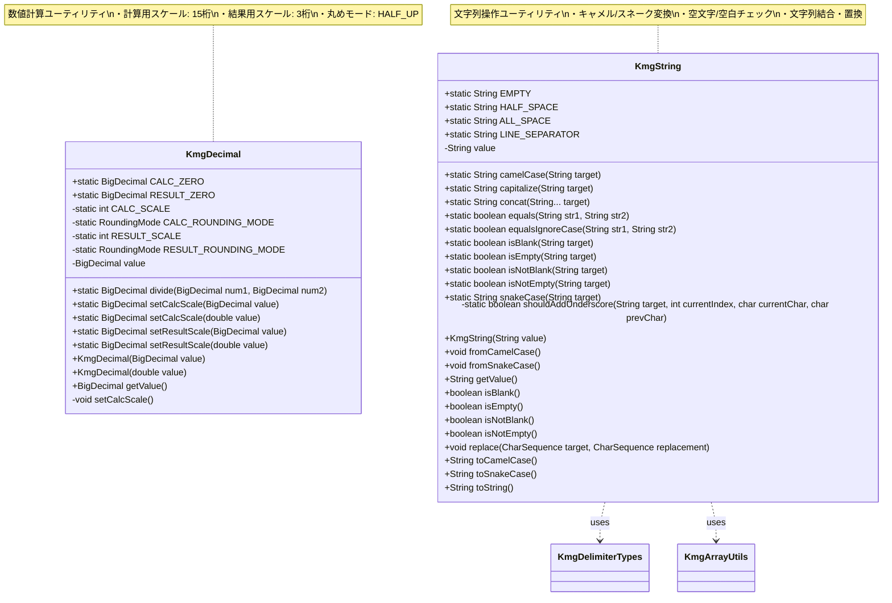
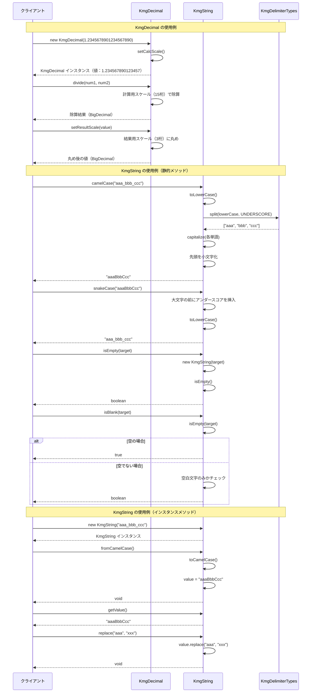

# インフラストラクチャ層型定義層の設計書

## 1. クラス図



## 2. シーケンス図



## 3. パッケージ概要

### 3.1 パッケージの目的

`kmg.core.infrastructure.type` パッケージは、アプリケーションで使用される基本的な型の拡張機能を提供します。文字列や数値などの基本型に対して、より高度な操作や安全な処理を行うためのユーティリティクラスを格納しています。

### 3.2 パッケージ構成

```text
kmg.core.infrastructure.type/
├── KmgDecimal.java          # 数値計算ユーティリティ
├── KmgString.java           # 文字列操作ユーティリティ
└── package-info.java        # パッケージ情報
```

## 4. 主要コンポーネント

### 4.1 KmgDecimal

BigDecimal を使用した高精度な数値計算を提供するユーティリティクラスです。

#### 4.1.1 主な機能

1. **定数**

   - `CALC_ZERO`: 計算用ゼロ（スケール 15 桁）
   - `RESULT_ZERO`: 結果用ゼロ（スケール 3 桁）

2. **計算用スケール管理**

   - スケール: 15 桁
   - 丸めモード: HALF_UP（四捨五入）
   - 高精度な中間計算を実現

3. **結果用スケール管理**

   - スケール: 3 桁
   - 丸めモード: HALF_UP（四捨五入）
   - 表示用の適切な桁数を提供

4. **除算処理**
   - `divide(BigDecimal, BigDecimal)`: 計算用スケールでの除算

#### 4.1.2 設計の特徴

- **静的メソッド**: 簡易に使用できる静的メソッドを提供
- **インスタンスメソッド**: 値を保持して連続的な操作が可能
- **自動スケール設定**: コンストラクタで自動的に計算用スケールを設定
- **型変換**: BigDecimal と double の両方に対応

### 4.2 KmgString

文字列の変換、検証、操作に関するユーティリティクラスです。

#### 4.2.1 主な機能

1. **定数**

   - `EMPTY`: 空文字列
   - `HALF_SPACE`: 半角スペース
   - `ALL_SPACE`: 全角スペース
   - `LINE_SEPARATOR`: システム依存の改行文字

2. **命名規則の変換**

   - `camelCase(String)`: スネークケース → キャメルケース
   - `snakeCase(String)`: キャメルケース → スネークケース
   - アンダースコア区切りとキャメルケースの相互変換

3. **文字列検証**

   - `isEmpty(String)`: null または空文字のチェック
   - `isBlank(String)`: null、空文字、または空白文字のみのチェック
   - `isNotEmpty(String)`: 空でないことのチェック
   - `isNotBlank(String)`: 空白でないことのチェック

4. **文字列操作**

   - `capitalize(String)`: 先頭文字を大文字化
   - `concat(String...)`: 複数の文字列を結合
   - `equals(String, String)`: null 安全な文字列比較
   - `equalsIgnoreCase(String, String)`: 大文字小文字を区別しない比較

5. **インスタンスメソッド**
   - `fromCamelCase()`: 自身をキャメルケースに変換
   - `fromSnakeCase()`: 自身をスネークケースに変換
   - `replace(CharSequence, CharSequence)`: 文字列置換

#### 4.2.2 設計の特徴

- **静的メソッド**: 簡易に使用できる静的ユーティリティメソッド
- **インスタンスメソッド**: 値を保持して連続的な操作が可能
- **null 安全**: null チェックを内包し、NullPointerException を防止
- **柔軟な変換**: キャメルケースとスネークケースの双方向変換

## 5. 設計原則

### 5.1 null 安全性

両クラスとも null 値の処理を適切に行い、予期しない NullPointerException を防ぎます。

- **KmgString**: 静的メソッドで null チェックを実施し、安全な結果を返す
- **KmgDecimal**: null 値に対しては NullPointerException をスローして異常を明示

### 5.2 使いやすさ

- **静的メソッド**: 簡単に呼び出せる静的ユーティリティメソッドを提供
- **インスタンスメソッド**: 連続的な操作が必要な場合にインスタンスを使用
- **定数の提供**: 頻繁に使用される値を定数として提供

### 5.3 精度と正確性

#### KmgDecimal の精度管理

- **計算用スケール（15 桁）**: 中間計算での精度を確保
- **結果用スケール（3 桁）**: 表示や出力での適切な桁数を提供
- **丸めモード**: 一貫した HALF_UP（四捨五入）を使用

#### KmgString の正確性

- **変換ロジック**: キャメルケースとスネークケースの変換ルールを正確に実装
- **エッジケース**: 1 文字、連続大文字、末尾大文字などのエッジケースに対応

### 5.4 テスト容易性

- 静的メソッドとインスタンスメソッドの両方を提供
- 各メソッドは単一の責務を持ち、テストしやすい設計
- 正常系、準正常系、異常系のすべてに対応

### 5.5 拡張性

- ユーティリティクラスとして設計し、新しいメソッドの追加が容易
- 既存のメソッドを変更せずに機能を追加可能

## 6. 使用例

### 6.1 KmgDecimal の使用例

#### 6.1.1 基本的な使用方法

```java
// インスタンス生成
KmgDecimal decimal = new KmgDecimal(1.2345678901234567890);
BigDecimal value = decimal.getValue(); // 1.234567890123457（計算用スケール15桁）

// 静的メソッドによる除算
BigDecimal num1 = new BigDecimal("10");
BigDecimal num2 = new BigDecimal("3");
BigDecimal result = KmgDecimal.divide(num1, num2); // 3.333333333333333
```

#### 6.1.2 スケール設定

```java
// 計算用スケール（15桁）の設定
BigDecimal calcValue = KmgDecimal.setCalcScale(1.2345678901234567890);
// → 1.234567890123457

// 結果用スケール（3桁）の設定
BigDecimal resultValue = KmgDecimal.setResultScale(1.2345678901234567890);
// → 1.235
```

#### 6.1.3 定数の使用

```java
// 計算用ゼロ（スケール15桁）
BigDecimal calcZero = KmgDecimal.CALC_ZERO; // 0.000000000000000

// 結果用ゼロ（スケール3桁）
BigDecimal resultZero = KmgDecimal.RESULT_ZERO; // 0.000
```

### 6.2 KmgString の使用例

#### 6.2.1 命名規則の変換（静的メソッド）

```java
// スネークケース → キャメルケース
String camelCase = KmgString.camelCase("aaa_bbb_ccc"); // "aaaBbbCcc"

// キャメルケース → スネークケース
String snakeCase = KmgString.snakeCase("aaaBbbCcc"); // "aaa_bbb_ccc"

// 連続大文字の処理
String result = KmgString.snakeCase("aaaBbbXMLHttp"); // "aaa_bbb_xml_http"
```

#### 6.2.2 文字列検証（静的メソッド）

```java
// 空文字チェック
boolean isEmpty1 = KmgString.isEmpty(null);  // true
boolean isEmpty2 = KmgString.isEmpty("");    // true
boolean isEmpty3 = KmgString.isEmpty("test"); // false

// 空白チェック
boolean isBlank1 = KmgString.isBlank(null);      // true
boolean isBlank2 = KmgString.isBlank("");        // true
boolean isBlank3 = KmgString.isBlank("   ");     // true
boolean isBlank4 = KmgString.isBlank("  test  "); // false
```

#### 6.2.3 文字列操作（静的メソッド）

```java
// 先頭文字の大文字化
String capitalized = KmgString.capitalize("test"); // "Test"

// 文字列結合
String concatenated = KmgString.concat("Hello", " ", "World"); // "Hello World"

// null 安全な文字列比較
boolean equals1 = KmgString.equals("test", "test"); // true
boolean equals2 = KmgString.equals(null, "test");   // false

// 大文字小文字を区別しない比較
boolean equalsIgnoreCase = KmgString.equalsIgnoreCase("TEST", "test"); // true
```

#### 6.2.4 インスタンスメソッドの使用

```java
// インスタンス生成と変換
KmgString kmgString = new KmgString("aaa_bbb_ccc");

// キャメルケースに変換
kmgString.fromCamelCase();
String value = kmgString.getValue(); // "aaaBbbCcc"

// 文字列置換
kmgString.replace("aaa", "xxx");
String replaced = kmgString.getValue(); // "xxxBbbCcc"

// スネークケースに変換
kmgString.fromSnakeCase();
String snakeCaseValue = kmgString.getValue(); // "xxx_bbb_ccc"

// 検証メソッド
boolean isEmpty = kmgString.isEmpty();     // false
boolean isBlank = kmgString.isBlank();     // false
boolean isNotEmpty = kmgString.isNotEmpty(); // true
boolean isNotBlank = kmgString.isNotBlank(); // true
```

#### 6.2.5 定数の使用

```java
// 定数の使用
String empty = KmgString.EMPTY;           // ""
String halfSpace = KmgString.HALF_SPACE;  // " "
String allSpace = KmgString.ALL_SPACE;    // "　"
String lineSeparator = KmgString.LINE_SEPARATOR; // システム依存の改行文字
```

### 6.3 実践的な使用例

#### 6.3.1 データベースフィールド名の変換

```java
// Javaのフィールド名（キャメルケース）からDBカラム名（スネークケース）への変換
String javaFieldName = "userId";
String dbColumnName = KmgString.snakeCase(javaFieldName); // "user_id"

// DBカラム名（スネークケース）からJavaのフィールド名（キャメルケース）への変換
String dbColumn = "user_name";
String javaField = KmgString.camelCase(dbColumn); // "userName"
```

#### 6.3.2 計算結果の表示

```java
// 高精度計算と結果の丸め
BigDecimal price = new BigDecimal("1000");
BigDecimal taxRate = new BigDecimal("0.08");

// 計算用スケールで計算
BigDecimal calcResult = price.multiply(taxRate); // 80.00...
BigDecimal calcScaled = KmgDecimal.setCalcScale(calcResult);

// 結果用スケールで表示
BigDecimal displayResult = KmgDecimal.setResultScale(calcScaled); // 80.000
```

#### 6.3.3 入力値の検証

```java
// ユーザー入力の検証
String userInput = request.getParameter("name");

if (KmgString.isBlank(userInput)) {
    throw new IllegalArgumentException("名前が入力されていません");
}

// 値の正規化
String normalized = userInput.trim();
```

## 7. テスト戦略

### 7.1 KmgDecimal のテストカバレッジ

1. **正常系**

   - 各スケール設定メソッドの動作確認
   - 除算処理の正確性確認
   - 定数の値確認

2. **準正常系**

   - null 値の処理（NullPointerException を期待）
   - ゼロ除算の処理（ArithmeticException を期待）

3. **境界値**
   - 非常に大きな値
   - 非常に小さな値
   - ゼロ値

### 7.2 KmgString のテストカバレッジ

1. **正常系**

   - 各変換メソッドの動作確認
   - 検証メソッドの正確性確認
   - 操作メソッドの機能確認

2. **準正常系**

   - null 値の処理
   - 空文字の処理
   - 1 文字の処理

3. **エッジケース**
   - 連続する大文字の処理
   - 末尾が大文字の場合の処理
   - 空白文字のみの文字列

## 8. パフォーマンス考慮事項

### 8.1 KmgDecimal

- **BigDecimal の使用**: 高精度だが、プリミティブ型より処理速度は遅い
- **スケール設定**: 各操作でスケールを設定するため、オーバーヘッドが存在
- **推奨事項**: 大量の計算が必要な場合は、適切なタイミングでスケール設定を行う

### 8.2 KmgString

- **StringBuilder の使用**: 文字列連結に StringBuilder を使用し、効率的な処理を実現
- **静的メソッドのオーバーヘッド**: 静的メソッドは内部でインスタンスを生成するため、連続操作ではインスタンスメソッドを推奨
- **推奨事項**: 連続的な文字列操作が必要な場合は、インスタンスを生成して使用

## 9. 今後の拡張方針

### 9.1 KmgDecimal の拡張案

1. **追加の数学関数**

   - 平方根、累乗などの数学関数
   - 統計関数（平均、標準偏差など）

2. **カスタムスケール**

   - スケールを指定できるメソッドの追加
   - 丸めモードを指定できるメソッドの追加

3. **フォーマット機能**
   - 数値のフォーマット機能（カンマ区切り、通貨表示など）

### 9.2 KmgString の拡張案

1. **追加の命名規則**

   - パスカルケースへの変換
   - ケバブケースへの変換

2. **文字列解析**

   - 正規表現によるマッチング
   - トークン分割機能

3. **エンコーディング**
   - URL エンコード/デコード
   - Base64 エンコード/デコード

## 10. まとめ

`kmg.core.infrastructure.type` パッケージは、基本的な型に対する拡張機能を提供し、以下の利点をもたらします。

1. **安全性**: null チェックやスケール管理により、安全な処理を実現
2. **利便性**: 頻繁に使用される操作を簡単に呼び出せる静的メソッドを提供
3. **柔軟性**: 静的メソッドとインスタンスメソッドの両方を提供し、用途に応じた使い分けが可能
4. **精度**: 高精度な数値計算と正確な文字列変換を実現

これらのユーティリティクラスは、アプリケーション全体で一貫した型操作を可能にし、コードの品質向上に貢献します。
