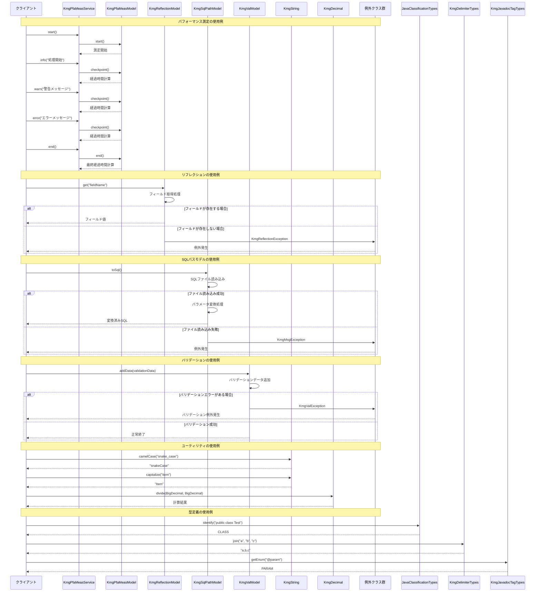

# コア全体の設計書

## 1. クラス図

```mermaid
classDiagram
    %% 例外クラス階層
    Exception <|-- KmgException
    KmgException <|-- KmgMsgException
    KmgMsgException <|-- KmgReflectionException
    KmgException <|-- KmgValException
    RuntimeException <|-- KmgRuntimeException

    %% メッセージタイプ階層
    KmgCmnTypes~String~ <|-- KmgCmnMsgTypes
    KmgCmnMsgTypes <|-- KmgCmnExcMsgTypes
    KmgCmnMsgTypes <|-- KmgCmnGenMsgTypes
    KmgCmnMsgTypes <|-- KmgCmnLogMsgTypes
    KmgCmnExcMsgTypes <|-- KmgCmnValMsgTypes

    %% 型定義クラス群
    KmgCmnTypes~String~ <|-- JavaClassificationTypes
    KmgCmnTypes~String~ <|-- KmgCharsetTypes
    KmgCmnTypes~String~ <|-- KmgDbDataTypeTypes
    KmgCmnTypes~String~ <|-- KmgDbTypes
    KmgCmnTypes~String~ <|-- KmgDelimiterTypes
    KmgCmnTypes~String~ <|-- KmgJavadocTagTypes
    KmgCmnTypes~String~ <|-- KmgJavaKeywordTypes
    KmgCmnTypes~String~ <|-- KmgTimeUnitTypes
    KmgCmnTypes~String~ <|-- KmgTemplateTypes

    %% モデルインターフェースと実装
    KmgPfaMeasModel <|.. KmgPfaMeasModelImpl
    KmgReflectionModel <|.. KmgReflectionModelImpl
    KmgSqlPathModel <|.. KmgSqlPathModelImpl
    KmgValDataModel <|.. KmgValDataModelImpl
    KmgValsModel <|.. KmgValsModelImpl

    %% サービスインターフェースと実装
    KmgPfaMeasService <|.. KmgPfaMeasServiceImpl

    %% ユーティリティクラス
    KmgString
    KmgDecimal
    KmgArrayUtils
    KmgListUtils
    KmgLocalDateTimeUtils
    KmgLocalDateUtils
    KmgMapUtils
    KmgMessageUtils
    KmgPathUtils

    %% テスト基底クラス
    AbstractKmgTest

    %% 例外クラス
    class KmgException {
        +KmgException(Throwable cause)
    }

    class KmgMsgException {
        -KmgCmnExcMsgTypes messageTypes
        -Object[] messageArgs
        -String message
        +KmgMsgException(KmgCmnExcMsgTypes messageTypes)
        +KmgMsgException(KmgCmnExcMsgTypes messageTypes, Object[] messageArgs)
        +KmgMsgException(KmgCmnExcMsgTypes messageTypes, Object[] messageArgs, Throwable cause)
        +KmgMsgException(KmgCmnExcMsgTypes messageTypes, Throwable cause)
        +String getMessage()
        +Object[] getMessageArgs()
        +KmgCmnExcMsgTypes getMessageTypes()
    }

    class KmgReflectionException {
        -KmgReflectionModel kmgReflectionModel
        +KmgReflectionException(KmgReflectionModel kmgReflectionModel, KmgCmnExcMsgTypes messageTypes)
        +KmgReflectionException(KmgReflectionModel kmgReflectionModel, KmgCmnExcMsgTypes messageTypes, Object[] messageArgs)
        +KmgReflectionException(KmgReflectionModel kmgReflectionModel, KmgCmnExcMsgTypes messageTypes, Object[] messageArgs, Throwable cause)
        +KmgReflectionException(KmgReflectionModel kmgReflectionModel, KmgCmnExcMsgTypes messageTypes, Throwable cause)
        +KmgReflectionModel getKmgReflectionModel()
    }

    class KmgValException {
        -KmgValsModel validationsModel
        +KmgValException(KmgValsModel validationsModel)
        +KmgValException(KmgValsModel validationsModel, Throwable cause)
        +KmgValsModel getValidationsModel()
    }

    class KmgRuntimeException {
        -KmgCmnExcMsgTypes messageTypes
        -Object[] messageArgs
        -String message
        +KmgRuntimeException(KmgCmnExcMsgTypes messageTypes)
        +KmgRuntimeException(KmgCmnExcMsgTypes messageTypes, Object[] messageArgs)
        +KmgRuntimeException(KmgCmnExcMsgTypes messageTypes, Object[] messageArgs, Throwable cause)
        +KmgRuntimeException(KmgCmnExcMsgTypes messageTypes, Throwable cause)
        +String getMessage()
        +Object[] getMessageArgs()
        +KmgCmnExcMsgTypes getMessageTypes()
    }

    %% 共通型インターフェース
    class KmgCmnTypes~T~ {
        <<interface>>
        +T get()
        +String getDetail()
        +String getDisplayName()
        +T getKey()
        +String toString()
    }

    class KmgCmnMsgTypes {
        <<interface>>
        +String get()
        +String getCode()
        +String getKey()
        +String getValue()
        +String toString()
    }

    class KmgCmnExcMsgTypes {
        <<interface>>
    }

    class KmgCmnGenMsgTypes {
        <<interface>>
    }

    class KmgCmnLogMsgTypes {
        <<interface>>
    }

    class KmgCmnValMsgTypes {
        <<interface>>
    }

    %% 型定義クラス
    class JavaClassificationTypes {
        <<enumeration>>
        +NONE, CLASS, INNER_CLASS, INTERFACE, ENUM, ENUM_CONST, ANNOTATION_DEFINITION, ANNOTATION_USAGE, FIELD, METHOD, CONSTRUCTOR, MODULE, PACKAGE_INFO
        -String displayName
        -String key
        -String detail
        -String classificationPattern
        +static JavaClassificationTypes identify(String text)
        +String getElementName(String text)
        +boolean isJavadocTarget()
        +boolean isNotJavadocTarget()
    }

    class KmgCharsetTypes {
        <<enumeration>>
        +NONE, MS932, UTF8
        -String displayName
        -String key
        -String detail
        -Charset charset
        +Charset toCharset()
    }

    class KmgDbDataTypeTypes {
        <<enumeration>>
        +NONE, INTEGER, LONG, DATE, TIME, STRING, SMALLSERIAL, SERIAL, FLOAT, DOUBLE, BIG_DECIMAL
        -String displayName
        -String key
        -String detail
        -Type type
        +Type getType()
    }

    class KmgDbTypes {
        <<enumeration>>
        +NONE, POSTGRE_SQL, MYSQL, ORACLE, SQL_SERVER
        -String displayName
        -String key
        -String detail
        -String[] aliasArray
        +String[] getAliasArray()
        +static KmgDbTypes getEnumByTarget(String target)
    }

    class KmgDelimiterTypes {
        <<enumeration>>
        +NONE, PERIOD, COMMA, COLON, VERTICAL_BAR, UNDERSCORE, SLASH, HYPHEN, HALF_SPACE, PLUS, ALL_COLON, ALL_IDEOGRAPHIC, SERIES_HALF_SPACE, LINE_SEPARATOR, REGEX_LINE_SEPARATOR, TAB, HALF_EQUAL, HALF_AT_SIGN
        -String displayName
        -String key
        -String detail
        +String join(Object... targets)
        +String joinAll(Object... targets)
        +String[] split(String target)
        +String[] split(String target, int limit)
    }

    class KmgJavadocTagTypes {
        <<enumeration>>
        +NONE, AUTHOR, VERSION, SEE, SINCE, DEPRECATED, PARAM, RETURN, THROWS, EXCEPTION, SERIAL_DATA, SERIAL_FIELD, SERIAL, INHERIT_DOC, CODE, LINK, LINK_PLAIN, LITERAL, VALUE, DOC_ROOT, HIDDEN, SUMMARY, INDEX, API_NOTE, IMPL_SPEC, IMPL_NOTE, SYSTEM_PROPERTY, SNIPPET, PROVIDES, USES
        -String displayName
        -String key
        -String detail
        -List~JavaClassificationTypes~ locations
        +List~JavaClassificationTypes~ getLocations()
        +boolean isVersionValue()
        +static String createSearchKey(String key)
    }

    class KmgJavaKeywordTypes {
        <<enumeration>>
        +NONE, ABSTRACT, ASSERT, BOOLEAN, BREAK, BYTE, CASE, CATCH, CHAR, CLASS, CONST, CONTINUE, DEFAULT, DO, DOUBLE, ELSE, ENUM, EXPORTS, EXTENDS, FINAL, FINALLY, FLOAT, FOR, GOTO, IF, IMPLEMENTS, IMPORT, INSTANCEOF, INT, INTERFACE, LONG, MODULE, NATIVE, NEW, NON_SEALED, OPEN, OPENS, PACKAGE, PERMITS, PRIVATE, PROTECTED, PROVIDES, PUBLIC, RECORD, REQUIRES, RETURN, SEALED, SHORT, STATIC, STRICTFP, SUPER, SWITCH, SYNCHRONIZED, THIS, THROW, THROWS, TO, TRANSIENT, TRANSITIVE, TRY, USES, VAR, VOID, VOLATILE, WHEN, WHILE, YIELD
        -String displayName
        -String key
        -String detail
    }

    class KmgTimeUnitTypes {
        <<enumeration>>
        +NONE, SECONDS, MILLISECOND, MICROSECONDS, NANOSECONDS
        -String displayName
        -String key
        -String detail
        -String unitName
        -BigDecimal unitValue
        +String getUnitName()
        +BigDecimal getUnitValue()
    }

    class KmgTemplateTypes {
        <<enumeration>>
        -String displayName
        -String key
        -String detail
    }

    %% モデルインターフェース
    class KmgPfaMeasModel {
        <<interface>>
        +void checkpoint()
        +void end()
        +double getElapsedTime()
        +long getEndTime()
        +long getStartTime()
        +KmgTimeUnitTypes getTimeUnit()
        +void start()
    }

    class KmgReflectionModel {
        <<interface>>
        +Object get(String fieldName)
        +Field getLastGetField()
        +Object getMethod(String methodName, Object... parameters)
        +void set(String fieldName, Object value)
    }

    class KmgSqlPathModel {
        <<interface>>
        +String toSql()
    }

    class KmgValDataModel {
        <<interface>>
        +String getMessage()
        +Object[] getMessageArgs()
        +KmgCmnValMsgTypes getMessageTypes()
    }

    class KmgValsModel {
        <<interface>>
        +void addData(KmgValDataModel data)
        +List~KmgValDataModel~ getDatas()
        +boolean isEmpty()
        +boolean isNotEmpty()
        +void merge(KmgValsModel valsModel)
    }

    %% モデル実装クラス
    class KmgPfaMeasModelImpl {
        -long startTime
        -long checkpointTime
        -long endTime
        -double elapsedTime
        -KmgTimeUnitTypes timeUnit
        +void checkpoint()
        +void end()
        +double getElapsedTime()
        +long getEndTime()
        +long getStartTime()
        +KmgTimeUnitTypes getTimeUnit()
        +void start()
        -long getNow()
        -void calculateElapsedTime()
    }

    class KmgReflectionModelImpl {
        -Object object
        -Class~?~ clazz
        -Field lastGetField
        +KmgReflectionModelImpl(Object object)
        +Object get(String fieldName)
        +Field getLastGetField()
        +Object getMethod(String methodName, Object... parameters)
        +void set(String fieldName, Object value)
        -Field getDeclaredField(Class~?~ targetClazz, String name)
        -Method[] getDeclaredMethods(Class~?~ targetClazz)
        -Field getField(Class~?~ targetClazz, String name)
        -Object getValue(Field field, Object targetObject)
        -Object invoke(Method method, Object targetObject, Object... parameters)
        -void setValue(Field field, Object targetObject, Object value)
    }

    class KmgSqlPathModelImpl {
        -Path sqlFilePath
        +KmgSqlPathModelImpl(Class~?~ zlass, Path sqlFileNamePath)
        +KmgSqlPathModelImpl(Object object, Path sqlFileNamePath)
        +String toSql()
        -static String convertParameters(String str)
    }

    class KmgValDataModelImpl {
        -KmgCmnValMsgTypes messageTypes
        -Object[] messageArgs
        -String message
        +KmgValDataModelImpl(KmgCmnValMsgTypes messageTypes, Object[] messageArgs)
        +String getMessage()
        +Object[] getMessageArgs()
        +KmgCmnValMsgTypes getMessageTypes()
        -String createMessage()
        -void createMessageSource()
    }

    class KmgValsModelImpl {
        -List~KmgValDataModel~ datas
        +KmgValsModelImpl()
        +void addData(KmgValDataModel data)
        +List~KmgValDataModel~ getDatas()
        +boolean isEmpty()
        +boolean isNotEmpty()
        +void merge(KmgValsModel valsModel)
    }

    %% サービスインターフェース
    class KmgPfaMeasService {
        <<interface>>
        +void end()
        +void error(String msgContents)
        +void error(String msgContents, Throwable throwable)
        +void info(String msgContents)
        +void start()
        +void warn(String msgContents)
    }

    %% サービス実装クラス
    class KmgPfaMeasServiceImpl {
        -Logger logger
        -String name
        -KmgPfaMeasModel kmgPfaMeasModel
        +KmgPfaMeasServiceImpl(String name)
        +KmgPfaMeasServiceImpl(String name, Logger logger)
        +void end()
        +void error(String msgContents)
        +void error(String msgContents, Throwable throwable)
        +String getName()
        +void info(String msgContents)
        +void start()
        +void warn(String msgContents)
        -KmgPfaMeasModel createKmgPfaMeasModel()
    }

    %% ユーティリティクラス
    class KmgString {
        +static String EMPTY
        +static String HALF_SPACE
        +static String ALL_SPACE
        +static String LINE_SEPARATOR
        -String value
        +static String camelCase(String target)
        +static String capitalize(String target)
        +static String concat(String... target)
        +static boolean equals(String str1, String str2)
        +static boolean equalsIgnoreCase(String str1, String str2)
        +static boolean isBlank(String target)
        +static boolean isEmpty(String target)
        +static boolean isNotBlank(String target)
        +static boolean isNotEmpty(String target)
        +static String snakeCase(String target)
        +KmgString(String value)
        +void fromCamelCase()
        +void fromSnakeCase()
        +String getValue()
        +boolean isBlank()
        +boolean isEmpty()
        +boolean isNotBlank()
        +boolean isNotEmpty()
        +void replace(CharSequence target, CharSequence replacement)
        +String toCamelCase()
        +String toSnakeCase()
        +String toString()
    }

    class KmgDecimal {
        +static BigDecimal CALC_ZERO
        +static BigDecimal RESULT_ZERO
        -BigDecimal value
        +static BigDecimal divide(BigDecimal num1, BigDecimal num2)
        +static BigDecimal setCalcScale(BigDecimal value)
        +static BigDecimal setCalcScale(double value)
        +static BigDecimal setResultScale(BigDecimal value)
        +static BigDecimal setResultScale(double value)
        +KmgDecimal(BigDecimal value)
        +KmgDecimal(double value)
        +BigDecimal getValue()
        -void setCalcScale()
    }

    class AbstractKmgTest {
        +static Path TEST_RESOURCES
        +static Path getTestMethodPath(Class~?~ testClass, String testMethodName)
        +static String normalizeLineSeparators(String text)
        +static void verifyFileContent(Path filePath)
        +AbstractKmgTest()
        +Path getCurrentTestMethodPath(TestInfo testInfo)
        +Path getTestMethodPath(String testMethodName)
        +void verifyKmgMsgException(KmgMsgException actualException, Class~?~ expectedCauseClass, String expectedDomainMessage, KmgCmnGenMsgTypes expectedMessageTypes)
        +void verifyKmgMsgException(KmgMsgException actualException, String expectedDomainMessage, KmgCmnGenMsgTypes expectedMessageTypes)
    }

    %% 関係性
    KmgMsgException --> KmgCmnExcMsgTypes : uses
    KmgRuntimeException --> KmgCmnExcMsgTypes : uses
    KmgReflectionException --> KmgReflectionModel : uses
    KmgValException --> KmgValsModel : uses
    KmgPfaMeasServiceImpl --> KmgPfaMeasModel : uses
    KmgPfaMeasModelImpl --> KmgTimeUnitTypes : uses
    KmgReflectionModelImpl --> KmgReflectionException : throws
    KmgSqlPathModelImpl --> KmgMsgException : throws
    KmgValDataModelImpl --> KmgCmnValMsgTypes : uses
    KmgValsModelImpl --> KmgValDataModel : uses
    AbstractKmgTest --> KmgMsgException : uses
    AbstractKmgTest --> KmgCmnGenMsgTypes : uses
```



## 2. シーケンス図



## 3. パッケージ構造

kmg-core は以下のパッケージ構造で構成されています：

### 3.1 ドメイン層 (domain)

- **service**: ビジネスロジックを提供するサービスインターフェースと実装
  - `KmgPfaMeasService`: パフォーマンス測定サービス
  - `KmgPfaMeasServiceImpl`: パフォーマンス測定サービスの実装

### 3.2 インフラストラクチャ層 (infrastructure)

#### 3.2.1 共通機能 (cmn)

- **KmgCmnTypes**: 共通型インターフェース
- **msg**: メッセージタイプの定義
  - `KmgCmnMsgTypes`: メッセージタイプの基底インターフェース
  - `KmgCmnExcMsgTypes`: 例外メッセージタイプ
  - `KmgCmnGenMsgTypes`: 一般メッセージタイプ
  - `KmgCmnLogMsgTypes`: ログメッセージタイプ
  - `KmgCmnValMsgTypes`: バリデーションメッセージタイプ

#### 3.2.2 例外処理 (exception)

- `KmgException`: 基底例外クラス
- `KmgMsgException`: メッセージ付き例外クラス
- `KmgReflectionException`: リフレクション例外クラス
- `KmgRuntimeException`: 実行時例外クラス
- `KmgValException`: バリデーション例外クラス

#### 3.2.3 モデル (model)

- **インターフェース**:
  - `KmgPfaMeasModel`: パフォーマンス測定モデル
  - `KmgReflectionModel`: リフレクションモデル
  - `KmgSqlPathModel`: SQL パスモデル
  - `KmgValDataModel`: バリデーションデータモデル
  - `KmgValsModel`: バリデーション集合モデル
- **実装クラス**:
  - 各インターフェースに対応する実装クラス

#### 3.2.4 型定義 (types)

- `JavaClassificationTypes`: Java 要素の分類
- `KmgCharsetTypes`: 文字セット定義
- `KmgDbDataTypeTypes`: データベースデータ型定義
- `KmgDbTypes`: データベース種類定義
- `KmgDelimiterTypes`: デリミタ定義
- `KmgJavadocTagTypes`: Javadoc タグ定義
- `KmgJavaKeywordTypes`: Java キーワード定義
- `KmgTimeUnitTypes`: 時間単位定義
- `KmgTemplateTypes`: テンプレート定義

#### 3.2.5 ユーティリティ (utils)

- `KmgString`: 文字列操作ユーティリティ
- `KmgDecimal`: 数値計算ユーティリティ
- `KmgArrayUtils`: 配列操作ユーティリティ
- `KmgListUtils`: リスト操作ユーティリティ
- `KmgLocalDateTimeUtils`: 日時操作ユーティリティ
- `KmgLocalDateUtils`: 日付操作ユーティリティ
- `KmgMapUtils`: マップ操作ユーティリティ
- `KmgMessageUtils`: メッセージ操作ユーティリティ
- `KmgPathUtils`: パス操作ユーティリティ

#### 3.2.6 テスト (test)

- `AbstractKmgTest`: テスト基底クラス

## 4. 主要コンポーネント

### 4.1 例外処理システム

kmg-core は階層的な例外処理システムを提供しています：

1. **KmgException**: 基底例外クラス
2. **KmgMsgException**: メッセージ付き例外（チェック例外）
3. **KmgRuntimeException**: メッセージ付き実行時例外
4. **KmgReflectionException**: リフレクション操作時の例外
5. **KmgValException**: バリデーション例外

### 4.2 型定義システム

`KmgCmnTypes<T>`インターフェースを基底とした型定義システム：

- 各型定義は enum として実装
- 表示名、キー、詳細情報を統一的な形式で提供
- 型安全な操作を保証

### 4.3 パフォーマンス測定

`KmgPfaMeasService`と`KmgPfaMeasModel`によるパフォーマンス測定機能：

- 開始/終了/チェックポイント機能
- 経過時間の自動計算
- 適切な時間単位の自動選択
- ログ出力機能

### 4.4 リフレクション機能

`KmgReflectionModel`による安全なリフレクション操作：

- フィールドの取得/設定
- メソッドの呼び出し
- 型安全な操作
- 例外処理

### 4.5 バリデーション機能

`KmgValsModel`と`KmgValDataModel`によるバリデーション機能：

- バリデーション結果の収集
- 複数のバリデーションエラーの管理
- メッセージ付きエラー情報

### 4.6 ユーティリティ機能

各種ユーティリティクラスによる共通機能の提供：

- 文字列操作（キャメルケース変換、大文字化など）
- 数値計算（BigDecimal 操作）
- 配列・リスト・マップ操作
- 日時操作
- パス操作

## 5. 設計原則

### 5.1 型安全性

- ジェネリクスを活用した型安全な設計
- enum による定数管理
- コンパイル時の型チェック

### 5.2 例外処理

- 階層的な例外設計
- メッセージ付き例外による詳細なエラー情報
- 適切な例外の使い分け

### 5.3 拡張性

- インターフェースベースの設計
- 実装クラスの分離
- 新機能の追加が容易

### 5.4 再利用性

- 共通機能のユーティリティ化
- 型定義の統一
- テンプレート機能

### 5.5 テスト容易性

- テスト基底クラスの提供
- モック化しやすい設計
- 検証メソッドの提供

## 6. 使用例

### 6.1 パフォーマンス測定

```java
KmgPfaMeasService measService = new KmgPfaMeasServiceImpl("処理名");
measService.start();
// 何らかの処理
measService.checkpoint();
measService.info("中間処理完了");
// 何らかの処理
measService.end();
```

### 6.2 リフレクション操作

```java
KmgReflectionModel reflection = new KmgReflectionModelImpl(targetObject);
Object value = reflection.get("fieldName");
reflection.set("fieldName", newValue);
```

### 6.3 バリデーション

```java
KmgValsModel validations = new KmgValsModelImpl();
// バリデーション処理
if (validations.isNotEmpty()) {
    throw new KmgValException(validations);
}
```

### 6.4 文字列操作

```java
String camelCase = KmgString.camelCase("snake_case_string");
String capitalized = KmgString.capitalize("item");
```

### 6.5 型定義の使用

```java
JavaClassificationTypes type = JavaClassificationTypes.identify("public class Test");
KmgDelimiterTypes delimiter = KmgDelimiterTypes.COMMA;
String joined = delimiter.join("a", "b", "c");
```
