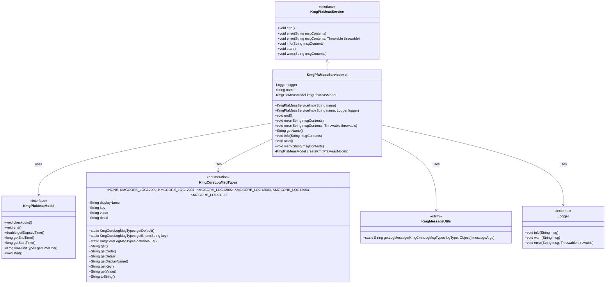

# ドメインサービスの設計書

## 1. クラス図



## 2. シーケンス図


## 3. パッケージ構造

service パッケージは以下の構造で構成されています：

### 3.1 ドメインサービス層 (domain.service)

- **KmgPfaMeasService**: パフォーマンス測定サービスのインターフェース
  - ビジネスロジックの契約を定義
  - 測定開始/終了、ログ出力機能を提供

### 3.2 ドメインサービス実装層 (domain.service.impl)

- **KmgPfaMeasServiceImpl**: パフォーマンス測定サービスの実装
  - インターフェースの具体的な実装
  - ログ出力とパフォーマンス測定の統合

## 4. 主要コンポーネント

### 4.1 KmgPfaMeasService インターフェース

パフォーマンス測定サービスの契約を定義するインターフェース：

- **start()**: 測定開始
- **end()**: 測定終了
- **checkpoint()**: チェックポイント（内部で自動実行）
- **info()**: 情報ログ出力
- **warn()**: 警告ログ出力
- **error()**: エラーログ出力（例外付き/なし）

### 4.2 KmgPfaMeasServiceImpl 実装クラス

パフォーマンス測定サービスの具体的な実装：

#### 4.2.1 主要フィールド

- **logger**: SLF4J ロガー（外部から注入可能）
- **name**: 測定対象の名称
- **kmgPfaMeasModel**: パフォーマンス測定モデル

#### 4.2.2 コンストラクタ

- **KmgPfaMeasServiceImpl(String name)**: 標準コンストラクタ
- **KmgPfaMeasServiceImpl(String name, Logger logger)**: テスト用コンストラクタ

#### 4.2.3 主要メソッド

- **start()**: 測定開始とログ出力
- **end()**: 測定終了とログ出力
- **info()**: 情報ログ出力（チェックポイント付き）
- **warn()**: 警告ログ出力（チェックポイント付き）
- **error()**: エラーログ出力（チェックポイント付き）
- **getName()**: 名称取得
- **createKmgPfaMeasModel()**: モデル生成（protected）

### 4.3 ログメッセージタイプ

KmgCoreLogMsgTypes による統一されたログメッセージ管理：

- **KMGCORE_LOG12000**: 開始メッセージ `{0}：開始`
- **KMGCORE_LOG12001**: 終了メッセージ `{0}：終了。経過時間=[{1}{2}]`
- **KMGCORE_LOG12002**: エラーメッセージ `{0}：{1}。経過時間=[{2}{3}]`
- **KMGCORE_LOG12003**: 情報メッセージ `{0}：{1}。経過時間=[{2}{3}]`
- **KMGCORE_LOG12004**: 警告メッセージ `{0}：{1}。経過時間=[{2}{3}]`

## 5. 設計原則

### 5.1 単一責任の原則

- パフォーマンス測定とログ出力の責任を明確に分離
- 各メソッドは単一の機能に集中

### 5.2 依存性注入

- ロガーを外部から注入可能（テスト容易性向上）
- モデル生成を protected メソッドで分離（拡張性向上）

### 5.3 統一されたログ出力

- メッセージタイプによる統一されたログ形式
- 経過時間の自動付与
- 適切なログレベル（info, warn, error）

### 5.4 型安全性

- インターフェースによる契約の明確化
- メッセージタイプによる型安全なログ出力

### 5.5 拡張性

- インターフェースベースの設計
- protected メソッドによる実装の拡張可能性

## 6. 使用例

### 6.1 基本的な使用例

```java
// サービスの作成
KmgPfaMeasService measService = new KmgPfaMeasServiceImpl("データ処理");

// 測定開始
measService.start();

// 処理実行
// ... 何らかの処理 ...

// 情報ログ出力（自動的にチェックポイント実行）
measService.info("データ読み込み完了");

// 処理実行
// ... 何らかの処理 ...

// 警告ログ出力
measService.warn("一部のデータが不正です");

// 処理実行
// ... 何らかの処理 ...

// エラーログ出力
try {
    // ... エラーが発生する可能性のある処理 ...
} catch (Exception e) {
    measService.error("処理中にエラーが発生しました", e);
}

// 測定終了
measService.end();
```

### 6.2 テスト用の使用例

```java
// テスト用ロガーを注入
Logger testLogger = LoggerFactory.getLogger("TestLogger");
KmgPfaMeasService measService = new KmgPfaMeasServiceImpl("テスト処理", testLogger);

// 通常の使用と同様
measService.start();
measService.info("テスト開始");
measService.end();
```

### 6.3 カスタム実装の例

```java
public class CustomPfaMeasServiceImpl extends KmgPfaMeasServiceImpl {

    public CustomPfaMeasServiceImpl(String name) {
        super(name);
    }

    @Override
    protected KmgPfaMeasModel createKmgPfaMeasModel() {
        // カスタムモデルの実装
        return new CustomKmgPfaMeasModelImpl();
    }
}
```

## 7. ログ出力例

### 7.1 開始ログ

```text
データ処理：開始
```

### 7.2 情報ログ

```text
データ処理：データ読み込み完了。経過時間=[1.234秒]
```

### 7.3 警告ログ

```text
データ処理：一部のデータが不正です。経過時間=[2.456秒]
```

### 7.4 エラーログ

```text
データ処理：処理中にエラーが発生しました。経過時間=[3.789秒]
```

### 7.5 終了ログ

```text
データ処理：終了。経過時間=[5.123秒]
```

## 8. パフォーマンス特性

### 8.1 オーバーヘッド

- チェックポイント処理は軽量（ナノ秒レベル）
- ログ出力は SLF4J の設定に依存
- メッセージ生成は最小限のオーバーヘッド

### 8.2 メモリ使用量

- 各インスタンスは軽量（ロガー、名称、モデルのみ）
- ログメッセージは都度生成（メモリ効率良好）

### 8.3 スレッド安全性

- インスタンス単位での使用を想定
- 複数スレッドからの同時アクセスは考慮されていない

## 9. 拡張ポイント

### 9.1 カスタムログメッセージ

- KmgCoreLogMsgTypes に新しいメッセージタイプを追加
- カスタムログ形式の実装

### 9.2 カスタム測定モデル

- createKmgPfaMeasModel() メソッドのオーバーライド
- 独自の測定ロジックの実装

### 9.3 カスタムロガー

- コンストラクタでのロガー注入
- 独自のログ出力形式の実装

## 10. 注意事項

### 10.1 使用上の注意

- start() と end() のペアでの使用を推奨
- 長時間実行される処理での使用を想定
- ログレベルは適切に設定すること

### 10.2 パフォーマンス考慮

- 頻繁なチェックポイントは避ける
- ログ出力の頻度を適切に制御
- 本番環境でのログレベル設定に注意

### 10.3 テスト考慮

- ロガーのモック化
- 時間依存のテストでの注意
- 並行処理テストでの注意
