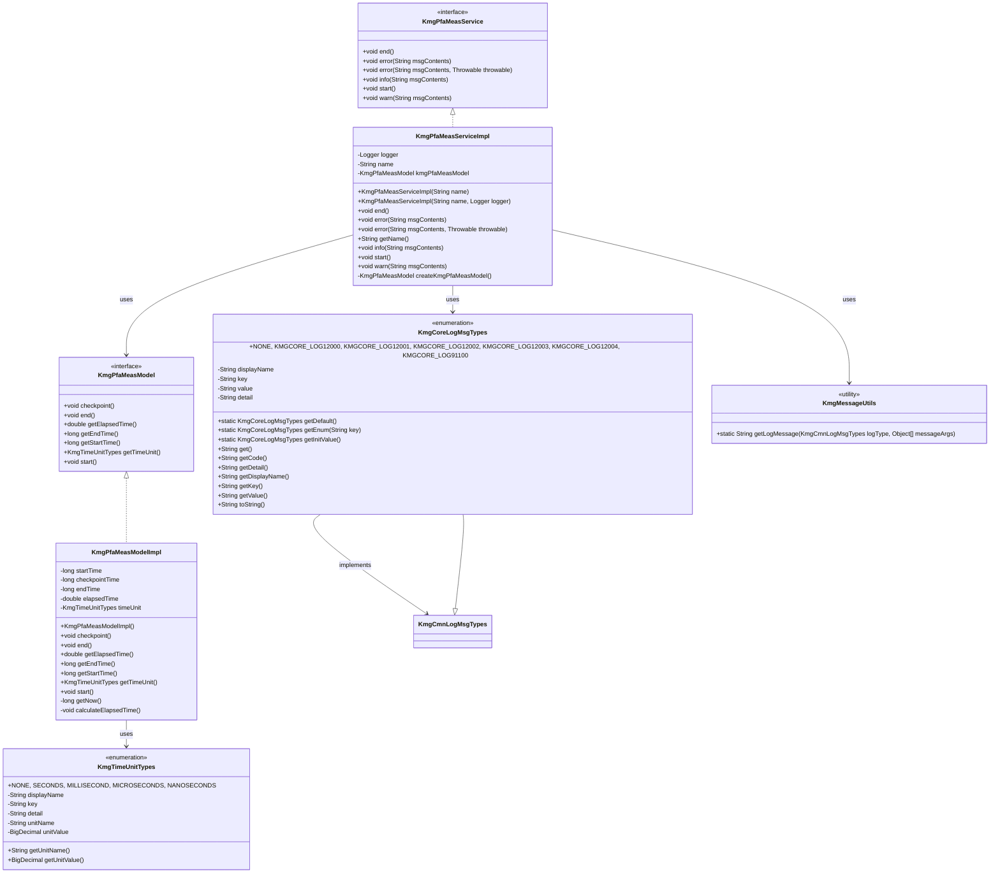
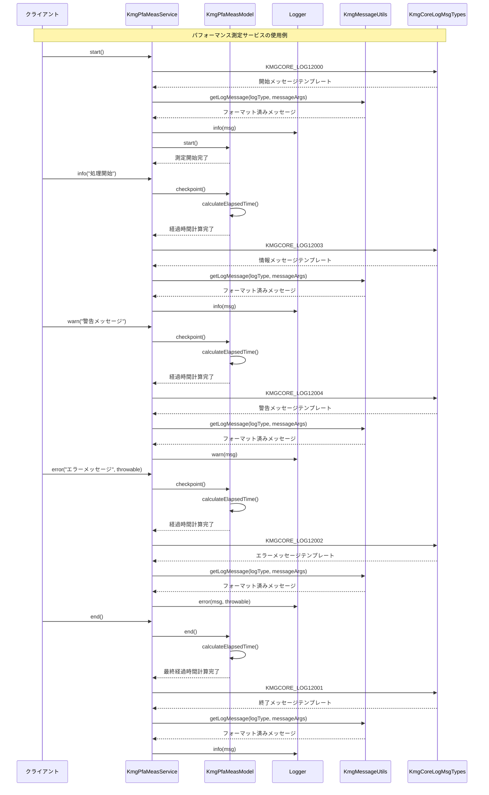

# ドメインサービス実装の設計書

## 1. クラス図



## 2. シーケンス図



## 3. パッケージ構造

ドメインサービス実装パッケージ（`kmg.core.domain.service.impl`）は以下の構造で構成されています：

### 3.1 ドメインサービス実装層 (domain.service.impl)

- **KmgPfaMeasServiceImpl**: パフォーマンス測定サービスの実装クラス
  - パフォーマンス測定の開始・終了・チェックポイント機能
  - ログ出力機能（情報・警告・エラー）
  - 経過時間の自動計算とログ出力

### 3.2 依存関係

#### 3.2.1 ドメイン層

- **KmgPfaMeasService**: パフォーマンス測定サービスインターフェース

#### 3.2.2 インフラストラクチャ層

- **KmgPfaMeasModel**: パフォーマンス測定モデルインターフェース
- **KmgPfaMeasModelImpl**: パフォーマンス測定モデル実装クラス
- **KmgCoreLogMsgTypes**: コアログメッセージタイプ
- **KmgMessageUtils**: メッセージ操作ユーティリティ
- **KmgTimeUnitTypes**: 時間単位定義

#### 3.2.3 外部ライブラリ

- **Logger**: SLF4J ロガー

## 4. 主要コンポーネント

### 4.1 KmgPfaMeasServiceImpl

パフォーマンス測定サービスの実装クラスです。

#### 4.1.1 主要機能

- **測定管理**: 開始・終了・チェックポイント機能
- **ログ出力**: 情報・警告・エラーログの出力
- **経過時間表示**: 適切な時間単位での経過時間表示

#### 4.1.2 設計特徴

- **依存性注入**: コンストラクタでロガーを注入可能
- **テンプレートメソッド**: 共通のログ出力処理を抽象化
- **ファクトリーメソッド**: モデル生成をサブクラスで拡張可能

### 4.2 ログメッセージシステム

#### 4.2.1 KmgCoreLogMsgTypes

パフォーマンス測定で使用するログメッセージを定義：

- **KMGCORE_LOG12000**: 開始メッセージ（`{0}：開始`）
- **KMGCORE_LOG12001**: 終了メッセージ（`{0}：終了。経過時間=[{1}{2}]`）
- **KMGCORE_LOG12002**: エラーメッセージ（`{0}：{1}。経過時間=[{2}{3}]`）
- **KMGCORE_LOG12003**: 情報メッセージ（`{0}：{1}。経過時間=[{2}{3}]`）
- **KMGCORE_LOG12004**: 警告メッセージ（`{0}：{1}。経過時間=[{2}{3}]`）

#### 4.2.2 メッセージパラメータ

- **{0}**: 処理名
- **{1}**: メッセージ内容（エラー・情報・警告の場合）
- **{2}**: 経過時間
- **{3}**: 時間単位

### 4.3 パフォーマンス測定モデル連携

#### 4.3.1 測定フロー

1. **開始**: `start()` → ログ出力 → モデル開始
2. **チェックポイント**: 各ログ出力時に自動実行
3. **終了**: `end()` → モデル終了 → ログ出力

#### 4.3.2 時間単位の自動選択

- ナノ秒 → マイクロ秒 → ミリ秒 → 秒の順で適切な単位を自動選択
- 経過時間の大きさに応じて最適な単位を表示

## 5. 設計原則

### 5.1 単一責任の原則

- **KmgPfaMeasServiceImpl**: パフォーマンス測定とログ出力のみに責任を限定
- **KmgPfaMeasModel**: 時間測定の計算ロジックのみに責任を限定

### 5.2 依存性逆転の原則

- サービス実装は抽象的なインターフェース（`KmgPfaMeasService`、`KmgPfaMeasModel`）に依存
- 具体的な実装クラスには直接依存しない

### 5.3 開放閉鎖の原則

- 新しいログメッセージタイプの追加が容易
- モデル生成処理の拡張が可能（`createKmgPfaMeasModel()`メソッド）

### 5.4 テンプレートメソッドパターン

- 各ログ出力メソッドで共通の処理フローを実装
- チェックポイント → メッセージ生成 → ログ出力の一連の流れ

### 5.5 ファクトリーメソッドパターン

- `createKmgPfaMeasModel()`メソッドでモデル生成を抽象化
- テスト用のモックモデル生成が容易

## 6. 使用例

### 6.1 基本的な使用例

```java
// サービスの生成
KmgPfaMeasService measService = new KmgPfaMeasServiceImpl("データ処理");

// 測定開始
measService.start();

// 処理実行
// ... 何らかの処理 ...

// 情報ログ出力
measService.info("データ読み込み完了");

// 処理実行
// ... 何らかの処理 ...

// 警告ログ出力
measService.warn("一部データが不正です");

// 処理実行
// ... 何らかの処理 ...

// エラーログ出力
try {
    // 何らかの処理
} catch (Exception e) {
    measService.error("処理中にエラーが発生しました", e);
}

// 測定終了
measService.end();
```

### 6.2 カスタムロガーを使用した例

```java
// カスタムロガーの設定
Logger customLogger = LoggerFactory.getLogger("CustomLogger");

// サービスの生成（カスタムロガー付き）
KmgPfaMeasService measService = new KmgPfaMeasServiceImpl("カスタム処理", customLogger);

// 使用は通常と同じ
measService.start();
// ... 処理 ...
measService.end();
```

### 6.3 テスト用の拡張例

```java
// テスト用のサービス実装
public class TestKmgPfaMeasServiceImpl extends KmgPfaMeasServiceImpl {

    private final KmgPfaMeasModel mockModel;

    public TestKmgPfaMeasServiceImpl(String name, Logger logger, KmgPfaMeasModel mockModel) {
        super(name, logger);
        this.mockModel = mockModel;
    }

    @Override
    protected KmgPfaMeasModel createKmgPfaMeasModel() {
        return this.mockModel;
    }
}
```

## 7. 拡張性

### 7.1 新しいログメッセージタイプの追加

`KmgCoreLogMsgTypes`に新しいメッセージタイプを追加することで、新しいログ出力機能を実装できます。

### 7.2 カスタムモデルの実装

`KmgPfaMeasModel`インターフェースを実装することで、独自の測定ロジックを提供できます。

### 7.3 ログ出力のカスタマイズ

`KmgMessageUtils`を拡張することで、メッセージフォーマットのカスタマイズが可能です。

## 8. パフォーマンス考慮事項

### 8.1 ログ出力の最適化

- ログレベルに応じた条件分岐
- メッセージ生成の遅延評価

### 8.2 時間測定の精度

- `System.nanoTime()`を使用した高精度な時間測定
- 適切な時間単位の自動選択による可読性向上

### 8.3 メモリ使用量

- 最小限のオブジェクト生成
- 再利用可能なメッセージテンプレート
