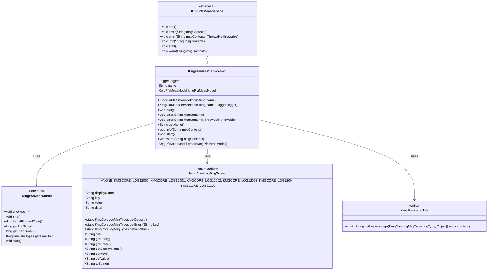
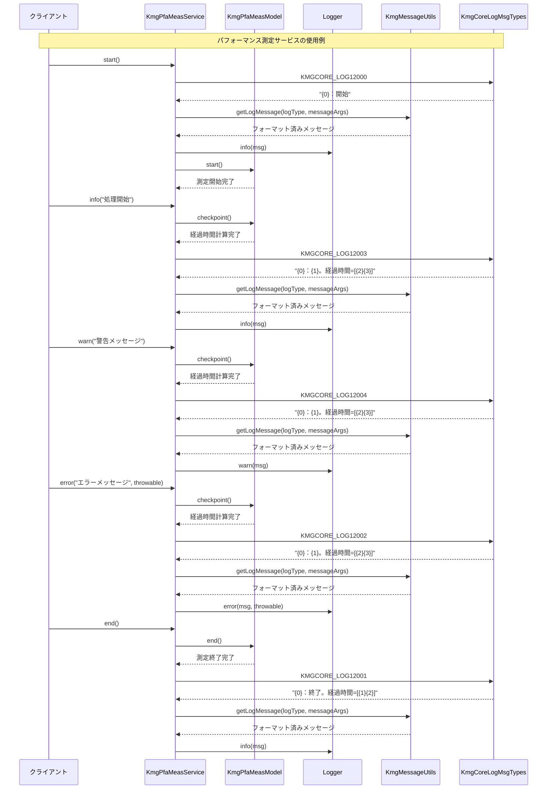

# ドメイン層の設計書

## 1. クラス図



## 2. シーケンス図



## 3. パッケージ構造

ドメイン層（domain）は以下のパッケージ構造で構成されています：

### 3.1 ドメインサービス (service)

- **KmgPfaMeasService**: パフォーマンス測定サービスのインターフェース
  - ビジネスロジックの核となる機能を定義
  - 測定の開始/終了、ログ出力機能を提供

### 3.2 ドメインサービス実装 (service.impl)

- **KmgPfaMeasServiceImpl**: パフォーマンス測定サービスの実装クラス
  - インターフェースの具体的な実装を提供
  - インフラストラクチャ層のモデルを利用してビジネスロジックを実現

## 4. 主要コンポーネント

### 4.1 パフォーマンス測定サービス

`KmgPfaMeasService`と`KmgPfaMeasServiceImpl`によるパフォーマンス測定機能：

#### 4.1.1 機能概要

- **測定管理**: 処理の開始から終了までの時間測定
- **ログ出力**: 測定結果とメッセージの統合ログ出力
- **チェックポイント**: 処理途中での経過時間確認

#### 4.1.2 主要メソッド

- **start()**: 測定開始とログ出力
- **end()**: 測定終了と最終結果のログ出力
- **checkpoint()**: 経過時間の確認（info/warn/error メソッド内で自動実行）
- **info(String)**: 情報レベルのログ出力
- **warn(String)**: 警告レベルのログ出力
- **error(String, Throwable)**: エラーレベルのログ出力

#### 4.1.3 ログメッセージタイプ

使用されるログメッセージタイプ：

- **KMGCORE_LOG12000**: `{0}：開始` - 測定開始時
- **KMGCORE_LOG12001**: `{0}：終了。経過時間=[{1}{2}]` - 測定終了時
- **KMGCORE_LOG12002**: `{0}：{1}。経過時間=[{2}{3}]` - エラーログ時
- **KMGCORE_LOG12003**: `{0}：{1}。経過時間=[{2}{3}]` - 情報ログ時
- **KMGCORE_LOG12004**: `{0}：{1}。経過時間=[{2}{3}]` - 警告ログ時

## 5. 設計原則

### 5.1 ドメイン駆動設計

- **ドメインサービス**: ビジネスロジックの核となる機能を提供
- **インターフェース分離**: 実装とインターフェースの明確な分離
- **依存関係の管理**: インフラストラクチャ層への適切な依存

### 5.2 単一責任の原則

- **KmgPfaMeasService**: パフォーマンス測定とログ出力に特化
- **明確な責務**: 各メソッドが明確な単一の責任を持つ

### 5.3 拡張性

- **インターフェースベース**: 実装の変更が容易
- **テスト容易性**: テスト用コンストラクタの提供
- **ログ出力の統一**: メッセージタイプによる統一的なログ出力

### 5.4 再利用性

- **汎用的な設計**: 様々な処理でのパフォーマンス測定に利用可能
- **設定可能なロガー**: 外部からロガーを注入可能

## 6. 使用例

### 6.1 基本的な使用例

```java
// サービスの作成
KmgPfaMeasService measService = new KmgPfaMeasServiceImpl("データ処理");

// 測定開始
measService.start();

// 処理の実行
try {
    // 何らかの処理
    measService.info("データ読み込み完了");

    // さらに処理
    measService.info("データ変換完了");

} catch (Exception e) {
    measService.error("処理中にエラーが発生", e);
    throw e;
}

// 測定終了
measService.end();
```

### 6.2 テストでの使用例

```java
// テスト用ロガーを指定
Logger testLogger = LoggerFactory.getLogger("TestLogger");
KmgPfaMeasService measService = new KmgPfaMeasServiceImpl("テスト処理", testLogger);

// テスト実行
measService.start();
// テスト処理
measService.info("テスト完了");
measService.end();
```

### 6.3 複数処理の測定例

```java
// 複数の処理を個別に測定
KmgPfaMeasService fileService = new KmgPfaMeasServiceImpl("ファイル処理");
KmgPfaMeasService dbService = new KmgPfaMeasServiceImpl("データベース処理");

// ファイル処理
fileService.start();
// ファイル処理の実装
fileService.end();

// データベース処理
dbService.start();
// データベース処理の実装
dbService.end();
```

## 7. 依存関係

### 7.1 インフラストラクチャ層への依存

- **KmgPfaMeasModel**: パフォーマンス測定の具体的な実装
- **KmgCoreLogMsgTypes**: ログメッセージの定義
- **KmgMessageUtils**: メッセージのフォーマット処理

### 7.2 外部ライブラリへの依存

- **SLF4J Logger**: ログ出力機能
- **LoggerFactory**: ロガーの生成

## 8. テスト戦略

### 8.1 単体テスト

- **インターフェースのテスト**: 各メソッドの動作確認
- **ログ出力のテスト**: 適切なログメッセージの出力確認
- **例外処理のテスト**: エラー時の適切な処理確認

### 8.2 統合テスト

- **実際の処理での測定**: 実用的な処理でのパフォーマンス測定
- **ログ出力の確認**: 実際のログファイルでの出力確認

## 9. 今後の拡張予定

### 9.1 機能拡張

- **複数測定の統合**: 複数の測定結果の統合表示
- **測定結果の永続化**: 測定結果のデータベース保存
- **統計情報の提供**: 測定結果の統計分析機能

### 9.2 パフォーマンス改善

- **非同期ログ出力**: ログ出力の非同期化
- **測定オーバーヘッドの削減**: 測定処理自体の最適化
